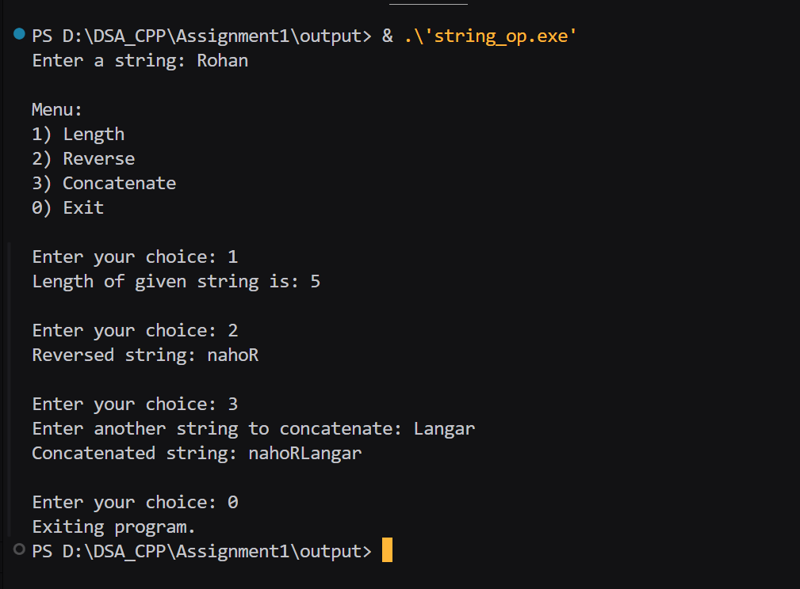

# Assignment No 1 :

## String operation without using buildin function :

**Code** :
      
```
#include <iostream>
using namespace std;

int length(char str[]) {
    int i = 0;
    while (str[i] != '\0') {
        i++;
    }
    return i;
}

void reverseStr(char str[]) {
    int n = length(str);
    for (int i = 0; i < n / 2; i++) {
        char temp = str[i];
        str[i] = str[n - i - 1];
        str[n - i - 1] = temp;
    }
}

void concate(char str1[],char str2[]){
    int len1=length(str1);
    int len2=length(str2);
    int j=0;
    for (int i=len1 ;i < len1+len2 ; i++){
        str1[i]=str2[j];
        j++;
    }
}

int main() {
    cout << "Enter a string: ";
    char string1[100], string2[100];
    cin >> string1;

    int choice;
    cout << "\nMenu:\n";
    cout << "1) Length\n";
    cout << "2) Reverse\n";
    cout << "3) Concatenate\n";
    cout << "0) Exit\n";

    do {
        cout << "\nEnter your choice: ";
        cin >> choice;

        switch (choice) {
        case 1: {
            int len = length(string1);
            cout << "Length of given string is: " << len << endl;
            break;
        }
        case 2: {
            reverseStr(string1);
            cout << "Reversed string: " << string1 << endl;
            break;
        }
        case 3: {
            cout << "Enter another string to concatenate: ";
            cin >> string2;
            concate(string1,string2);
            cout << "Concatenated string: " << string1 << endl;
            break;
        }
        case 0:
            cout << "Exiting program." << endl;
            break;
        default:
            cout << "Invalid choice!" << endl;
        }
    } while (choice != 0);

    return 0;
}

```

**Output** :
 
