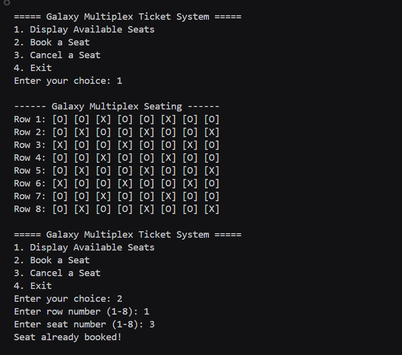
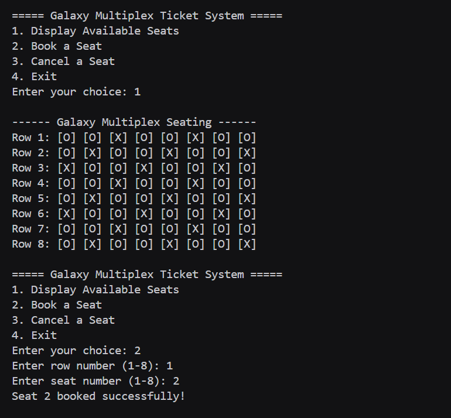
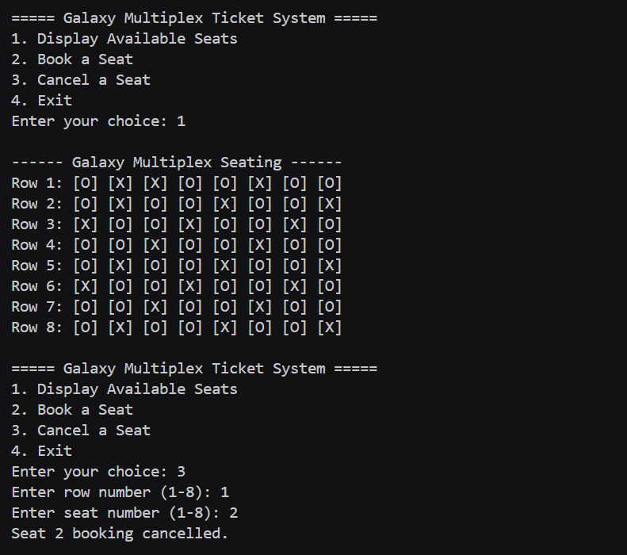

# Assignment no : 12
### Title : Implement a program for movie theater ticket booking system using circular doubly linked list. The system should allow booking and cancellation of seats in multiple rows.

#### Theory :
**Circular Doubly Linked List** is a data structure where each node contains data and two pointers - one pointing to the next node and another to the previous node. In a circular doubly linked list, the last node points to the first node and the first node points to the last node, forming a circular structure.


**Operations:**
1. **Creation** - Initialize nodes with seat numbers and booking status
2. **Display** - Show current seating arrangement with booked/available status
3. **Book Seat** - Mark a specific seat as booked
4. **Cancel Booking** - Mark a booked seat as available
5. **Search** - Find a specific seat in the circular list

**Time Complexity:**
- Search: O(n)
- Insertion: O(1) if position is known
- Deletion: O(1) if position is known
- Display: O(n)

#### Program :
```cpp
#include<iostream>
using namespace std;

typedef struct Seat_rrl {
    int seatNo_rrl;
    bool isBooked_rrl;
    Seat_rrl *next_rrl;
    Seat_rrl *prev_rrl;
} Seat_rrl;

Seat_rrl* createRow_rrl(int totalSeats_rrl) {
    Seat_rrl* head_rrl = NULL;
    Seat_rrl* prev_rrl = NULL;

    for (int i = 1; i <= totalSeats_rrl; i++) {
        Seat_rrl* newSeat_rrl = new Seat_rrl;
        if (newSeat_rrl == NULL) {
            cout << "Memory allocation failed!\n";
            return NULL;
        }
        newSeat_rrl->seatNo_rrl = i;
        newSeat_rrl->isBooked_rrl = false;
        newSeat_rrl->next_rrl = newSeat_rrl->prev_rrl = NULL;

        if (head_rrl == NULL) {
            head_rrl = newSeat_rrl;
        } else {
            prev_rrl->next_rrl = newSeat_rrl;
            newSeat_rrl->prev_rrl = prev_rrl;
        }
        prev_rrl = newSeat_rrl;
    }

    head_rrl->prev_rrl = prev_rrl;
    prev_rrl->next_rrl = head_rrl;

    return head_rrl;
}

void displaySeats_rrl(Seat_rrl* head_rrl) {
    if (head_rrl == NULL) return;

    Seat_rrl* temp_rrl = head_rrl;
    do {
        if (temp_rrl->isBooked_rrl)
            cout << "[X] ";
        else
            cout << "[O] ";
        temp_rrl = temp_rrl->next_rrl;
    } while (temp_rrl != head_rrl);
    cout << endl;
}

void displayAllRows_rrl(Seat_rrl* rows_rrl[], int totalRows_rrl) {
    cout << "\n------ Galaxy Multiplex Seating ------\n";
    for (int i = 0; i < totalRows_rrl; i++) {
        cout << "Row " << (i + 1) << ": ";
        displaySeats_rrl(rows_rrl[i]);
    }
}

void bookSeat_rrl(Seat_rrl* row_rrl, int seatNo_rrl) {
    if (row_rrl == NULL) return;

    Seat_rrl* temp_rrl = row_rrl;
    do {
        if (temp_rrl->seatNo_rrl == seatNo_rrl) {
            if (temp_rrl->isBooked_rrl)
                cout << "Seat already booked!\n";
            else {
                temp_rrl->isBooked_rrl = true;
                cout << "Seat " << seatNo_rrl << " booked successfully!\n";
            }
            return;
        }
        temp_rrl = temp_rrl->next_rrl;
    } while (temp_rrl != row_rrl);

    cout << "Invalid seat number!\n";
}

void cancelSeat_rrl(Seat_rrl* row_rrl, int seatNo_rrl) {
    if (row_rrl == NULL) return;

    Seat_rrl* temp_rrl = row_rrl;
    do {
        if (temp_rrl->seatNo_rrl == seatNo_rrl) {
            if (!temp_rrl->isBooked_rrl)
                cout << "Seat is not booked!\n";
            else {
                temp_rrl->isBooked_rrl = false;
                cout << "Seat " << seatNo_rrl << " booking cancelled.\n";
            }
            return;
        }
        temp_rrl = temp_rrl->next_rrl;
    } while (temp_rrl != row_rrl);

    cout << "Invalid seat number!\n";
}

void preBookRandom_rrl(Seat_rrl* rows_rrl[], int totalRows_rrl) {
    for (int i = 0; i < totalRows_rrl; i++) {
        Seat_rrl* temp_rrl = rows_rrl[i];
        int counter_rrl = 0;
        do {
            if ((temp_rrl->seatNo_rrl + i) % 3 == 0)
                temp_rrl->isBooked_rrl = true;
            temp_rrl = temp_rrl->next_rrl;
            counter_rrl++;
        } while (counter_rrl < 8);
    }
}

int main() {
    const int totalRows_rrl = 8;
    const int totalSeats_rrl = 8;
    Seat_rrl* rows_rrl[totalRows_rrl];

    for (int i = 0; i < totalRows_rrl; i++) {
        rows_rrl[i] = createRow_rrl(totalSeats_rrl);
    }

    preBookRandom_rrl(rows_rrl, totalRows_rrl);

    int choice_rrl, row_rrl, seat_rrl;
    do {
        cout << "\n===== Galaxy Multiplex Ticket System =====\n";
        cout << "1. Display Available Seats\n";
        cout << "2. Book a Seat\n";
        cout << "3. Cancel a Seat\n";
        cout << "4. Exit\n";
        cout << "Enter your choice: ";
        cin >> choice_rrl;

        switch (choice_rrl) {
        case 1:
            displayAllRows_rrl(rows_rrl, totalRows_rrl);
            break;
        case 2:
            cout << "Enter row number (1-8): ";
            cin >> row_rrl;
            cout << "Enter seat number (1-8): ";
            cin >> seat_rrl;
            bookSeat_rrl(rows_rrl[row_rrl - 1], seat_rrl);
            break;
        case 3:
            cout << "Enter row number (1-8): ";
            cin >> row_rrl;
            cout << "Enter seat number (1-8): ";
            cin >> seat_rrl;
            cancelSeat_rrl(rows_rrl[row_rrl - 1], seat_rrl);
            break;
        case 4:
            cout << "Exiting system...\n";
            break;
        default:
            cout << "Invalid choice! Try again.\n";
        }
    } while (choice_rrl != 4);

    return 0;
}
```

### Output :




https://drive.google.com/drive/folders/1ZFDfWePY5kkDqtjVmOmjZwUWAAIl1FcN?usp=drive_link