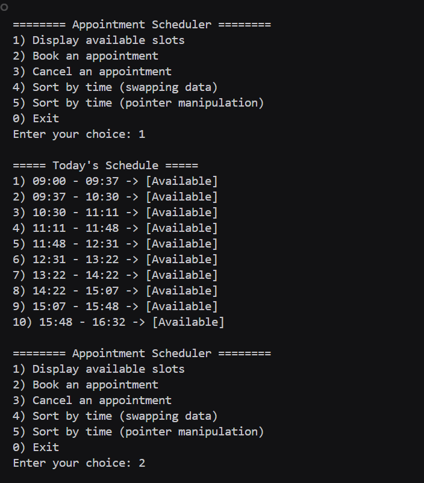
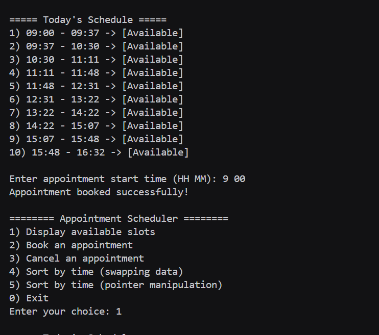
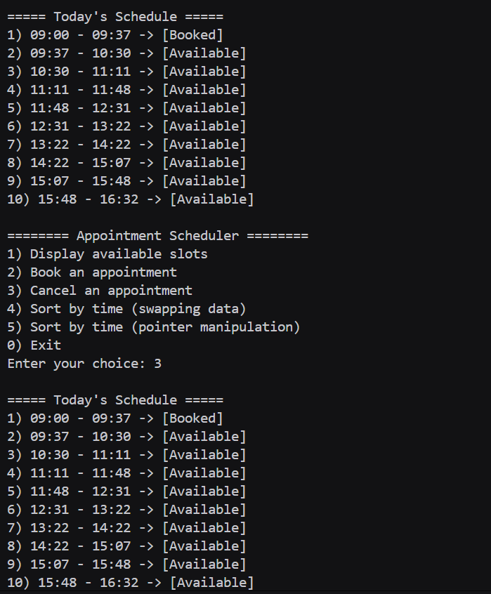
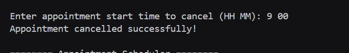

# Assignment no : 13
### Title : Implement a program for appointment scheduling system using singly linked list. The system should allow booking, cancellation, and sorting of appointments by time using two different methods: data swapping and pointer manipulation.

#### Theory :
**Appointment Scheduling System** using singly linked list is a practical application that manages time slots for appointments. Each node represents a time slot with start time, end time, and booking status.


**Sorting Methods:**
1. **Data Swapping Method:**
   - Swaps the actual data (start time, end time, booking status) between nodes
   - Node structure remains unchanged
   - Simpler to implement but involves more data movement

2. **Pointer Manipulation Method:**
   - Changes the links between nodes without moving data
   - More efficient for large data structures
   - Requires careful handling of pointers
   - Uses insertion sort algorithm


**Time Complexity:**
- Search: O(n)
- Book/Cancel: O(n)
- Sort by Data Swapping: O(n²)
- Sort by Pointer Manipulation: O(n²)
- Display: O(n)

#### Program :
```cpp
#include <iostream>
#include <cstdlib>
#include <ctime>
#include <iomanip>
using namespace std;

typedef struct Appointment_rrl {
    int start_rrl;
    int end_rrl;
    bool booked_rrl;
    Appointment_rrl *next_rrl;
} Appointment_rrl;

void displayTime_rrl(int time_rrl) {
    int hr_rrl = time_rrl / 60;
    int min_rrl = time_rrl % 60;
    cout << setw(2) << setfill('0') << hr_rrl << ":"
         << setw(2) << setfill('0') << min_rrl;
}

Appointment_rrl* createSchedule_rrl(int startMin_rrl, int endMin_rrl, int minDur_rrl, int maxDur_rrl) {
    Appointment_rrl *head_rrl = nullptr, *last_rrl = nullptr;
    int curr_rrl = startMin_rrl;

    while (curr_rrl < endMin_rrl) {
        int dur_rrl = minDur_rrl + (rand() % (maxDur_rrl - minDur_rrl + 1));
        int end_rrl = curr_rrl + dur_rrl;
        if (end_rrl > endMin_rrl) break;

        Appointment_rrl *node_rrl = new Appointment_rrl;
        node_rrl->start_rrl = curr_rrl;
        node_rrl->end_rrl = end_rrl;
        node_rrl->booked_rrl = false;
        node_rrl->next_rrl = nullptr;

        if (!head_rrl)
            head_rrl = node_rrl;
        else
            last_rrl->next_rrl = node_rrl;

        last_rrl = node_rrl;
        curr_rrl = end_rrl;
    }
    return head_rrl;
}

void displaySlots_rrl(Appointment_rrl *head_rrl) {
    Appointment_rrl *temp_rrl = head_rrl;
    int i_rrl = 1;
    cout << "\n===== Today's Schedule =====\n";
    while (temp_rrl) {
        cout << i_rrl++ << ") ";
        displayTime_rrl(temp_rrl->start_rrl);
        cout << " - ";
        displayTime_rrl(temp_rrl->end_rrl);
        cout << " -> " << (temp_rrl->booked_rrl ? "[Booked]" : "[Available]") << "\n";
        temp_rrl = temp_rrl->next_rrl;
    }
}

void bookAppointment_rrl(Appointment_rrl *head_rrl) {
    displaySlots_rrl(head_rrl);
    int st_hr, st_min;
    cout << "\nEnter appointment start time (HH MM): ";
    cin >> st_hr >> st_min;
    if (cin.fail()) {
        cin.clear();
        cin.ignore(1000, '\n');
        cout << "Invalid input.\n";
        return;
    }
    int st_time = st_hr * 60 + st_min;

    Appointment_rrl *temp_rrl = head_rrl;
    while (temp_rrl) {
        if (temp_rrl->start_rrl == st_time) {
            if (temp_rrl->booked_rrl)
                cout << "Slot already booked!\n";
            else {
                temp_rrl->booked_rrl = true;
                cout << "Appointment booked successfully!\n";
            }
            return;
        }
        temp_rrl = temp_rrl->next_rrl;
    }
    cout << "No such time slot found.\n";
}

void cancelAppointment_rrl(Appointment_rrl *head_rrl) {
    displaySlots_rrl(head_rrl);
    int st_hr, st_min;
    cout << "\nEnter appointment start time to cancel (HH MM): ";
    cin >> st_hr >> st_min;
    if (cin.fail()) {
        cin.clear();
        cin.ignore(1000, '\n');
        cout << "Invalid input.\n";
        return;
    }
    int st_time = st_hr * 60 + st_min;

    Appointment_rrl *temp_rrl = head_rrl;
    while (temp_rrl) {
        if (temp_rrl->start_rrl == st_time) {
            if (!temp_rrl->booked_rrl)
                cout << "Slot is not booked!\n";
            else {
                temp_rrl->booked_rrl = false;
                cout << "Appointment cancelled successfully!\n";
            }
            return;
        }
        temp_rrl = temp_rrl->next_rrl;
    }
    cout << "No such time slot found.\n";
}

void sortByData_rrl(Appointment_rrl *head_rrl) {
    for (Appointment_rrl *i = head_rrl; i != nullptr; i = i->next_rrl) {
        for (Appointment_rrl *j = i->next_rrl; j != nullptr; j = j->next_rrl) {
            if (i->start_rrl > j->start_rrl) {
                swap(i->start_rrl, j->start_rrl);
                swap(i->end_rrl, j->end_rrl);
                swap(i->booked_rrl, j->booked_rrl);
            }
        }
    }
    cout << "List sorted by swapping data.\n";
}

Appointment_rrl* sortByPointer_rrl(Appointment_rrl *head_rrl) {
    if (!head_rrl || !head_rrl->next_rrl) return head_rrl;

    Appointment_rrl *sorted_rrl = nullptr;
    Appointment_rrl *curr_rrl = head_rrl;

    while (curr_rrl) {
        Appointment_rrl *next_rrl = curr_rrl->next_rrl;

        if (!sorted_rrl || curr_rrl->start_rrl < sorted_rrl->start_rrl) {
            curr_rrl->next_rrl = sorted_rrl;
            sorted_rrl = curr_rrl;
        } else {
            Appointment_rrl *temp_rrl = sorted_rrl;
            while (temp_rrl->next_rrl && temp_rrl->next_rrl->start_rrl < curr_rrl->start_rrl)
                temp_rrl = temp_rrl->next_rrl;

            curr_rrl->next_rrl = temp_rrl->next_rrl;
            temp_rrl->next_rrl = curr_rrl;
        }
        curr_rrl = next_rrl;
    }
    cout << "List sorted by pointer manipulation.\n";
    return sorted_rrl;
}

void freeList_rrl(Appointment_rrl *head_rrl) {
    Appointment_rrl *temp_rrl;
    while (head_rrl) {
        temp_rrl = head_rrl;
        head_rrl = head_rrl->next_rrl;
        delete temp_rrl;
    }
}

int main() {
    srand((unsigned)time(0));

    int start_hr_rrl = 9, end_hr_rrl = 17;
    int minDur_rrl = 30, maxDur_rrl = 60;

    Appointment_rrl *head_rrl = createSchedule_rrl(start_hr_rrl * 60, end_hr_rrl * 60, minDur_rrl, maxDur_rrl);

    int choice_rrl;
    do {
        cout << "\n======== Appointment Scheduler ========\n";
        cout << "1) Display available slots\n";
        cout << "2) Book an appointment\n";
        cout << "3) Cancel an appointment\n";
        cout << "4) Sort by time (swapping data)\n";
        cout << "5) Sort by time (pointer manipulation)\n";
        cout << "0) Exit\n";
        cout << "Enter your choice: ";
        cin >> choice_rrl;

        switch (choice_rrl) {
            case 1: displaySlots_rrl(head_rrl); break;
            case 2: bookAppointment_rrl(head_rrl); break;
            case 3: cancelAppointment_rrl(head_rrl); break;
            case 4: sortByData_rrl(head_rrl); break;
            case 5: head_rrl = sortByPointer_rrl(head_rrl); break;
            case 0: cout << "Exiting...\n"; break;
            default: cout << "Invalid choice!\n"; break;
        }
    } while (choice_rrl != 0);

    freeList_rrl(head_rrl);
    return 0;
}
```

### Output :





https://drive.google.com/drive/folders/1FVZxnyM-24oes4ytYuzkEpOWl_pKst-i?usp=sharing