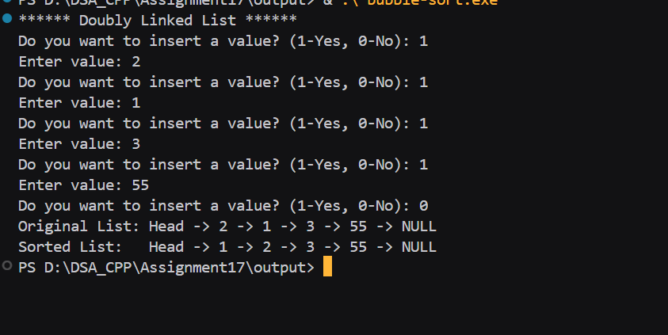

# Assignment no : 17
### Title : Implement bubble sort algorithm on a doubly linked list to sort elements in ascending order.

#### Theory :
**Bubble Sort on Doubly Linked List** is an adaptation of the classic bubble sort algorithm for linked list data structures. Unlike arrays, we cannot use indices, so we traverse using pointers and swap data values.

**Bubble Sort Algorithm:**
1. Compare adjacent elements in the list
2. Swap them if they are in wrong order (first > second)
3. Continue until no more swaps are needed
4. After each pass, the largest element "bubbles up" to its correct position

**Algorithm Steps:**
1. Start from the head of the list
2. Compare current node with next node
3. If current > next, swap their data values
4. Move to next pair
5. Repeat until no swaps occur in a complete pass

**Time Complexity:**
- Best Case: O(n) - when list is already sorted
- Average Case: O(n²)
- Worst Case: O(n²) - when list is reverse sorted

**Space Complexity:** O(1) - only uses constant extra space

#### Program :
```cpp
#include <iostream>
using namespace std;

typedef struct Node {
    int data;
    Node* prev;
    Node* next;
} Node;

Node* createNode_rrl(int val) {
    Node* node = new Node;
    node->data = val;
    node->prev = nullptr;
    node->next = nullptr;
    return node;
}

Node* createList_rrl() {
    Node* head = nullptr;
    Node* tail = nullptr;
    int ch;
    while (true) {
        cout << "Do you want to insert a value? (1-Yes, 0-No): ";
        cin >> ch;
        if (ch == 0) break;

        int val;
        cout << "Enter value: ";
        cin >> val;

        Node* node = createNode_rrl(val);
        if (!head) {
            head = tail = node;
        } else {
            tail->next = node;
            node->prev = tail;
            tail = node;
        }
    }
    return head;
}
```// Bu
bble sort implementation
void bubbleSort_rrl(Node* head) {
    if (!head) return;
    bool swapped;
    Node* ptr;
    Node* last = nullptr;

    do {
        swapped = false;
        ptr = head;
        while (ptr->next != last) {
            if (ptr->data > ptr->next->data) {
                swap(ptr->data, ptr->next->data);
                swapped = true;
            }
            ptr = ptr->next;
        }
        last = ptr;
    } while (swapped);
}

void display_rrl(Node* head) {
    Node* temp = head;
    cout << "Head -> ";
    while (temp) {
        cout << temp->data << " -> ";
        temp = temp->next;
    }
    cout << "NULL" << endl;
}

int main() {
    cout << "****** Doubly Linked List ******" << endl;

    Node* head = createList_rrl();

    cout << "Original List: ";
    display_rrl(head);

    bubbleSort_rrl(head);

    cout << "Sorted List:   ";
    display_rrl(head);

    return 0;
}
```

### Output :


https://drive.google.com/file/d/1be8fdFIlC34jVv4d2rjjYMnIWAX1T1wF/view?usp=drive_link