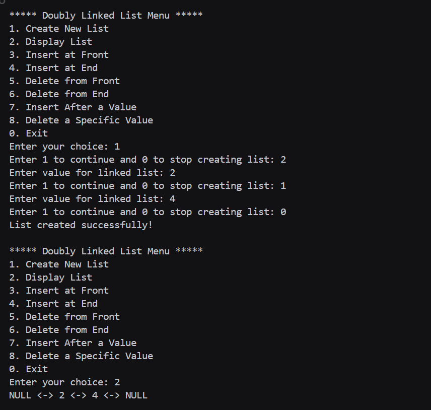
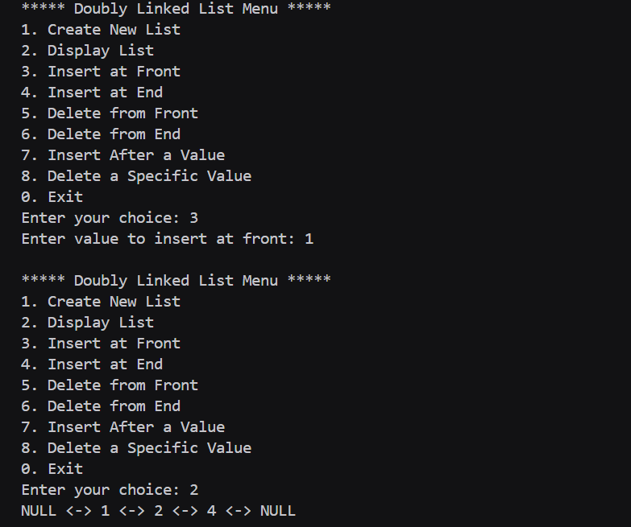
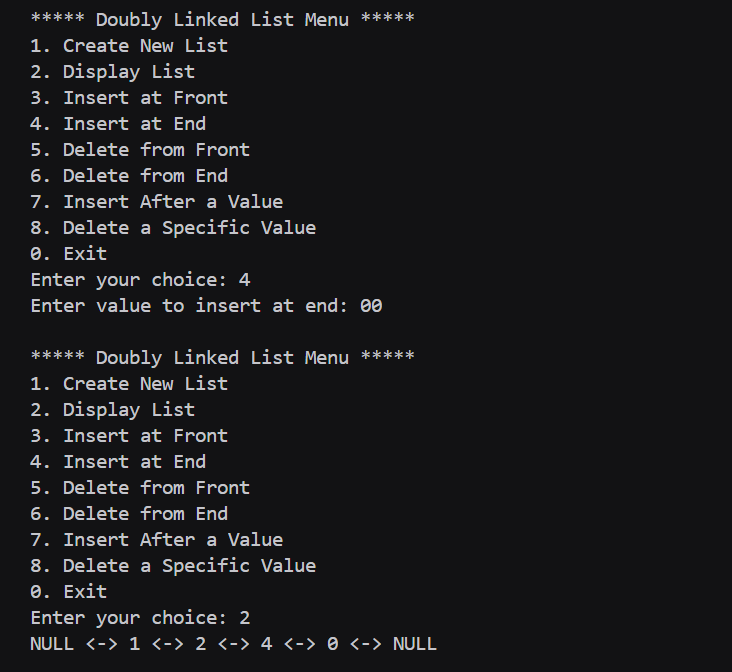
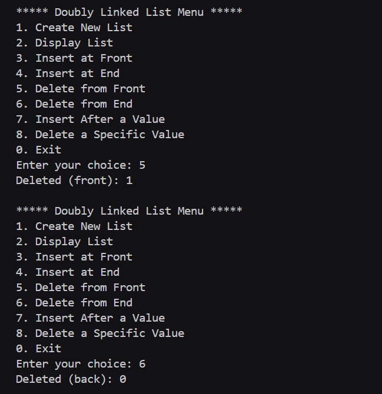
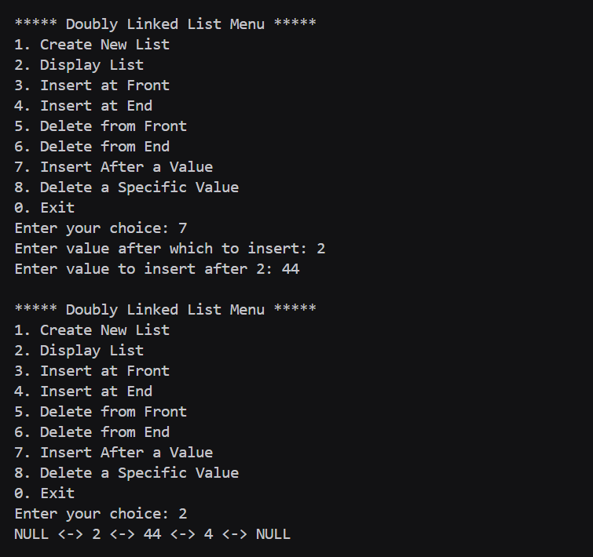
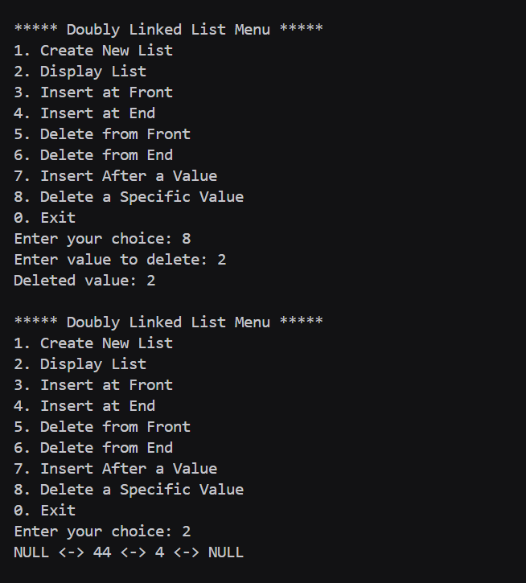

# Assignment no : 18
### Title : Implement a comprehensive doubly linked list with operations for insertion, deletion, and manipulation at various positions.

#### Theory :
**Doubly Linked List** is a linear data structure where each node contains data and two pointers - one pointing to the next node and another to the previous node. This bidirectional linking provides more flexibility compared to singly linked lists.

**Node Structure:**
- **Data**: Stores the actual value
- **Next**: Pointer to the next node
- **Previous**: Pointer to the previous node

**Key Operations:**
1. **Push Front** - Insert at the beginning
2. **Push Back** - Insert at the end
3. **Pop Front** - Delete from the beginning
4. **Pop Back** - Delete from the end
5. **Insert After** - Insert after a specific value
6. **Delete Value** - Delete a specific value

**Time Complexity:**
- Insertion: O(1) at known position, O(n) for search
- Deletion: O(1) at known position, O(n) for search
- Search: O(n)
- Traversal: O(n)

#### Program :
```cpp
#include<iostream>
using namespace std;

struct dll {
    int val;
    dll *next;
    dll *pre;
};

// Function to create a new node
dll* createnode_rrl() {
    dll *newnode = new dll();
    newnode->next = NULL;
    newnode->pre = NULL;
    return newnode;
}

// Function to create initial linked list
dll* createNewList_rrl() {
    dll *head = createnode_rrl();   
    dll *temp = head;
    int ch;
    while (1) {
        cout << "Enter 1 to continue and 0 to stop creating list: ";
        cin >> ch;
        if (ch == 0)
            break;
        dll *newnode = createnode_rrl();
        cout << "Enter value for linked list: ";
        cin >> newnode->val;
        newnode->pre = temp;
        temp->next = newnode;
        temp = temp->next;
    }
    return head;
}

// Display the doubly linked list
void print_rrl(dll *head) {
    dll *temp = head->next;
    if (temp == NULL) {
        cout << "List is empty!\n";
        return;
    }
    cout << "NULL <-> ";
    while (temp != NULL) {
        cout << temp->val << " <-> ";
        temp = temp->next;
    }
    cout << "NULL\n";
}

// Insert at front
void push_front_rrl(dll *&head) {
    dll *temp = head;
    dll *newnode = createnode_rrl();
    cout << "Enter value to insert at front: ";
    cin >> newnode->val;

    newnode->next = temp->next;
    newnode->pre = temp;
    if (temp->next != NULL) temp->next->pre = newnode;
    temp->next = newnode;
}

// Insert at end
void push_back_rrl(dll *&head) {
    dll *temp = head;
    while (temp->next != NULL)
        temp = temp->next;

    dll *newnode = createnode_rrl();
    cout << "Enter value to insert at end: ";
    cin >> newnode->val;

    temp->next = newnode;
    newnode->pre = temp;
}

// Delete from front
void pop_front_rrl(dll *&head) {
    if (head->next == NULL) {
        cout << "List is empty!\n";
        return;
    }
    dll *todelete = head->next;
    head->next = todelete->next;
    if (todelete->next != NULL)
        todelete->next->pre = head;

    cout << "Deleted (front): " << todelete->val << endl;
    delete todelete;
}

// Delete from end
void pop_back_rrl(dll *&head) {
    if (head->next == NULL) {
        cout << "List is empty!\n";
        return;
    }
    dll *temp = head->next;
    while (temp->next != NULL)
        temp = temp->next;

    cout << "Deleted (back): " << temp->val << endl;
    temp->pre->next = NULL;
    delete temp;
}

// Insert after a specific value
void insert_after_rrl(dll *&head, int key) {
    dll *temp = head->next;
    while (temp != NULL && temp->val != key)
        temp = temp->next;

    if (temp == NULL) {
        cout << "Value " << key << " not found!\n";
        return;
    }

    dll *newnode = createnode_rrl();
    cout << "Enter value to insert after " << key << ": ";
    cin >> newnode->val;

    newnode->next = temp->next;
    newnode->pre = temp;
    if (temp->next != NULL)
        temp->next->pre = newnode;
    temp->next = newnode;
}

// Delete a specific value
void delete_value_rrl(dll *&head, int key) {
    dll *temp = head->next;
    while (temp != NULL && temp->val != key)
        temp = temp->next;

    if (temp == NULL) {
        cout << "Value " << key << " not found!\n";
        return;
    }

    temp->pre->next = temp->next;
    if (temp->next != NULL)
        temp->next->pre = temp->pre;

    cout << "Deleted value: " << temp->val << endl;
    delete temp;
}

int main() {
    dll *head = NULL;
    int ch;

    do {
        cout << "\n***** Doubly Linked List Menu *****\n";
        cout << "1. Create New List\n";
        cout << "2. Display List\n";
        cout << "3. Insert at Front\n";
        cout << "4. Insert at End\n";
        cout << "5. Delete from Front\n";
        cout << "6. Delete from End\n";
        cout << "7. Insert After a Value\n";
        cout << "8. Delete a Specific Value\n";
        cout << "0. Exit\n";
        cout << "Enter your choice: ";
        cin >> ch;

        switch (ch) {
            case 1:
                head = createNewList_rrl();
                cout << "List created successfully!\n";
                break;

            case 2:
                print_rrl(head);
                break;

            case 3:
                if (!head) cout << "Please create a list first!\n";
                else push_front_rrl(head);
                break;

            case 4:
                if (!head) cout << "Please create a list first!\n";
                else push_back_rrl(head);
                break;

            case 5:
                if (!head) cout << "Please create a list first!\n";
                else pop_front_rrl(head);
                break;

            case 6:
                if (!head) cout << "Please create a list first!\n";
                else pop_back_rrl(head);
                break;

            case 7:
                if (!head) cout << "Please create a list first!\n";
                else {
                    int key;
                    cout << "Enter value after which to insert: ";
                    cin >> key;
                    insert_after_rrl(head, key);
                }
                break;

            case 8:
                if (!head) cout << "Please create a list first!\n";
                else {
                    int key;
                    cout << "Enter value to delete: ";
                    cin >> key;
                    delete_value_rrl(head, key);
                }
                break;

            case 0:
                cout << "Exiting program...\n";
                break;

            default:
                cout << "Invalid choice! Try again.\n";
        }

    } while (ch != 0);

    return 0;
}

```

### Output :







https://drive.google.com/drive/folders/1CsaDtsJybHIoyYtNOFXcKrxv8k_87nk1?usp=sharing