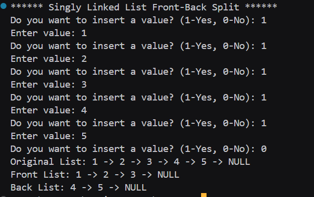

# Assignment no : 19
### Title : Implement a program to split a singly linked list into two halves using the "tortoise and hare" algorithm.

#### Theory :
**Front-Back Split** is a fundamental operation that divides a singly linked list into two approximately equal halves. This operation uses the famous "tortoise and hare" (slow-fast pointer) technique.

**Tortoise and Hare Algorithm:**
- **Slow Pointer (Tortoise)**: Moves one step at a time
- **Fast Pointer (Hare)**: Moves two steps at a time
- When fast pointer reaches the end, slow pointer is at the middle

**Algorithm Steps:**
1. Initialize slow pointer to head and fast pointer to head->next
2. Move slow pointer one step and fast pointer two steps
3. Continue until fast pointer reaches end
4. Split the list at slow pointer's position
5. First half: from head to slow pointer
6. Second half: from slow->next to end

**Time Complexity:** O(n) - single traversal
**Space Complexity:** O(1) - only uses two pointers

#### Program :
```cpp
#include <iostream>
using namespace std;

typedef struct Node {
    int data;
    Node* next;
} Node;

Node* createNode_rrl(int val) {
    Node* node = new Node;
    node->data = val;
    node->next = nullptr;
    return node;
}

Node* createList_rrl() {
    Node* head = nullptr;
    Node* tail = nullptr;
    int ch;
    while (true) {
        cout << "Do you want to insert a value? (1-Yes, 0-No): ";
        cin >> ch;
        if (ch == 0) break;

        int val;
        cout << "Enter value: ";
        cin >> val;

        Node* node = createNode_rrl(val);
        if (!head) head = tail = node;
        else {
            tail->next = node;
            tail = node;
        }
    }
    return head;
}

void display_rrl(Node* head) {
    Node* temp = head;
    while (temp) {
        cout << temp->data << " -> ";
        temp = temp->next;
    }
    cout << "NULL" << endl;
}

void frontBackSplit_rrl(Node* source, Node*& front, Node*& back) {
    if (!source) { 
        front = back = nullptr;
        return;
    }
    if (!source->next) { 
        front = source;
        back = nullptr;
        return;
    }

    Node* slow = source;
    Node* fast = source->next;

    while (fast) {
        fast = fast->next;
        if (fast) {
            slow = slow->next;
            fast = fast->next;
        }
    }

    front = source;
    back = slow->next;
    slow->next = nullptr;
}

int main() {
    cout << "****** Singly Linked List Front-Back Split ******" << endl;

    Node* head = createList_rrl();

    cout << "Original List: ";
    display_rrl(head);

    Node* front = nullptr;
    Node* back = nullptr;

    frontBackSplit_rrl(head, front, back);

    cout << "Front List: ";
    display_rrl(front);
    cout << "Back List: ";
    display_rrl(back);

    return 0;
}
```

### Output :


https://drive.google.com/file/d/1cwRBk14VL5N_iKydA--ga5S0M3853fKB/view?usp=drive_link