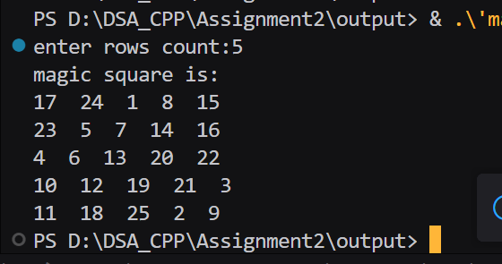

## Assignment no : 2
### Title : Write a program to construct and verify a magic square of order 'n' (for both even & odd) such that all rows, columns, and diagonals sum to the same value.


#### Theory :


#### Program :
```
#include <iostream>
#include <vector>

void generate_odd_magic_square(std::vector<std::vector<int>>& magic_rrl, int n_rrl) {
    int i_rrl = 0;
    int j_rrl = n_rrl / 2;
    int num_rrl = 1;

    while (num_rrl <= n_rrl * n_rrl) {
        magic_rrl[i_rrl][j_rrl] = num_rrl;
        num_rrl++;

        int newi_rrl = (i_rrl - 1 + n_rrl) % n_rrl;
        int newj_rrl = (j_rrl + 1) % n_rrl;
        if (magic_rrl[newi_rrl][newj_rrl] != 0) {
            i_rrl = (i_rrl + 1) % n_rrl;
        } else {
            i_rrl = newi_rrl;
            j_rrl = newj_rrl;
        }
    }
}

void generate_doubly_even_magic_square(std::vector<std::vector<int>>& magic_rrl, int n_rrl) {
    int num_rrl = 1;
    int total_rrl = n_rrl * n_rrl;

    for (int i_rrl = 0; i_rrl < n_rrl; i_rrl++) {
        for (int j_rrl = 0; j_rrl < n_rrl; j_rrl++) {
            magic_rrl[i_rrl][j_rrl] = num_rrl++;
        }
    }

    for (int i_rrl = 0; i_rrl < n_rrl; i_rrl++) {
        for (int j_rrl = 0; j_rrl < n_rrl; j_rrl++) {
            if (((i_rrl % 4 == j_rrl % 4) || ((i_rrl + j_rrl) % 4 == 3))) {
                magic_rrl[i_rrl][j_rrl] = total_rrl + 1 - magic_rrl[i_rrl][j_rrl];
            }
        }
    }
}

int main() {
    int n_rrl;
    std::cout << "enter rows count:";
    std::cin >> n_rrl;

    if (n_rrl < 3) {
        std::cout << "magic square is not possible for n < 3!\n";
        return -1;
    }

    std::vector<std::vector<int>> magic_rrl(n_rrl, std::vector<int>(n_rrl, 0));

    if (n_rrl % 2 == 1) {
        generate_odd_magic_square(magic_rrl, n_rrl);
    } else if (n_rrl % 4 == 0) {
        generate_doubly_even_magic_square(magic_rrl, n_rrl);
    } else {
        std::cout << "magic square for singly even (n=4k+2) is not implemented!\n";
        return -2;
    }

    std::cout << "magic square is:\n";
    for (int i_rrl = 0; i_rrl < n_rrl; i_rrl++) {
        for (int j_rrl = 0; j_rrl < n_rrl; j_rrl++) {
            std::cout << magic_rrl[i_rrl][j_rrl] << "  ";
        }
        std::cout << "\n";
    }

    return 0;
}

```

#### Output :


