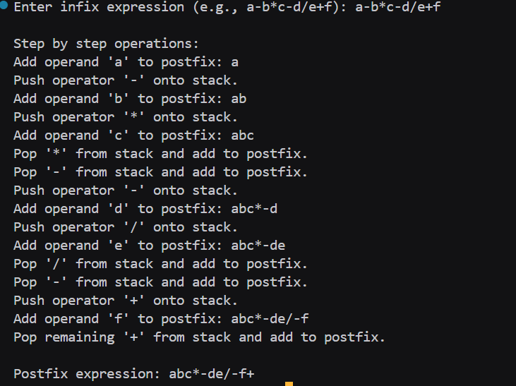

# Assignment no : 21
### Title : Implement a program to convert infix expression to postfix expression using stack data structure with step-by-step visualization.

#### Theory :
**Infix to Postfix Conversion** is a fundamental algorithm in computer science that transforms mathematical expressions from human-readable infix notation to computer-friendly postfix notation using a stack.

**Expression Notations:**
- **Infix**: Operator between operands (A + B)
- **Postfix**: Operator after operands (A B +)
- **Prefix**: Operator before operands (+ A B)

**Algorithm Steps:**
1. Scan the infix expression from left to right
2. If operand: Add directly to postfix
3. If operator: 
   - Pop operators with higher/equal precedence from stack
   - Push current operator onto stack
4. After scanning: Pop all remaining operators

**Time Complexity:** O(n) where n is the length of expression

#### Program :
```cpp
#include <iostream>
#include <stack>
#include <string>
using namespace std;

int precedence_rrl(char op) {
    if (op == '+' || op == '-') return 1;
    if (op == '*' || op == '/') return 2;
    return 0;
}

bool isOperator_rrl(char ch) {
    return ch == '+' || ch == '-' || ch == '*' || ch == '/';
}

string infixToPostfix_rrl(string infix) {
    stack<char> st;
    string postfix = "";

    cout << "\nStep by step operations:\n";
    for (char ch : infix) {
        if (isalnum(ch)) {
            postfix += ch;
            cout << "Add operand '" << ch << "' to postfix: " << postfix << endl;
        } else if (isOperator_rrl(ch)) {
            while (!st.empty() && precedence_rrl(st.top()) >= precedence_rrl(ch)) {
                cout << "Pop '" << st.top() << "' from stack and add to postfix.\n";
                postfix += st.top();
                st.pop();
            }
            st.push(ch);
            cout << "Push operator '" << ch << "' onto stack.\n";
        }
    }

    while (!st.empty()) {
        cout << "Pop remaining '" << st.top() << "' from stack and add to postfix.\n";
        postfix += st.top();
        st.pop();
    }

    return postfix;
}

int main() {
    string infix;
    cout << "Enter infix expression (e.g., a-b*c-d/e+f): ";
    cin >> infix;

    string postfix = infixToPostfix_rrl(infix);

    cout << "\nPostfix expression: " << postfix << endl;

    return 0;
}
```

### Output :

https://drive.google.com/file/d/1DPN7dE6IXsOaNBeiUDx6LBM5GikQPgnq/view?usp=drive_link