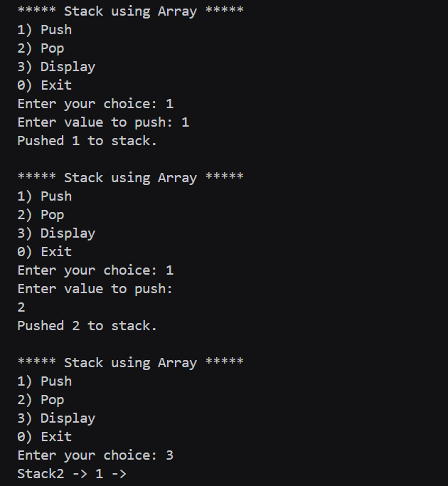
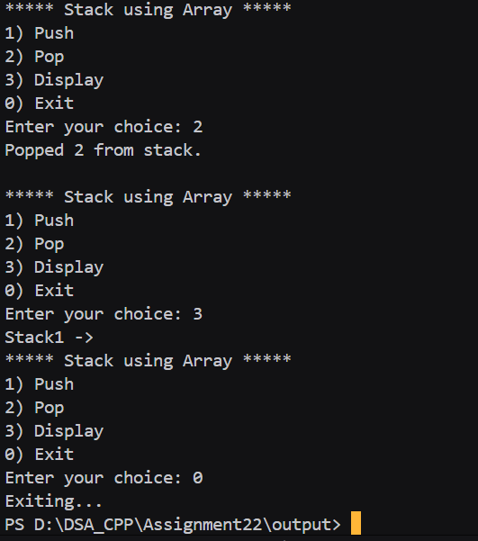

# Assignment no : 22
### Title : Implement stack data structure using array with basic operations like push, pop, and display.

#### Theory :
**Stack using Array** is a linear data structure that follows the Last-In-First-Out (LIFO) principle. It uses a fixed-size array to store elements and a top pointer to track the current position.

**Time Complexity:**
- Push: O(1)
- Pop: O(1)
- Top: O(1)
- Display: O(n)

#### Program :
```cpp
#include <iostream>
using namespace std;

#define MAX 100

typedef struct Stack {
    int arr[MAX];
    int top;
} Stack;

void initStack_rrl(Stack &s) {
    s.top = -1;
}

bool isEmpty_rrl(Stack &s) {
    return s.top == -1;
}

bool isFull_rrl(Stack &s) {
    return s.top == MAX - 1;
}

void push_rrl(Stack &s, int val) {
    if (isFull_rrl(s)) {
        cout << "Stack Overflow! Cannot push " << val << endl;
        return;
    }
    s.top++;
    s.arr[s.top] = val;
    cout << "Pushed " << val << " to stack." << endl;
}

void pop_rrl(Stack &s) {
    if (isEmpty_rrl(s)) {
        cout << "Stack Underflow! Nothing to pop." << endl;
        return;
    }
    int val = s.arr[s.top];
    s.top--;
    cout << "Popped " << val << " from stack." << endl;
}

void display_rrl(Stack &s) {
    if (isEmpty_rrl(s)) {
        cout << "Stack is empty." << endl;
        return;
    }
    cout <<"Stack";
    for (int i = s.top; i >= 0; i--) {
        cout << s.arr[i] << " -> ";
    }
    
}

int main() {
    Stack s;
    initStack_rrl(s);
    int ch, val;

    do {
        cout << "\n***** Stack using Array *****\n";
        cout << "1) Push\n";
        cout << "2) Pop\n";
        cout << "3) Display\n";
        cout << "0) Exit\n";
        cout << "Enter your choice: ";
        cin >> ch;

        switch(ch) {
            case 1:
                cout << "Enter value to push: ";
                cin >> val;
                push_rrl(s, val);
                break;
            case 2:
                pop_rrl(s);
                break;
            case 3:
                display_rrl(s);
                break;
            case 0:
                cout << "Exiting..." << endl;
                break;
            default:
                cout << "Invalid choice! Try again." << endl;
        }
    } while (ch != 0);

    return 0;
}
```

### Output  :



https://drive.google.com/drive/folders/1yedQs4N2YXnypv4yuYw6ZEtPRiD9fRJL?usp=drive_link