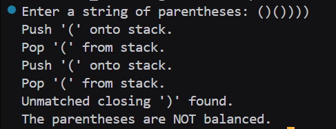

# Assignment no : 23
### Title : Implement a program to check if parentheses, brackets, and braces are balanced in an expression using stack data structure.

#### Theory :
**Balanced Parentheses Problem** is a classic application of stack data structure that checks whether opening and closing brackets are properly matched and nested in an expression.

**Types of Brackets:**
- **Parentheses**: ( )
- **Square Brackets**: [ ]
- **Curly Braces**: { }

**Balanced Expression Rules:**
1. Every opening bracket must have a corresponding closing bracket
2. Brackets must be closed in the correct order
3. No closing bracket should appear without a matching opening bracket

**Algorithm Steps:**
1. Scan the expression from left to right
2. If opening bracket: Push onto stack
3. If closing bracket:
   - Check if stack is empty (unmatched closing)
   - Pop from stack and check if it matches
   - If no match, expression is unbalanced
4. After scanning: Stack should be empty for balanced expression

**Time Complexity:** O(n) where n is the length of expression

#### Program :
```cpp
#include <iostream>
#include <stack>
#include <string>
using namespace std;

bool isMatching_rrl(char open, char close) {
    return (open == '(' && close == ')') ||
           (open == '{' && close == '}') ||
           (open == '[' && close == ']');
}

bool isBalanced_rrl(const string &expr) {
    stack<char> st;

    for (char ch : expr) {
        if (ch == '(' || ch == '{' || ch == '[') {
            st.push(ch);
            cout << "Push '" << ch << "' onto stack.\n";
        } else if (ch == ')' || ch == '}' || ch == ']') {
            if (st.empty()) {
                cout << "Unmatched closing '" << ch << "' found.\n";
                return false;
            }
            char top = st.top();
            st.pop();
            cout << "Pop '" << top << "' from stack.\n";
            if (!isMatching_rrl(top, ch)) {
                cout << "Mismatched pair: '" << top << "' and '" << ch << "'.\n";
                return false;
            }
        }
    }

    if (!st.empty()) {
        cout << "Unmatched opening brackets remain in stack.\n";
        return false;
    }

    return true;
}

int main() {
    string expr;
    cout << "Enter a string of parentheses: ";
    cin >> expr;

    if (isBalanced_rrl(expr)) {
        cout << "The parentheses are balanced.\n";
    } else {
        cout << "The parentheses are NOT balanced.\n";
    }

    return 0;
}
```

### Output 


https://drive.google.com/file/d/1PTdXuxXEktVMe_tZ5SeeD3XWycfIWib8/view?usp=drive_link