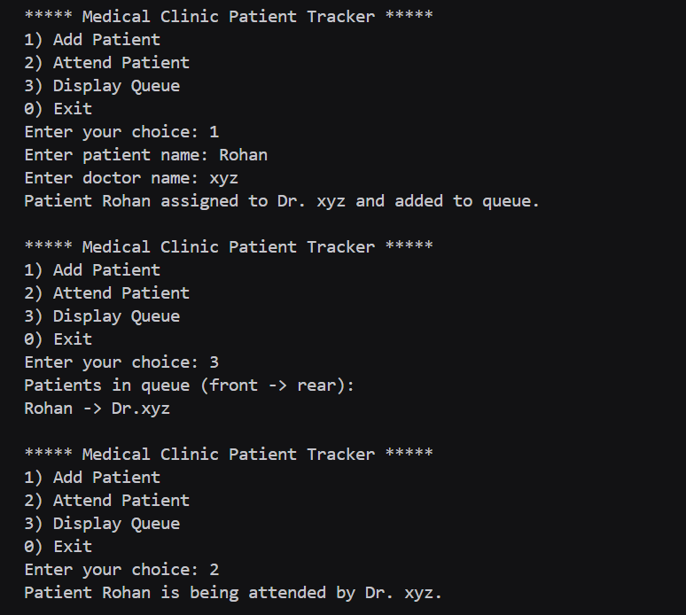

# Assignment no : 25
### Title : Implement a hospital patient management system using queue data structure with linked list implementation for patient scheduling.

#### Theory :
**Queue Data Structure** follows the First-In-First-Out (FIFO) principle, making it perfect for managing patient appointments in a hospital where patients are served in the order they arrive.

**Queue Operations:**
1. **Enqueue** - Add patient to the rear of queue
2. **Dequeue** - Remove patient from the front of queue
3. **Front** - View the next patient without removing
4. **Display** - Show all patients in queue

**FIFO Principle:**
- First patient to arrive is the first to be served
- Maintains fairness in patient scheduling
- Natural order for appointment systems


#### Program :
```cpp
#include <iostream>
#include <string>
using namespace std;

typedef struct Node {
    string patientName;
    string doctorName;
    Node* next;
} Node;

Node* createNode_rrl(string patient, string doctor) {
    Node* node = new Node;
    node->patientName = patient;
    node->doctorName = doctor;
    node->next = nullptr;
    return node;
}

class PatientQueue_rrl {
private:
    Node* front;
    Node* rear;

public:
    PatientQueue_rrl() {
        front = rear = nullptr;
    }

    bool isEmpty_rrl() {
        return front == nullptr;
    }

    void enqueue_rrl() {
        string patient, doctor;
        cout << "Enter patient name: ";
        cin >> patient;
        cout << "Enter doctor name: ";
        cin >> doctor;

        Node* node = createNode_rrl(patient, doctor);
        if (rear == nullptr) {
            front = rear = node;
        } else {
            rear->next = node;
            rear = node;
        }
        cout << "Patient " << patient << " assigned to Dr. " << doctor << " and added to queue.\n";
    }

    void dequeue_rrl() {
        if (isEmpty_rrl()) {
            cout << "No patients in queue.\n";
            return;
        }
        Node* temp = front;
        cout << "Patient " << temp->patientName << " is being attended by Dr. " << temp->doctorName << ".\n";
        front = front->next;
        if (!front) rear = nullptr;
        delete temp;
    }

    void display_rrl() {
        if (isEmpty_rrl()) {
            cout << "No patients in queue.\n";
            return;
        }
        Node* temp = front;
        cout << "Patients in queue (front -> rear):\n";
        while (temp) {
            cout << temp->patientName << " -> Dr." << temp->doctorName << endl;
            temp = temp->next;
        }
    }
};

int main() {
    PatientQueue_rrl queue;
    int ch;

    do {
        cout << "\n***** Medical Clinic Patient Tracker *****\n";
        cout << "1) Add Patient\n";
        cout << "2) Attend Patient\n";
        cout << "3) Display Queue\n";
        cout << "0) Exit\n";
        cout << "Enter your choice: ";
        cin >> ch;

        switch(ch) {
            case 1:
                queue.enqueue_rrl();
                break;
            case 2:
                queue.dequeue_rrl();
                break;
            case 3:
                queue.display_rrl();
                break;
            case 0:
                cout << "Exiting..." << endl;
                break;
            default:
                cout << "Invalid choice! Try again." << endl;
        }
    } while (ch != 0);

    return 0;
}
```


https://drive.google.com/file/d/1grRRLHErAY3kePpSu4mQTV6I0SoIm6CE/view?usp=drive_link