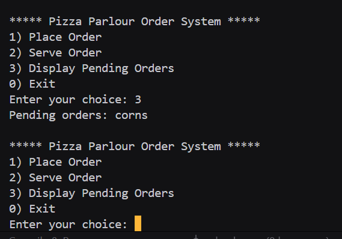

# Assignment no : 26
### Title : Implement a pizza parlour order management system using circular queue data structure with array implementation.

#### Theory :
**Circular Queue** is an advanced version of linear queue where the last position is connected to the first position, forming a circle. This eliminates the problem of wasted space in linear queues.

**Circular Queue Operations:**
1. **Enqueue** - Add element at rear position
2. **Dequeue** - Remove element from front position
3. **isFull** - Check if queue is completely filled
4. **isEmpty** - Check if queue has no elements

**Pizza Parlour Application:**
- Orders are processed in FIFO manner
- Limited kitchen capacity (fixed queue size)
- Continuous order processing
- Fair service to customers

**Time Complexity:**
- Enqueue: O(1)
- Dequeue: O(1)
- Display: O(n)

#### Program :
```cpp
#include <iostream>
#include <string>
using namespace std;

class PizzaQueue_rrl {
private:
    int front, rear, maxSize;
    string* orders;

public:
    PizzaQueue_rrl(int n) {
        maxSize = n;
        orders = new string[maxSize];
        front = rear = -1;
    }

    ~PizzaQueue_rrl() {
        delete[] orders;
    }

    bool isEmpty_rrl() {
        return front == -1;
    }

    bool isFull_rrl() {
        return ((rear + 1) % maxSize == front);
    }

    void placeOrder_rrl() {
        if (isFull_rrl()) {
            cout << "Order queue is full! Cannot accept new orders.\n";
            return;
        }
        string orderName;
        cout << "Enter order details (e.g., Pizza type): ";
        cin >> orderName;

        if (isEmpty_rrl()) {
            front = rear = 0;
        } else {
            rear = (rear + 1) % maxSize;
        }
        orders[rear] = orderName;
        cout << "Order '" << orderName << "' placed successfully.\n";
    }

    void serveOrder_rrl() {
        if (isEmpty_rrl()) {
            cout << "No orders to serve.\n";
            return;
        }
        cout << "Serving order: " << orders[front] << endl;
        if (front == rear) {
            front = rear = -1;
        } else {
            front = (front + 1) % maxSize;
        }
    }

    void displayOrders_rrl() {
        if (isEmpty_rrl()) {
            cout << "No pending orders.\n";
            return;
        }
        cout << "Pending orders: ";
        int i = front;
        while (true) {
            cout << orders[i] << " ";
            if (i == rear) break;
            i = (i + 1) % maxSize;
        }
        cout << endl;
    }
};

int main() {
    int n;
    cout << "Enter maximum number of orders the pizza parlour can accept: ";
    cin >> n;

    PizzaQueue_rrl pq(n);
    int ch;

    do {
        cout << "\n***** Pizza Parlour Order System *****\n";
        cout << "1) Place Order\n";
        cout << "2) Serve Order\n";
        cout << "3) Display Pending Orders\n";
        cout << "0) Exit\n";
        cout << "Enter your choice: ";
        cin >> ch;

        switch(ch) {
            case 1:
                pq.placeOrder_rrl();
                break;
            case 2:
                pq.serveOrder_rrl();
                break;
            case 3:
                pq.displayOrders_rrl();
                break;
            case 0:
                cout << "Exiting system...\n";
                break;
            default:
                cout << "Invalid choice! Try again.\n";
        }
    } while(ch != 0);

    return 0;
}
```



https://drive.google.com/file/d/1ShFf4Uv1x3T36aj9z642vm2qQ1im3Djq/view?usp=drive_link