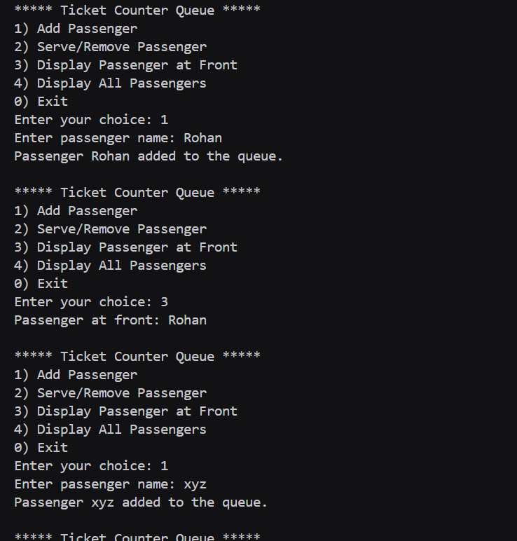
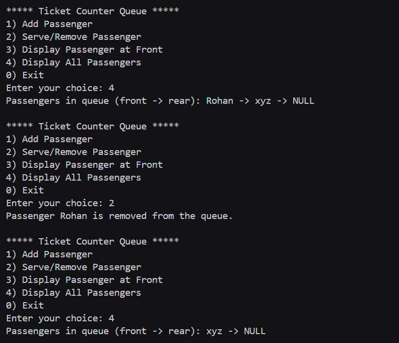

# Assignment no : 27
### Title : Implement a ticket counter passenger queue management system using queue data structure with linked list implementation.

#### Theory :
**Queue with Linked List Implementation** provides a dynamic queue structure that can grow and shrink as needed, perfect for managing passenger queues at ticket counters where the number of passengers varies.

**Ticket Counter Scenario:**
- Passengers arrive and join the queue
- Ticket agent serves passengers in order
- Queue length varies throughout the day
- Fair and organized service system

**Passenger Management Features:**
- Add passengers as they arrive
- Serve passengers in arrival order
- Track queue status
- Display waiting passengers

**Time Complexity:**
- Enqueue: O(1)
- Dequeue: O(1)
- Display: O(n)
- Count: O(1)


#### Program :
```cpp
#include <iostream>
#include <string>
using namespace std;

typedef struct Node {
    string passengerName;
    Node* next;
} Node;

Node* createNode_rrl(string name) {
    Node* node = new Node;
    node->passengerName = name;
    node->next = nullptr;
    return node;
}

class PassengerQueue_rrl {
private:
    Node* front;
    Node* rear;
    int count;

public:
    PassengerQueue_rrl() {
        front = rear = nullptr;
        count = 0;
    }

    bool isEmpty_rrl() {
        return front == nullptr;
    }

    void enqueue_rrl() {
        string name;
        cout << "Enter passenger name: ";
        cin >> name;

        Node* node = createNode_rrl(name);
        if (rear == nullptr) {
            front = rear = node;
        } else {
            rear->next = node;
            rear = node;
        }
        count++;
        cout << "Passenger " << name << " added to the queue.\n";
    }

    void dequeue_rrl() {
        if (isEmpty_rrl()) {
            cout << "No passengers to remove.\n";
            return;
        }
        Node* temp = front;
        cout << "Passenger " << temp->passengerName << " is removed from the queue.\n";
        front = front->next;
        if (!front) rear = nullptr;
        delete temp;
        count--;
    }

    void displayFront_rrl() {
        if (isEmpty_rrl()) {
            cout << "Queue is empty.\n";
            return;
        }
        cout << "Passenger at front: " << front->passengerName << endl;
    }

    void displayCount_rrl() {
        cout << "Total passengers left in queue: " << count << endl;
    }

    void displayQueue_rrl() {
        if (isEmpty_rrl()) {
            cout << "Queue is empty.\n";
            return;
        }
        Node* temp = front;
        cout << "Passengers in queue (front -> rear): ";
        while (temp) {
            cout << temp->passengerName << " -> ";
            temp = temp->next;
        }
        cout << "NULL\n";
    }
};

int main() {
    PassengerQueue_rrl queue;
    int ch;

    do {
        cout << "\n***** Ticket Counter Queue *****\n";
        cout << "1) Add Passenger\n";
        cout << "2) Serve/Remove Passenger\n";
        cout << "3) Display Passenger at Front\n";
        cout << "4) Display All Passengers\n";
        cout << "0) Exit\n";
        cout << "Enter your choice: ";
        cin >> ch;

        switch(ch) {
            case 1:
                queue.enqueue_rrl();
                break;
            case 2:
                queue.dequeue_rrl();
                break;
            case 3:
                queue.displayFront_rrl();
                break;
            case 4:
                queue.displayQueue_rrl();
                break;
            case 0:
                cout << "Exiting system...\n";
                queue.displayCount_rrl();
                break;
            default:
                cout << "Invalid choice! Try again.\n";
        }
    } while (ch != 0);

    return 0;
}
```





https://drive.google.com/drive/folders/1yrR_vJs7A9z_Ol6J6tXulbtSbkJPwXX_?usp=drive_link