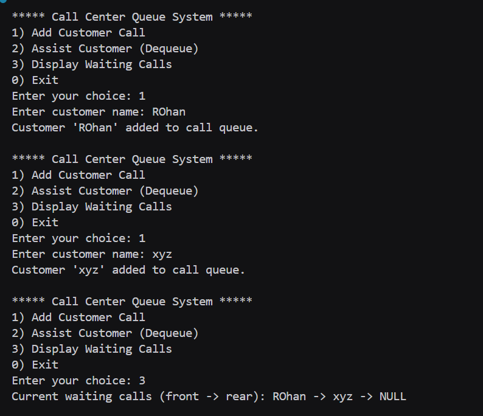
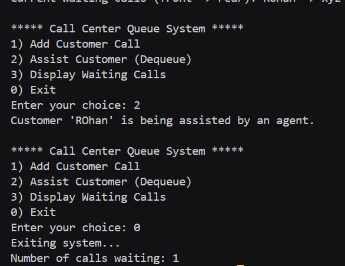

# Assignment no : 29
### Title : Implement a call center queue management system using queue data structure with linked list implementation for handling customer calls.

#### Theory :
**Call Center Queue System** uses queue data structure to manage incoming customer calls in a fair, first-come-first-served manner. This ensures efficient call handling and customer satisfaction.

**Call Center Operations:**
1. **Enqueue** - Add incoming customer call to queue
2. **Dequeue** - Assign waiting call to available agent
3. **Display Queue** - Show all waiting calls
4. **Count Calls** - Track number of waiting customers


#### Program :
```cpp
#include <iostream>
#include <string>
using namespace std;

typedef struct Node {
    string customerName;
    Node* next;
} Node;

Node* createNode_rrl(string name) {
    Node* node = new Node;
    node->customerName = name;
    node->next = nullptr;
    return node;
}

class CallQueue_rrl {
private:
    Node* front;
    Node* rear;
    int count;

public:
    CallQueue_rrl() {
        front = rear = nullptr;
        count = 0;
    }

    bool isEmpty_rrl() {
        return front == nullptr;
    }

    void enqueue_rrl() {
        string name;
        cout << "Enter customer name: ";
        cin >> name;
        Node* node = createNode_rrl(name);
        if (rear == nullptr) {
            front = rear = node;
        } else {
            rear->next = node;
            rear = node;
        }
        count++;
        cout << "Customer '" << name << "' added to call queue.\n";
    }

    void dequeue_rrl() {
        if (isEmpty_rrl()) {
            cout << "No calls waiting. System is idle.\n";
            return;
        }
        Node* temp = front;
        cout << "Customer '" << temp->customerName << "' is being assisted by an agent.\n";
        front = front->next;
        if (!front) rear = nullptr;
        delete temp;
        count--;
    }

    void displayQueue_rrl() {
        if (isEmpty_rrl()) {
            cout << "No calls waiting.\n";
            return;
        }
        Node* temp = front;
        cout << "Current waiting calls (front -> rear): ";
        while (temp) {
            cout << temp->customerName << " -> ";
            temp = temp->next;
        }
        cout << "NULL\n";
    }

    void displayCount_rrl() {
        cout << "Number of calls waiting: " << count << endl;
    }
};

int main() {
    CallQueue_rrl queue;
    int ch;

    do {
        cout << "\n***** Call Center Queue System *****\n";
        cout << "1) Add Customer Call\n";
        cout << "2) Assist Customer (Dequeue)\n";
        cout << "3) Display Waiting Calls\n";
        cout << "0) Exit\n";
        cout << "Enter your choice: ";
        cin >> ch;

        switch(ch) {
            case 1:
                queue.enqueue_rrl();
                break;
            case 2:
                queue.dequeue_rrl();
                break;
            case 3:
                queue.displayQueue_rrl();
                break;
            case 0:
                cout << "Exiting system...\n";
                queue.displayCount_rrl();
                break;
            default:
                cout << "Invalid choice! Try again.\n";
        }
    } while (ch != 0);

    return 0;
}
```



https://drive.google.com/drive/folders/1ClLPZaEIVINIelWVZ28Y37NVIGiHotvg?usp=drive_link