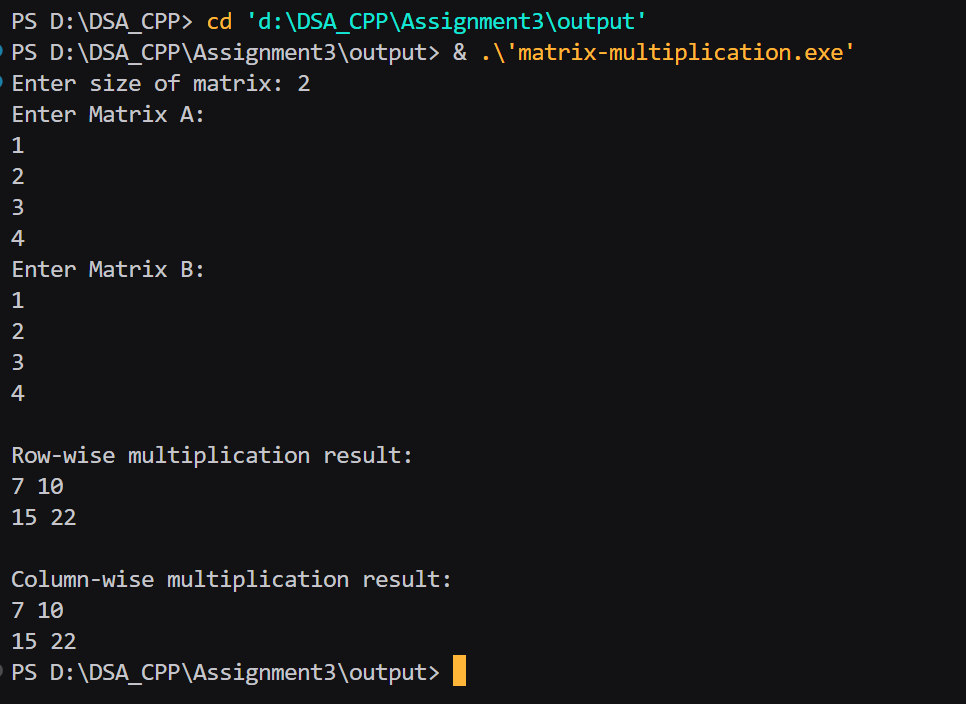

# Assignment Number : 3
### Title :
#### Implement matrix multiplication and analyse its performance using row-major vs column-major order access patterns to understand how memory layout affects cache performance.

##### ----- Algoritham ------ 
1) Start the program.

2) Declare integer pointers for 2D arrays A, B, RowResult, and ColResult.

3) Ask the user to enter the size n of the square matrices.

4) Dynamically allocate memory for all 2D arrays (A, B, RowResult, ColResult).

5) Allocate an array of row pointers first.

6) Then allocate memory for each row.

7) Check if memory allocation was successful.
→ If not, display an error message and exit the program.

8) Input all elements of Matrix A from the user.

9) Input all elements of Matrix B from the user.

9) Perform Row-wise multiplication:
For each row i of A,
For each column j of B,
Initialize RowResult[i][j] = 0.
Multiply corresponding elements and accumulate the sum.

10) Perform Column-wise multiplication:
For each column j of B,
For each row i of A,
Initialize ColResult[i][j] = 0.
Multiply corresponding elements and accumulate the sum.

11) Print the Row-wise result matrix.

12) Print the Column-wise result matrix.

13) Free the dynamically allocated memory for all matrices (A, B, RowResult, ColResult).

14) Set all pointers to NULL (best practice).

15) End the program.

```
#include <iostream>
using namespace std;

int main() {
    int n;
    cout << "Enter size of matrix: ";
    cin >> n;

    // allocate pointers for rows
    int **A = new int*[n];
    int **B = new int*[n];
    int **RowResult = new int*[n];
    int **ColResult = new int*[n];

    // allocate memory for each row
    for (int i = 0; i < n; i++) {
        A[i] = new int[n];
        B[i] = new int[n];
        RowResult[i] = new int[n];
        ColResult[i] = new int[n];
    }

    // input A
    cout << "Enter Matrix A:\n";
    for (int i = 0; i < n; i++)
        for (int j = 0; j < n; j++)
            cin >> A[i][j];

    // input B
    cout << "Enter Matrix B:\n";
    for (int i = 0; i < n; i++)
        for (int j = 0; j < n; j++)
            cin >> B[i][j];

    // Row-wise multiplication
    for (int i = 0; i < n; i++) {
        for (int j = 0; j < n; j++) {
            RowResult[i][j] = 0;
            for (int k = 0; k < n; k++) {
                RowResult[i][j] += A[i][k] * B[k][j];
            }
        }
    }

    // Column-wise multiplication
    for (int j = 0; j < n; j++) {
        for (int i = 0; i < n; i++) {
            ColResult[i][j] = 0;
            for (int k = 0; k < n; k++) {
                ColResult[i][j] += A[i][k] * B[k][j];
            }
        }
    }

    // print Row-wise result
    cout << "\nRow-wise multiplication result:\n";
    for (int i = 0; i < n; i++) {
        for (int j = 0; j < n; j++) {
            cout << RowResult[i][j] << " ";
        }
        cout << endl;
    }

    // print Column-wise result
    cout << "\nColumn-wise multiplication result:\n";
    for (int i = 0; i < n; i++) {
        for (int j = 0; j < n; j++) {
            cout << ColResult[i][j] << " ";
        }
        cout << endl;
    }

    // free memory
    for (int i = 0; i < n; i++) {
        delete[] A[i];
        delete[] B[i];
        delete[] RowResult[i];
        delete[] ColResult[i];
    }
    delete[] A;
    delete[] B;
    delete[] RowResult;
    delete[] ColResult;

    return 0;
}
```
## 


