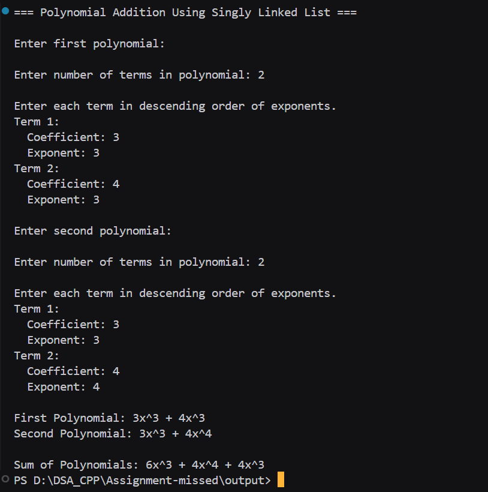

# Assignment-missed
### Title : Implement polynomial addition using singly linked list to represent and manipulate polynomial expressions.

#### Theory :
**Polynomial Representation using Linked Lists** is an efficient way to store and manipulate polynomial expressions where each node contains a coefficient and exponent pair. This representation is particularly useful for sparse polynomials.

**Polynomial Addition Algorithm:**
1. Compare exponents of current terms from both polynomials
2. If exponents are equal: Add coefficients
3. If first exponent > second: Copy first term
4. If second exponent > first: Copy second term
5. Move to next term and repeat
6. Copy remaining terms from longer polynomial

**Example Addition:**
- P1(x) = 5x³ + 3x² + 2
- P2(x) = 4x³ + x² + 3x + 1
- Sum = 9x³ + 4x² + 3x + 3

#### Program :
```cpp
#include <iostream>
using namespace std;

struct Node {
    int coeff;
    int exp;
    Node* next;
};

Node* createNode(int coeff, int exp) {
    Node* node = new Node;
    node->coeff = coeff;
    node->exp = exp;
    node->next = nullptr;
    return node;
}

Node* createPoly() {
    int n;
    cout << "\nEnter number of terms in polynomial: ";
    cin >> n;

    Node* head = nullptr;
    Node* tail = nullptr;

    cout << "\nEnter each term in descending order of exponents.\n";
    for (int i = 0; i < n; i++) {
        int coeff, exp;
        cout << "Term " << i + 1 << ":\n";
        cout << "  Coefficient: ";
        cin >> coeff;
        cout << "  Exponent: ";
        cin >> exp;

        Node* node = createNode(coeff, exp);
        if (!head)
            head = tail = node;
        else {
            tail->next = node;
            tail = node;
        }
    }
    return head;
}

void display(Node* head) {
    if (!head) {
        cout << "0";
        return;
    }
    Node* temp = head;
    while (temp) {
        cout << temp->coeff << "x^" << temp->exp;
        if (temp->next && temp->next->coeff >= 0)
            cout << " + ";
        else if (temp->next)
            cout << " ";
        temp = temp->next;
    }
    cout << endl;
}

Node* addPoly(Node* p1, Node* p2) {
    Node* result = nullptr;
    Node* tail = nullptr;

    while (p1 && p2) {
        Node* node = nullptr;

        if (p1->exp > p2->exp) {
            node = createNode(p1->coeff, p1->exp);
            p1 = p1->next;
        } else if (p1->exp < p2->exp) {
            node = createNode(p2->coeff, p2->exp);
            p2 = p2->next;
        } else {
            int sum = p1->coeff + p2->coeff;
            if (sum != 0)
                node = createNode(sum, p1->exp);
            p1 = p1->next;
            p2 = p2->next;
        }

        if (node) {
            if (!result)
                result = tail = node;
            else {
                tail->next = node;
                tail = node;
            }
        }
    }

    while (p1) {
        Node* node = createNode(p1->coeff, p1->exp);
        if (!result)
            result = tail = node;
        else {
            tail->next = node;
            tail = node;
        }
        p1 = p1->next;
    }
    while (p2) {
        Node* node = createNode(p2->coeff, p2->exp);
        if (!result)
            result = tail = node;
        else {
            tail->next = node;
            tail = node;
        }
        p2 = p2->next;
    }

    return result;
}

int main() {
    cout << "=== Polynomial Addition Using Singly Linked List ===\n";

    cout << "\nEnter first polynomial:\n";
    Node* poly1 = createPoly();

    cout << "\nEnter second polynomial:\n";
    Node* poly2 = createPoly();

    cout << "\nFirst Polynomial: ";
    display(poly1);

    cout << "Second Polynomial: ";
    display(poly2);

    Node* sum = addPoly(poly1, poly2);

    cout << "\nSum of Polynomials: ";
    display(sum);

    return 0;
}

```


https://drive.google.com/file/d/1N5fFbrGPAsjooqpJ7txMQtDF2YGfW1Ae/view?usp=drive_link