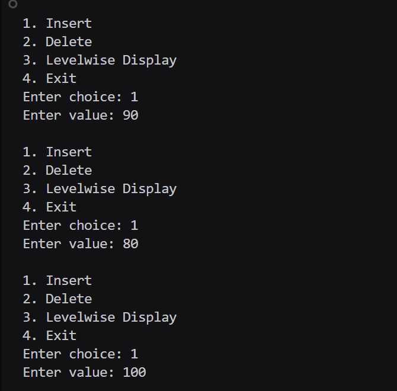
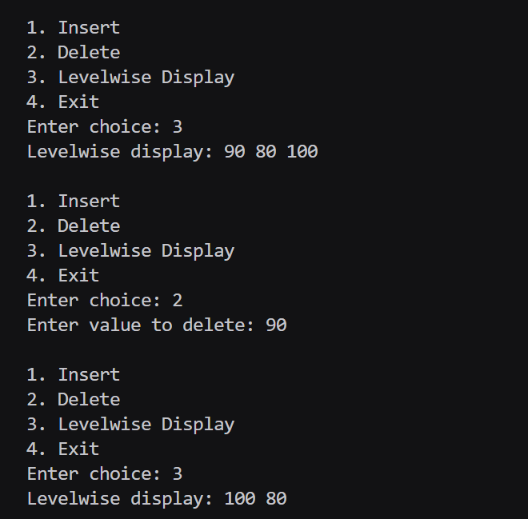

# Assignment No : 24  
### **Title:** Implement a program to perform Binary Search Tree (BST) operations — Create, Insert, Delete, and Levelwise Display.

---

## **Theory**

A **Binary Search Tree (BST)** is a type of binary tree where each node follows a specific ordering property:

- The **left subtree** of a node contains values **less than** the node’s key.  
- The **right subtree** of a node contains values **greater than** the node’s key.  

This property ensures efficient **search**, **insertion**, and **deletion** operations.

---

### **BST Operations**

1. **Create:**  
   Initializes an empty tree (root = NULL).

2. **Insert:**  
   Adds a new node at its appropriate position following BST rules:  
   - If the new value < current node → go to left subtree.  
   - If the new value > current node → go to right subtree.  

3. **Delete:**  
   Removes a node while maintaining BST structure.  
   - **Case 1:** Node has **no children** — delete directly.  
   - **Case 2:** Node has **one child** — connect parent to that child.  
   - **Case 3:** Node has **two children** — replace with inorder successor (smallest in right subtree).

4. **Levelwise Display (Level Order Traversal):**  
   Displays all nodes level by level using a queue.

---

### **Algorithm Steps**

1. Create an empty tree.  
2. Insert elements one by one by comparing with current node values.  
3. For deletion:
   - Search for the node.
   - Apply one of the three deletion cases.
4. Use queue-based traversal to display nodes level-wise.  

---

## **Program**

```cpp
#include <iostream>
#include <queue>
using namespace std;

struct Node {
    int data;
    Node* left;
    Node* right;
};

Node* createNode(int value) {
    Node* newNode = new Node();
    newNode->data = value;
    newNode->left = newNode->right = NULL;
    return newNode;
}

Node* insert(Node* root_rrl, int value_rrl) {
    if (root_rrl == NULL)
        return createNode(value_rrl);
    if (value_rrl < root_rrl->data)
        root_rrl->left = insert(root_rrl->left, value_rrl);
    else if (value_rrl > root_rrl->data)
        root_rrl->right = insert(root_rrl->right, value_rrl);
    return root_rrl;
}

Node* findMin(Node* root_rrl) {
    while (root_rrl && root_rrl->left != NULL)
        root_rrl = root_rrl->left;
    return root_rrl;
}

Node* deleteNode(Node* root_rrl, int key_rrl) {
    if (root_rrl == NULL)
        return root_rrl;
    if (key_rrl < root_rrl->data)
        root_rrl->left = deleteNode(root_rrl->left, key_rrl);
    else if (key_rrl > root_rrl->data)
        root_rrl->right = deleteNode(root_rrl->right, key_rrl);
    else {
        if (root_rrl->left == NULL && root_rrl->right == NULL) {
            delete root_rrl;
            return NULL;
        } else if (root_rrl->left == NULL) {
            Node* temp_rrl = root_rrl->right;
            delete root_rrl;
            return temp_rrl;
        } else if (root_rrl->right == NULL) {
            Node* temp_rrl = root_rrl->left;
            delete root_rrl;
            return temp_rrl;
        } else {
            Node* temp_rrl = findMin(root_rrl->right);
            root_rrl->data = temp_rrl->data;
            root_rrl->right = deleteNode(root_rrl->right, temp_rrl->data);
        }
    }
    return root_rrl;
}

void levelwiseDisplay(Node* root_rrl) {
    if (root_rrl == NULL) return;
    queue<Node*> q_rrl;
    q_rrl.push(root_rrl);
    while (!q_rrl.empty()) {
        Node* curr_rrl = q_rrl.front();
        q_rrl.pop();
        cout << curr_rrl->data << " ";
        if (curr_rrl->left) q_rrl.push(curr_rrl->left);
        if (curr_rrl->right) q_rrl.push(curr_rrl->right);
    }
}

int main() {
    Node* root_rrl = NULL;
    int choice_rrl, val_rrl;
    while (true) {
        cout << "\n1. Insert\n2. Delete\n3. Levelwise Display\n4. Exit\nEnter choice: ";
        cin >> choice_rrl;
        switch (choice_rrl) {
            case 1:
                cout << "Enter value: ";
                cin >> val_rrl;
                root_rrl = insert(root_rrl, val_rrl);
                break;
            case 2:
                cout << "Enter value to delete: ";
                cin >> val_rrl;
                root_rrl = deleteNode(root_rrl, val_rrl);
                break;
            case 3:
                cout << "Levelwise display: ";
                levelwiseDisplay(root_rrl);
                cout << endl;
                break;
            case 4:
                return 0;
        }
    }
}
```
## Output 

