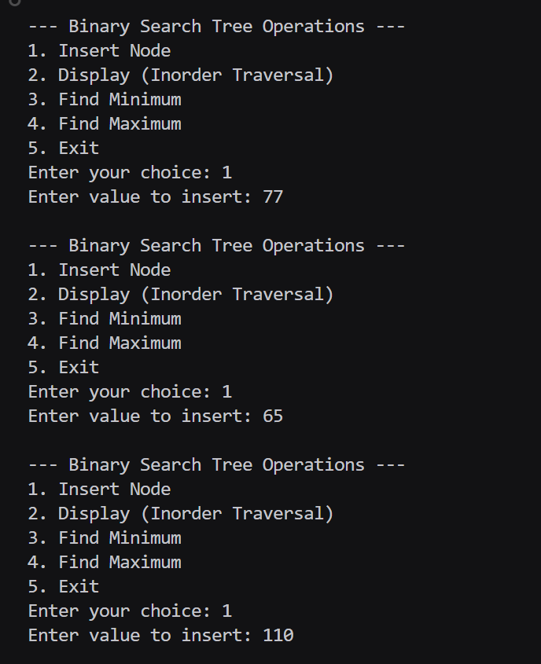
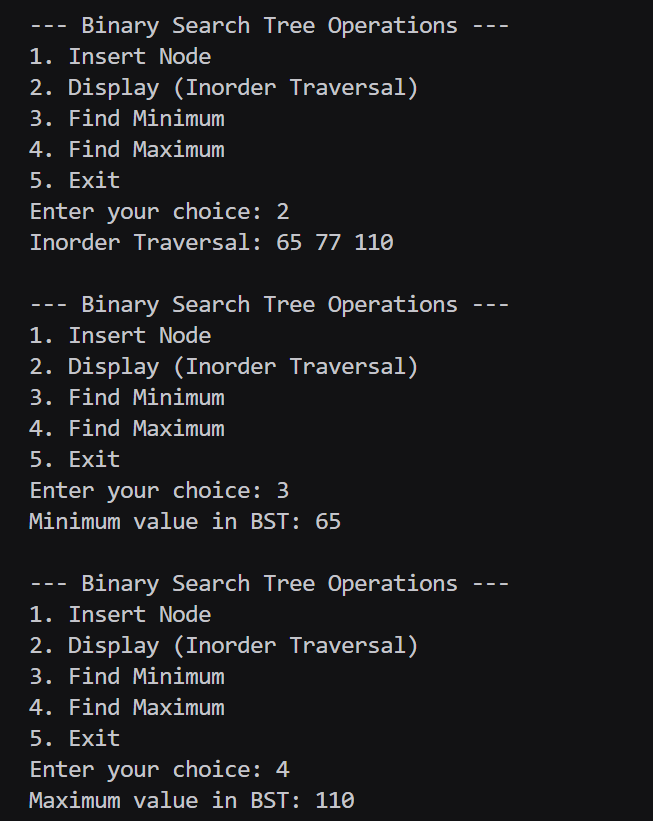

# Assignment No: 26
### **Title:** Write a Program to create a Binary Search Tree (BST) and find Minimum/Maximum value in BST.

---

### **Theory:**

A **Binary Search Tree (BST)** is a binary tree data structure where each node follows the property:

- All nodes in the **left subtree** have values **less than** the root.
- All nodes in the **right subtree** have values **greater than** the root.

This structure allows efficient **search, insertion, deletion, and finding of minimum/maximum** elements.

---

### **BST Operations:**

#### 1. **Insert Node**
- If the tree is empty → new node becomes the root.  
- If the new value < root → insert into left subtree.  
- If the new value > root → insert into right subtree.  

#### 2. **Find Minimum**
- The **leftmost node** in the BST has the minimum value.  
- Traverse continuously to the **left child** until `NULL` is reached.

#### 3. **Find Maximum**
- The **rightmost node** in the BST has the maximum value.  
- Traverse continuously to the **right child** until `NULL` is reached.

---

### **Algorithm Steps:**
1. Start with `root = NULL`.
2. Insert elements to form a BST.
3. For minimum: move to the **left child** until `NULL`.
4. For maximum: move to the **right child** until `NULL`.
5. Display results.

---

### **Program:**
```
#include <iostream>
using namespace std;

struct Node_rrl {
    int data_rrl;
    Node_rrl* left_rrl;
    Node_rrl* right_rrl;
};

Node_rrl* createNode_rrl(int val_rrl) {
    Node_rrl* newNode_rrl = new Node_rrl();
    newNode_rrl->data_rrl = val_rrl;
    newNode_rrl->left_rrl = newNode_rrl->right_rrl = nullptr;
    return newNode_rrl;
}

Node_rrl* insert_rrl(Node_rrl* root_rrl, int val_rrl) {
    if (root_rrl == nullptr)
        return createNode_rrl(val_rrl);
    if (val_rrl < root_rrl->data_rrl)
        root_rrl->left_rrl = insert_rrl(root_rrl->left_rrl, val_rrl);
    else if (val_rrl > root_rrl->data_rrl)
        root_rrl->right_rrl = insert_rrl(root_rrl->right_rrl, val_rrl);
    return root_rrl;
}

int findMin_rrl(Node_rrl* root_rrl) {
    if (root_rrl == nullptr) {
        cout << "Tree is empty.\n";
        return -1;
    }
    Node_rrl* temp_rrl = root_rrl;
    while (temp_rrl->left_rrl != nullptr)
        temp_rrl = temp_rrl->left_rrl;
    return temp_rrl->data_rrl;
}

int findMax_rrl(Node_rrl* root_rrl) {
    if (root_rrl == nullptr) {
        cout << "Tree is empty.\n";
        return -1;
    }
    Node_rrl* temp_rrl = root_rrl;
    while (temp_rrl->right_rrl != nullptr)
        temp_rrl = temp_rrl->right_rrl;
    return temp_rrl->data_rrl;
}

void inorder_rrl(Node_rrl* root_rrl) {
    if (root_rrl != nullptr) {
        inorder_rrl(root_rrl->left_rrl);
        cout << root_rrl->data_rrl << " ";
        inorder_rrl(root_rrl->right_rrl);
    }
}

int main() {
    Node_rrl* root_rrl = nullptr;
    int choice_rrl, val_rrl;

    do {
        cout << "\n--- Binary Search Tree Operations ---\n";
        cout << "1. Insert Node\n";
        cout << "2. Display (Inorder Traversal)\n";
        cout << "3. Find Minimum\n";
        cout << "4. Find Maximum\n";
        cout << "5. Exit\n";
        cout << "Enter your choice: ";
        cin >> choice_rrl;

        switch (choice_rrl) {
            case 1:
                cout << "Enter value to insert: ";
                cin >> val_rrl;
                root_rrl = insert_rrl(root_rrl, val_rrl);
                break;

            case 2:
                cout << "Inorder Traversal: ";
                inorder_rrl(root_rrl);
                cout << endl;
                break;

            case 3:
                cout << "Minimum value in BST: " << findMin_rrl(root_rrl) << endl;
                break;

            case 4:
                cout << "Maximum value in BST: " << findMax_rrl(root_rrl) << endl;
                break;

            case 5:
                cout << "Exiting program.\n";
                break;

            default:
                cout << "Invalid choice.\n";
        }

    } while (choice_rrl != 5);

    return 0;
}
```

### Output 

