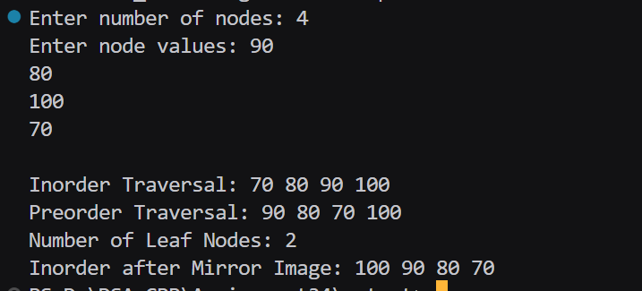

# Assignment No : 26
### Title : Write a Program to create a Binary Tree and perform following operations on it using recursion:
a. Inorder Traversal  
b. Preorder Traversal  
c. Display Number of Leaf Nodes  
d. Mirror Image  

---

### Theory :
A **Binary Tree** is a hierarchical data structure in which each node has at most two children, referred to as the left child and the right child.

Each node contains:
- Data
- Pointer to the left child
- Pointer to the right child

**Tree Traversals:**
1. **Inorder (Left → Root → Right)**
2. **Preorder (Root → Left → Right)**

**Leaf Node:**  
A node that does not have any children (both left and right pointers are `NULL`).

**Mirror Image:**  
Swapping the left and right child nodes of every node in the tree recursively.


---

### Program :
```
#include <iostream>
using namespace std;

struct Node_rrl {
    int data_rrl;
    Node_rrl* left_rrl;
    Node_rrl* right_rrl;
};

Node_rrl* createNode_rrl(int data_rrl) {
    Node_rrl* newNode_rrl = new Node_rrl();
    newNode_rrl->data_rrl = data_rrl;
    newNode_rrl->left_rrl = nullptr;
    newNode_rrl->right_rrl = nullptr;
    return newNode_rrl;
}

Node_rrl* insert_rrl(Node_rrl* root_rrl, int data_rrl) {
    if (root_rrl == nullptr)
        return createNode_rrl(data_rrl);

    if (data_rrl < root_rrl->data_rrl)
        root_rrl->left_rrl = insert_rrl(root_rrl->left_rrl, data_rrl);
    else
        root_rrl->right_rrl = insert_rrl(root_rrl->right_rrl, data_rrl);

    return root_rrl;
}

void inorder_rrl(Node_rrl* root_rrl) {
    if (root_rrl != nullptr) {
        inorder_rrl(root_rrl->left_rrl);
        cout << root_rrl->data_rrl << " ";
        inorder_rrl(root_rrl->right_rrl);
    }
}

void preorder_rrl(Node_rrl* root_rrl) {
    if (root_rrl != nullptr) {
        cout << root_rrl->data_rrl << " ";
        preorder_rrl(root_rrl->left_rrl);
        preorder_rrl(root_rrl->right_rrl);
    }
}

int countLeafNodes_rrl(Node_rrl* root_rrl) {
    if (root_rrl == nullptr)
        return 0;
    if (root_rrl->left_rrl == nullptr && root_rrl->right_rrl == nullptr)
        return 1;
    return countLeafNodes_rrl(root_rrl->left_rrl) + countLeafNodes_rrl(root_rrl->right_rrl);
}

void mirror_rrl(Node_rrl* root_rrl) {
    if (root_rrl == nullptr)
        return;
    swap(root_rrl->left_rrl, root_rrl->right_rrl);
    mirror_rrl(root_rrl->left_rrl);
    mirror_rrl(root_rrl->right_rrl);
}

int main() {
    Node_rrl* root_rrl = nullptr;
    int n_rrl, data_rrl;

    cout << "Enter number of nodes: ";
    cin >> n_rrl;

    cout << "Enter node values: ";
    for (int i = 0; i < n_rrl; i++) {
        cin >> data_rrl;
        root_rrl = insert_rrl(root_rrl, data_rrl);
    }

    cout << "\nInorder Traversal: ";
    inorder_rrl(root_rrl);

    cout << "\nPreorder Traversal: ";
    preorder_rrl(root_rrl);

    cout << "\nNumber of Leaf Nodes: " << countLeafNodes_rrl(root_rrl);

    mirror_rrl(root_rrl);
    cout << "\nInorder after Mirror Image: ";
    inorder_rrl(root_rrl);

    return 0;
}
```

### Output
