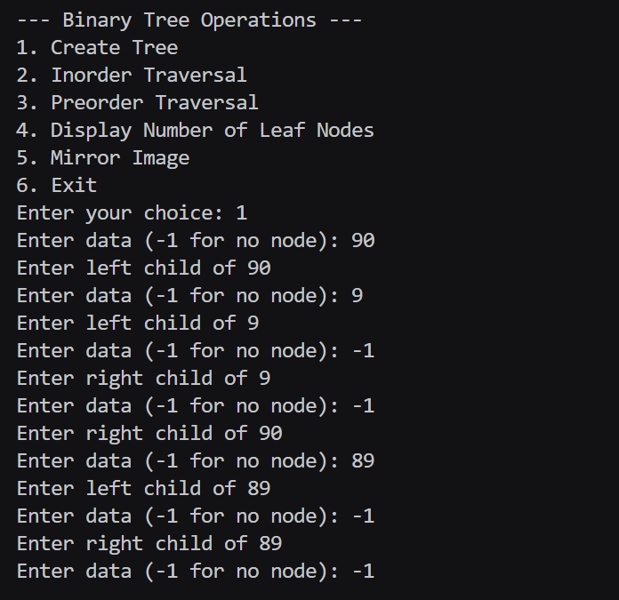
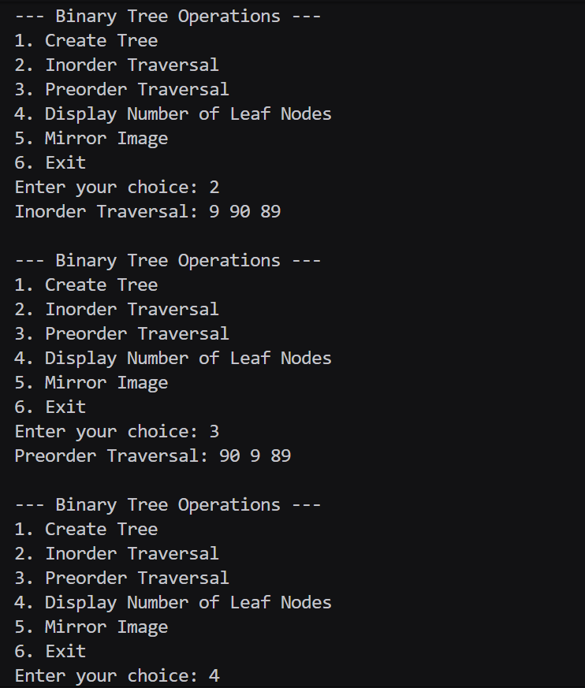
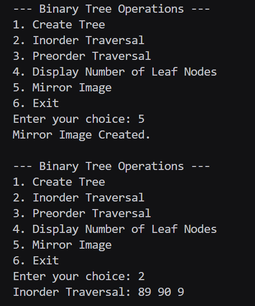

# Assignment No : 35
### Title : Write a Program to create a Binary Tree and perform the following Recursive operations on it:
a. Inorder Traversal  
b. Preorder Traversal  
c. Display Number of Leaf Nodes  
d. Mirror Image  

---

### Theory :
A **Binary Tree** is a hierarchical data structure in which each node has at most two children, referred to as the left child and the right child.

Each node contains:
- Data
- Pointer to the left child
- Pointer to the right child

**Tree Traversals:**
1. **Inorder Traversal (Left → Root → Right)**
2. **Preorder Traversal (Root → Left → Right)**

**Leaf Node:**  
A node that has no children (both left and right pointers are `NULL`).

**Mirror Image:**  
Swapping the left and right child nodes of every node recursively.

### Program :
```
#include <iostream>
using namespace std;

struct Node {
    int data_rrl;
    Node* left_rrl;
    Node* right_rrl;
};

Node* createNode(int data_rrl) {
    Node* newNode_rrl = new Node();
    newNode_rrl->data_rrl = data_rrl;
    newNode_rrl->left_rrl = nullptr;
    newNode_rrl->right_rrl = nullptr;
    return newNode_rrl;
}

Node* createTree_rrl() {
    int data_rrl;
    cout << "Enter data (-1 for no node): ";
    cin >> data_rrl;
    if (data_rrl == -1)
        return nullptr;

    Node* newNode_rrl = createNode(data_rrl);
    cout << "Enter left child of " << data_rrl << endl;
    newNode_rrl->left_rrl = createTree_rrl();

    cout << "Enter right child of " << data_rrl << endl;
    newNode_rrl->right_rrl = createTree_rrl();

    return newNode_rrl;
}

void inorder_rrl(Node* root_rrl) {
    if (root_rrl == nullptr)
        return;
    inorder_rrl(root_rrl->left_rrl);
    cout << root_rrl->data_rrl << " ";
    inorder_rrl(root_rrl->right_rrl);
}

void preorder_rrl(Node* root_rrl) {
    if (root_rrl == nullptr)
        return;
    cout << root_rrl->data_rrl << " ";
    preorder_rrl(root_rrl->left_rrl);
    preorder_rrl(root_rrl->right_rrl);
}

int countLeafNodes_rrl(Node* root_rrl) {
    if (root_rrl == nullptr)
        return 0;
    if (root_rrl->left_rrl == nullptr && root_rrl->right_rrl == nullptr)
        return 1;
    return countLeafNodes_rrl(root_rrl->left_rrl) + countLeafNodes_rrl(root_rrl->right_rrl);
}

void mirror_rrl(Node* root_rrl) {
    if (root_rrl == nullptr)
        return;
    mirror_rrl(root_rrl->left_rrl);
    mirror_rrl(root_rrl->right_rrl);
    Node* temp_rrl = root_rrl->left_rrl;
    root_rrl->left_rrl = root_rrl->right_rrl;
    root_rrl->right_rrl = temp_rrl;
}

int main() {
    Node* root_rrl = nullptr;
    int choice_rrl;

    while (true) {
        cout << "\n--- Binary Tree Operations ---\n";
        cout << "1. Create Tree\n";
        cout << "2. Inorder Traversal\n";
        cout << "3. Preorder Traversal\n";
        cout << "4. Display Number of Leaf Nodes\n";
        cout << "5. Mirror Image\n";
        cout << "6. Exit\n";
        cout << "Enter your choice: ";
        cin >> choice_rrl;

        switch (choice_rrl) {
        case 1:
            root_rrl = createTree_rrl();
            break;
        case 2:
            cout << "Inorder Traversal: ";
            inorder_rrl(root_rrl);
            cout << endl;
            break;
        case 3:
            cout << "Preorder Traversal: ";
            preorder_rrl(root_rrl);
            cout << endl;
            break;
        case 4:
            cout << "Number of Leaf Nodes: " << countLeafNodes_rrl(root_rrl) << endl;
            break;
        case 5:
            mirror_rrl(root_rrl);
            cout << "Mirror Image Created.\n";
            break;
        case 6:
            return 0;
        default:
            cout << "Invalid Choice!\n";
        }
    }
}

```

### Output :


