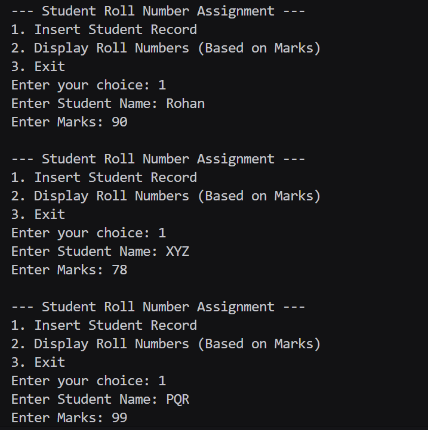
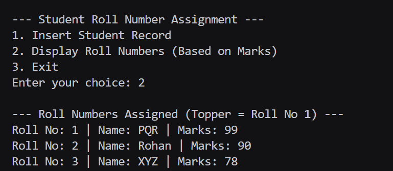

# Assignment No: 36  
### Unit: IV  
### Title:  
Write a program, using trees, to assign the roll numbers to the students of your class as per their previous year's result.  
*(i.e., the topper will be roll no. 1)*  

---

##  Theory

A **Binary Search Tree (BST)** is a non-linear data structure where:
- Each node contains a value (here, student marks).
- The **left child** contains values smaller than the parent.
- The **right child** contains values greater than the parent.

This property allows easy sorting and retrieval of students according to marks.

---

##  Logic
1. Each student is represented as a node containing:
   - Name  
   - Marks  

2. Insert each student into the BST according to their marks.

3. Perform a **Reverse Inorder Traversal** (Right → Root → Left)  
   - This gives students in **descending order** of marks.  
   - Assign roll numbers starting from 1 (topper).

---

### Code 
```
#include <iostream>
#include <string>
using namespace std;

struct Node {
    string name_rrl;
    int marks_rrl;
    Node* left_rrl;
    Node* right_rrl;
};

Node* createNode(string name_rrl, int marks_rrl) {
    Node* newNode_rrl = new Node();
    newNode_rrl->name_rrl = name_rrl;
    newNode_rrl->marks_rrl = marks_rrl;
    newNode_rrl->left_rrl = nullptr;
    newNode_rrl->right_rrl = nullptr;
    return newNode_rrl;
}

Node* insert_rrl(Node* root_rrl, string name_rrl, int marks_rrl) {
    if (root_rrl == nullptr)
        return createNode(name_rrl, marks_rrl);

    if (marks_rrl < root_rrl->marks_rrl)
        root_rrl->left_rrl = insert_rrl(root_rrl->left_rrl, name_rrl, marks_rrl);
    else
        root_rrl->right_rrl = insert_rrl(root_rrl->right_rrl, name_rrl, marks_rrl);

    return root_rrl;
}

void assignRollNumbers_rrl(Node* root_rrl, int& roll_rrl) {
    if (root_rrl == nullptr)
        return;
    assignRollNumbers_rrl(root_rrl->right_rrl, roll_rrl); // Higher marks first
    cout << "Roll No: " << roll_rrl << " | Name: " << root_rrl->name_rrl << " | Marks: " << root_rrl->marks_rrl << endl;
    roll_rrl++;
    assignRollNumbers_rrl(root_rrl->left_rrl, roll_rrl);
}

int main() {
    Node* root_rrl = nullptr;
    int choice_rrl;
    string name_rrl;
    int marks_rrl;

    while (true) {
        cout << "\n--- Student Roll Number Assignment ---\n";
        cout << "1. Insert Student Record\n";
        cout << "2. Display Roll Numbers (Based on Marks)\n";
        cout << "3. Exit\n";
        cout << "Enter your choice: ";
        cin >> choice_rrl;

        switch (choice_rrl) {
        case 1:
            cout << "Enter Student Name: ";
            cin >> name_rrl;
            cout << "Enter Marks: ";
            cin >> marks_rrl;
            root_rrl = insert_rrl(root_rrl, name_rrl, marks_rrl);
            break;
        case 2:
            if (root_rrl == nullptr)
                cout << "No records found.\n";
            else {
                cout << "\n--- Roll Numbers Assigned (Topper = Roll No 1) ---\n";
                int roll_rrl = 1;
                assignRollNumbers_rrl(root_rrl, roll_rrl);
            }
            break;
        case 3:
            return 0;
        default:
            cout << "Invalid choice!\n";
        }
    }
}
```

### Output


