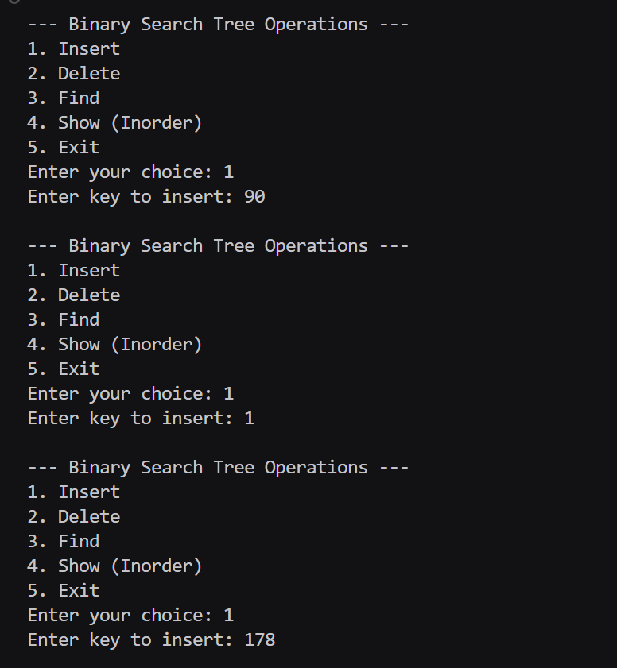
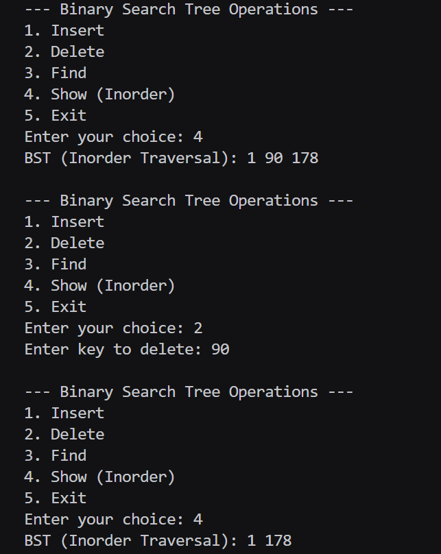

# Assignment No : 37
### Title : Write a program to illustrate operations on a Binary Search Tree (BST) holding numeric keys.  
The menu must include:  
- Insert  
- Delete  
- Find  
- Show  

---

## Theory

A **Binary Search Tree (BST)** is a non-linear data structure in which each node contains:
- A numeric key.
- A pointer to a left child (smaller value).
- A pointer to a right child (larger value).

### BST Properties:
1. Left child < Parent < Right child  
2. No duplicate keys are allowed.  
3. Inorder traversal of a BST gives keys in **ascending order**.

## Algorithm (Delete Operation)

1. If tree is empty → return.  
2. Search for node to delete.  
3. **Cases:**
   - Node has **no child** → delete directly.  
   - Node has **one child** → link parent to that child.  
   - Node has **two children** → replace with inorder successor (smallest node in right subtree).  

---

###  Code 
```
#include <iostream>
using namespace std;

struct Node_rrl {
    int key_rrl;
    Node_rrl* left_rrl;
    Node_rrl* right_rrl;
};

Node_rrl* createNode_rrl(int key_rrl) {
    Node_rrl* newNode_rrl = new Node_rrl();
    newNode_rrl->key_rrl = key_rrl;
    newNode_rrl->left_rrl = nullptr;
    newNode_rrl->right_rrl = nullptr;
    return newNode_rrl;
}

Node_rrl* insert_rrl(Node_rrl* root_rrl, int key_rrl) {
    if (root_rrl == nullptr)
        return createNode_rrl(key_rrl);

    if (key_rrl < root_rrl->key_rrl)
        root_rrl->left_rrl = insert_rrl(root_rrl->left_rrl, key_rrl);
    else if (key_rrl > root_rrl->key_rrl)
        root_rrl->right_rrl = insert_rrl(root_rrl->right_rrl, key_rrl);
    else
        cout << "Duplicate key not allowed!\n";

    return root_rrl;
}

Node_rrl* findMin_rrl(Node_rrl* root_rrl) {
    while (root_rrl && root_rrl->left_rrl != nullptr)
        root_rrl = root_rrl->left_rrl;
    return root_rrl;
}

Node_rrl* delete_rrl(Node_rrl* root_rrl, int key_rrl) {
    if (root_rrl == nullptr)
        return root_rrl;

    if (key_rrl < root_rrl->key_rrl)
        root_rrl->left_rrl = delete_rrl(root_rrl->left_rrl, key_rrl);
    else if (key_rrl > root_rrl->key_rrl)
        root_rrl->right_rrl = delete_rrl(root_rrl->right_rrl, key_rrl);
    else {
        if (root_rrl->left_rrl == nullptr) {
            Node_rrl* temp_rrl = root_rrl->right_rrl;
            delete root_rrl;
            return temp_rrl;
        }
        else if (root_rrl->right_rrl == nullptr) {
            Node_rrl* temp_rrl = root_rrl->left_rrl;
            delete root_rrl;
            return temp_rrl;
        }
        Node_rrl* temp_rrl = findMin_rrl(root_rrl->right_rrl);
        root_rrl->key_rrl = temp_rrl->key_rrl;
        root_rrl->right_rrl = delete_rrl(root_rrl->right_rrl, temp_rrl->key_rrl);
    }
    return root_rrl;
}

bool find_rrl(Node_rrl* root_rrl, int key_rrl) {
    if (root_rrl == nullptr)
        return false;
    if (root_rrl->key_rrl == key_rrl)
        return true;
    if (key_rrl < root_rrl->key_rrl)
        return find_rrl(root_rrl->left_rrl, key_rrl);
    else
        return find_rrl(root_rrl->right_rrl, key_rrl);
}

void inorder_rrl(Node_rrl* root_rrl) {
    if (root_rrl != nullptr) {
        inorder_rrl(root_rrl->left_rrl);
        cout << root_rrl->key_rrl << " ";
        inorder_rrl(root_rrl->right_rrl);
    }
}

int main() {
    Node_rrl* root_rrl = nullptr;
    int choice_rrl, key_rrl;

    while (true) {
        cout << "\n--- Binary Search Tree Operations ---\n";
        cout << "1. Insert\n";
        cout << "2. Delete\n";
        cout << "3. Find\n";
        cout << "4. Show (Inorder)\n";
        cout << "5. Exit\n";
        cout << "Enter your choice: ";
        cin >> choice_rrl;

        switch (choice_rrl) {
            case 1:
                cout << "Enter key to insert: ";
                cin >> key_rrl;
                root_rrl = insert_rrl(root_rrl, key_rrl);
                break;

            case 2:
                cout << "Enter key to delete: ";
                cin >> key_rrl;
                root_rrl = delete_rrl(root_rrl, key_rrl);
                break;

            case 3:
                cout << "Enter key to find: ";
                cin >> key_rrl;
                if (find_rrl(root_rrl, key_rrl))
                    cout << "Key found in the BST.\n";
                else
                    cout << "Key not found.\n";
                break;

            case 4:
                cout << "BST (Inorder Traversal): ";
                inorder_rrl(root_rrl);
                cout << endl;
                break;

            case 5:
                return 0;

            default:
                cout << "Invalid choice!\n";
        }
    }
}
```
### Output

