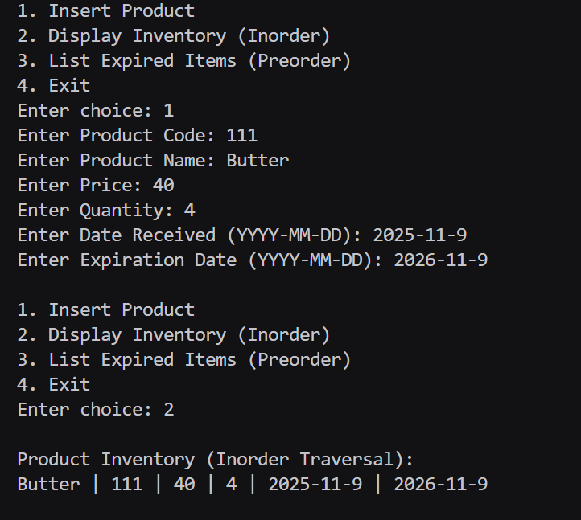
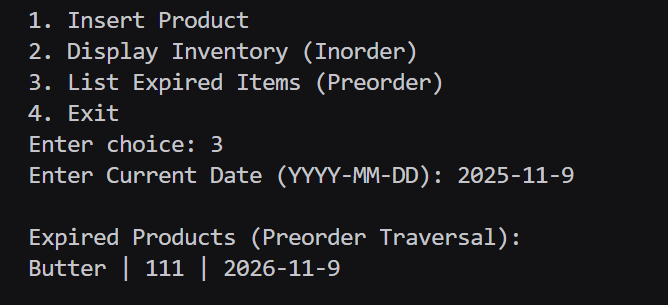

# Assignment No : 28
### Title : Write a program to implement a product inventory management system for a shop using a search tree data structure.

---

### Theory :
A **Binary Search Tree (BST)** is a data structure used for efficient searching, insertion, and ordered traversal of records.  
In this application, each product is stored as a node in the BST, organized alphabetically by product name.

Each node stores:
- Unique Product Code  
- Product Name  
- Price  
- Quantity in Stock  
- Date Received  
- Expiration Date  

The inorder traversal displays the product list in ascending order of product names,  
while preorder traversal helps list all expired items in prefix order.


### Algorithm :
1. Create a structure for product details and tree links.  
2. Insert product details into the BST organized by product name.  
3. Perform inorder traversal to display all items alphabetically.  
4. Perform preorder traversal to list expired items.  
5. Display the menu for user operations.

---

### Program :
```
#include <iostream>
#include <string>
using namespace std;

struct Product_rrl {
    string code_rrl, name_rrl, dateReceived_rrl, expiry_rrl;
    float price_rrl;
    int quantity_rrl;
    Product_rrl *left_rrl, *right_rrl;
};

Product_rrl* createProduct_rrl(string code_rrl, string name_rrl, float price_rrl, int quantity_rrl, string dateReceived_rrl, string expiry_rrl) {
    Product_rrl* new_rrl = new Product_rrl;
    new_rrl->code_rrl = code_rrl;
    new_rrl->name_rrl = name_rrl;
    new_rrl->price_rrl = price_rrl;
    new_rrl->quantity_rrl = quantity_rrl;
    new_rrl->dateReceived_rrl = dateReceived_rrl;
    new_rrl->expiry_rrl = expiry_rrl;
    new_rrl->left_rrl = new_rrl->right_rrl = NULL;
    return new_rrl;
}

Product_rrl* insert_rrl(Product_rrl* root_rrl, string code_rrl, string name_rrl, float price_rrl, int quantity_rrl, string dateReceived_rrl, string expiry_rrl) {
    if (root_rrl == NULL)
        return createProduct_rrl(code_rrl, name_rrl, price_rrl, quantity_rrl, dateReceived_rrl, expiry_rrl);
    if (name_rrl < root_rrl->name_rrl)
        root_rrl->left_rrl = insert_rrl(root_rrl->left_rrl, code_rrl, name_rrl, price_rrl, quantity_rrl, dateReceived_rrl, expiry_rrl);
    else if (name_rrl > root_rrl->name_rrl)
        root_rrl->right_rrl = insert_rrl(root_rrl->right_rrl, code_rrl, name_rrl, price_rrl, quantity_rrl, dateReceived_rrl, expiry_rrl);
    return root_rrl;
}

void inorder_rrl(Product_rrl* root_rrl) {
    if (root_rrl != NULL) {
        inorder_rrl(root_rrl->left_rrl);
        cout << root_rrl->name_rrl << " | " << root_rrl->code_rrl << " | " << root_rrl->price_rrl << " | " 
             << root_rrl->quantity_rrl << " | " << root_rrl->dateReceived_rrl << " | " << root_rrl->expiry_rrl << endl;
        inorder_rrl(root_rrl->right_rrl);
    }
}

void listExpired_rrl(Product_rrl* root_rrl, string currentDate_rrl) {
    if (root_rrl != NULL) {
        cout << root_rrl->name_rrl << " | " << root_rrl->code_rrl << " | " << root_rrl->expiry_rrl << endl;
        listExpired_rrl(root_rrl->left_rrl, currentDate_rrl);
        listExpired_rrl(root_rrl->right_rrl, currentDate_rrl);
    }
}

int main() {
    Product_rrl* root_rrl = NULL;
    int choice_rrl, quantity_rrl;
    float price_rrl;
    string code_rrl, name_rrl, dateReceived_rrl, expiry_rrl, currentDate_rrl;

    while (true) {
        cout << "\n1. Insert Product\n2. Display Inventory (Inorder)\n3. List Expired Items (Preorder)\n4. Exit\nEnter choice: ";
        cin >> choice_rrl;

        if (choice_rrl == 1) {
            cout << "Enter Product Code: ";
            cin >> code_rrl;
            cout << "Enter Product Name: ";
            cin >> name_rrl;
            cout << "Enter Price: ";
            cin >> price_rrl;
            cout << "Enter Quantity: ";
            cin >> quantity_rrl;
            cout << "Enter Date Received (YYYY-MM-DD): ";
            cin >> dateReceived_rrl;
            cout << "Enter Expiration Date (YYYY-MM-DD): ";
            cin >> expiry_rrl;
            root_rrl = insert_rrl(root_rrl, code_rrl, name_rrl, price_rrl, quantity_rrl, dateReceived_rrl, expiry_rrl);
        } 
        else if (choice_rrl == 2) {
            cout << "\nProduct Inventory (Inorder Traversal):\n";
            inorder_rrl(root_rrl);
        } 
        else if (choice_rrl == 3) {
            cout << "Enter Current Date (YYYY-MM-DD): ";
            cin >> currentDate_rrl;
            cout << "\nExpired Products (Preorder Traversal):\n";
            listExpired_rrl(root_rrl, currentDate_rrl);
        } 
        else if (choice_rrl == 4)
            break;
        else
            cout << "Invalid choice.\n";
    }
    return 0;
}
```
### Output 

