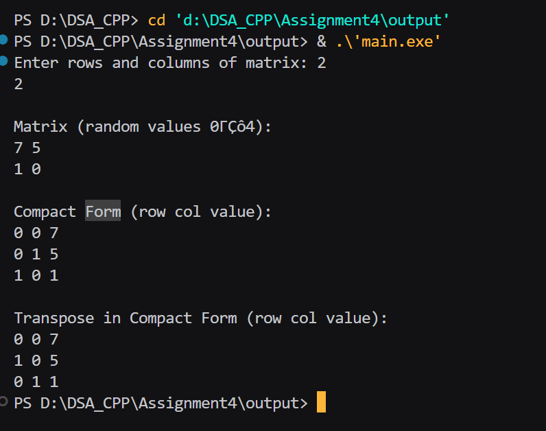

## Assignment no : 4
### Title : Develop a program to identify and efficiently store a sparse matrix using compact representation and perform basic operations like display and simple transpose.


#### Theory :
What Is Sparse matrix : A sparse matrix is a matrix in which most of the elements are zero. Instead of storing all elements (including zeros), we can store only the non-zero elements along with their positions. This reduces memory usage and improves efficiency.


#### Program :
```
#include <iostream>
#include <cstdlib>  
#include <ctime>    
using namespace std;

int main() {
    int rows_rrl, cols_rrl;
    cout << "Enter rows and columns of matrix: ";
    cin >> rows_rrl >> cols_rrl;

    srand(time(0)); 
    int **mat_rrl = new int*[rows_rrl];
    for (int i_rrl = 0; i_rrl < rows_rrl; i_rrl++)
        mat_rrl[i_rrl] = new int[cols_rrl];

    cout << "\nMatrix (random values 0–4):\n";
    int nonZero_rrl = 0;
    for (int i_rrl = 0; i_rrl < rows_rrl; i_rrl++) {
        for (int j_rrl = 0; j_rrl < cols_rrl; j_rrl++) {
            mat_rrl[i_rrl][j_rrl] = rand() % 10; 
            cout << mat_rrl[i_rrl][j_rrl] << " ";
            if (mat_rrl[i_rrl][j_rrl] != 0) nonZero_rrl++;
        }
        cout << endl;
    }

    int **compact_rrl = new int*[nonZero_rrl];
    for (int i_rrl = 0; i_rrl < nonZero_rrl; i_rrl++)
        compact_rrl[i_rrl] = new int[3];

    int k_rrl = 0;
    for (int i_rrl = 0; i_rrl < rows_rrl; i_rrl++) {
        for (int j_rrl = 0; j_rrl < cols_rrl; j_rrl++) {
            if (mat_rrl[i_rrl][j_rrl] != 0) {
                compact_rrl[k_rrl][0] = i_rrl;           
                compact_rrl[k_rrl][1] = j_rrl;           
                compact_rrl[k_rrl][2] = mat_rrl[i_rrl][j_rrl]; 
                k_rrl++;
            }
        }
    }

    cout << "\nCompact Form (row col value):\n";
    for (int i_rrl = 0; i_rrl < nonZero_rrl; i_rrl++) {
        cout << compact_rrl[i_rrl][0] << " "
             << compact_rrl[i_rrl][1] << " "
             << compact_rrl[i_rrl][2] << endl;
    }

    cout << "\nTranspose in Compact Form (row col value):\n";
    for (int i_rrl = 0; i_rrl < nonZero_rrl; i_rrl++) {
        cout << compact_rrl[i_rrl][1] << " "
             << compact_rrl[i_rrl][0] << " "
             << compact_rrl[i_rrl][2] << endl;
    }

    for (int i_rrl = 0; i_rrl < rows_rrl; i_rrl++) delete[] mat_rrl[i_rrl];
    delete[] mat_rrl;

    for (int i_rrl = 0; i_rrl < nonZero_rrl; i_rrl++) delete[] compact_rrl[i_rrl];
    delete[] compact_rrl;

    return 0;
}
```

#### Output :
