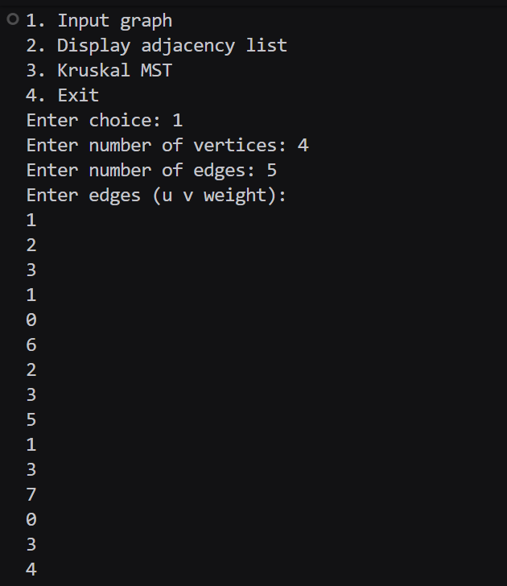
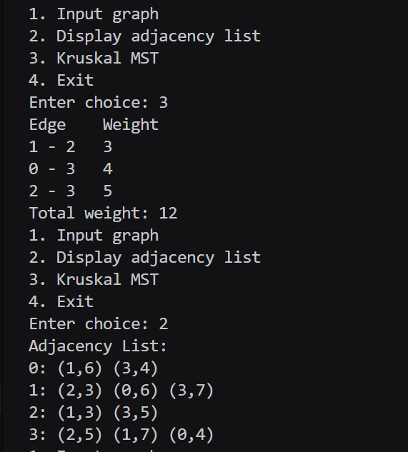

# Assignment No : 43 
### Title : Write a Program to implement Kruskal’s algorithm to find minimum spanning tree of a user defined graph using adjacency list.

---

### Theory :  
A **graph** is a collection of vertices connected by edges.  
A **Minimum Spanning Tree (MST)** of a connected, weighted, undirected graph is a subset of its edges that connects all vertices **without any cycles** and with the **minimum total weight**.  

**Kruskal’s Algorithm** is a **greedy algorithm** that finds the MST by always choosing the **edge with the smallest weight** that doesn’t form a cycle.  
It uses a **Disjoint Set Union (DSU)** or **Union-Find** structure to efficiently check for cycles.

**Adjacency List Representation:**  
- Each vertex maintains a list of its adjacent vertices and the weights of connecting edges.  
- This representation is memory efficient and ideal for sparse graphs.

---

### Algorithm :  
1. Represent the graph using an **adjacency list** and an **edge list**.  
2. Sort all edges in **ascending order of weight**.  
3. Initialize each vertex as its own parent (using DSU).  
4. Pick edges in order:  
   - If the selected edge does **not** form a cycle, include it in the MST.  
   - Otherwise, discard it.  
5. Repeat until **(V – 1)** edges are added to the MST.  
6. Display all edges included in the MST and the total minimum cost.

---

### Code :
```
#include <iostream>
#include <vector>
#include <algorithm>
#include <climits>
using namespace std;

struct Edge_rrl { int u_rrl; int v_rrl; int w_rrl; };
struct AdjEdge_rrl { int vertex_rrl; int weight_rrl; };

int findSet_rrl(vector<int> &parent_rrl, int x_rrl) {
    if (parent_rrl[x_rrl] != x_rrl) parent_rrl[x_rrl] = findSet_rrl(parent_rrl, parent_rrl[x_rrl]);
    return parent_rrl[x_rrl];
}

void unionSet_rrl(vector<int> &parent_rrl, vector<int> &rank_rrl, int a_rrl, int b_rrl) {
    a_rrl = findSet_rrl(parent_rrl, a_rrl);
    b_rrl = findSet_rrl(parent_rrl, b_rrl);
    if (a_rrl == b_rrl) return;
    if (rank_rrl[a_rrl] < rank_rrl[b_rrl]) parent_rrl[a_rrl] = b_rrl;
    else if (rank_rrl[b_rrl] < rank_rrl[a_rrl]) parent_rrl[b_rrl] = a_rrl;
    else { parent_rrl[b_rrl] = a_rrl; rank_rrl[a_rrl]++; }
}

int main() {
    int vertices_rrl = 0, edges_rrl = 0;
    vector<vector<AdjEdge_rrl>> adj_rrl;
    vector<Edge_rrl> edgeList_rrl;
    int choice_rrl = 0;
    while (true) {
        cout << "1. Input graph\n2. Display adjacency list\n3. Kruskal MST\n4. Exit\nEnter choice: ";
        if (!(cin >> choice_rrl)) return 0;
        if (choice_rrl == 1) {
            cout << "Enter number of vertices: ";
            cin >> vertices_rrl;
            cout << "Enter number of edges: ";
            cin >> edges_rrl;
            adj_rrl.assign(vertices_rrl, vector<AdjEdge_rrl>());
            edgeList_rrl.clear();
            cout << "Enter edges (u v weight):\n";
            for (int i_rrl = 0; i_rrl < edges_rrl; i_rrl++) {
                int u_rrl, v_rrl, w_rrl;
                cin >> u_rrl >> v_rrl >> w_rrl;
                AdjEdge_rrl a1_rrl = {v_rrl, w_rrl};
                AdjEdge_rrl a2_rrl = {u_rrl, w_rrl};
                if (u_rrl >= 0 && u_rrl < vertices_rrl) adj_rrl[u_rrl].push_back(a1_rrl);
                if (v_rrl >= 0 && v_rrl < vertices_rrl) adj_rrl[v_rrl].push_back(a2_rrl);
                Edge_rrl e_rrl = {u_rrl, v_rrl, w_rrl};
                edgeList_rrl.push_back(e_rrl);
            }
        } else if (choice_rrl == 2) {
            cout << "Adjacency List:\n";
            for (int i_rrl = 0; i_rrl < (int)adj_rrl.size(); i_rrl++) {
                cout << i_rrl << ": ";
                for (auto ed_rrl : adj_rrl[i_rrl]) cout << "(" << ed_rrl.vertex_rrl << "," << ed_rrl.weight_rrl << ") ";
                cout << "\n";
            }
        } else if (choice_rrl == 3) {
            if (vertices_rrl == 0) { cout << "Graph not defined\n"; continue; }
            sort(edgeList_rrl.begin(), edgeList_rrl.end(), [](const Edge_rrl &a_rrl, const Edge_rrl &b_rrl){
                return a_rrl.w_rrl < b_rrl.w_rrl;
            });
            vector<int> parent_rrl(vertices_rrl), rank_rrl(vertices_rrl, 0);
            for (int i_rrl = 0; i_rrl < vertices_rrl; i_rrl++) parent_rrl[i_rrl] = i_rrl;
            vector<Edge_rrl> mst_rrl;
            int totalWeight_rrl = 0;
            for (auto e_rrl : edgeList_rrl) {
                int u_rrl = e_rrl.u_rrl;
                int v_rrl = e_rrl.v_rrl;
                int setU_rrl = findSet_rrl(parent_rrl, u_rrl);
                int setV_rrl = findSet_rrl(parent_rrl, v_rrl);
                if (setU_rrl != setV_rrl) {
                    unionSet_rrl(parent_rrl, rank_rrl, setU_rrl, setV_rrl);
                    mst_rrl.push_back(e_rrl);
                    totalWeight_rrl += e_rrl.w_rrl;
                }
            }
            if ((int)mst_rrl.size() != vertices_rrl - 1) {
                cout << "MST not possible (graph disconnected)\n";
            } else {
                cout << "Edge \tWeight\n";
                for (auto me_rrl : mst_rrl) cout << me_rrl.u_rrl << " - " << me_rrl.v_rrl << "\t" << me_rrl.w_rrl << "\n";
                cout << "Total weight: " << totalWeight_rrl << "\n";
            }
        } else if (choice_rrl == 4) {
            return 0;
        } else {
            cout << "Invalid choice\n";
        }
    }
    return 0;
}

```

### Output

