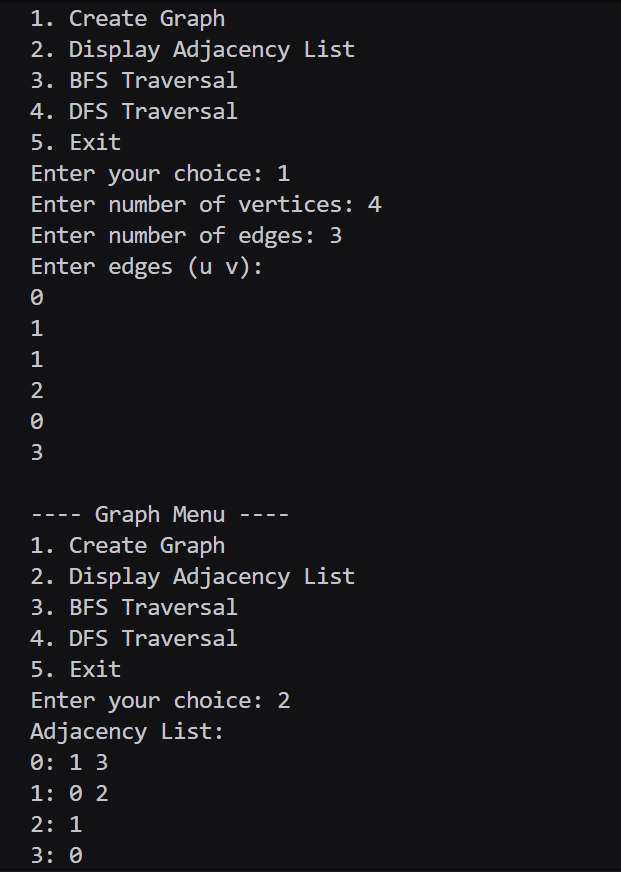
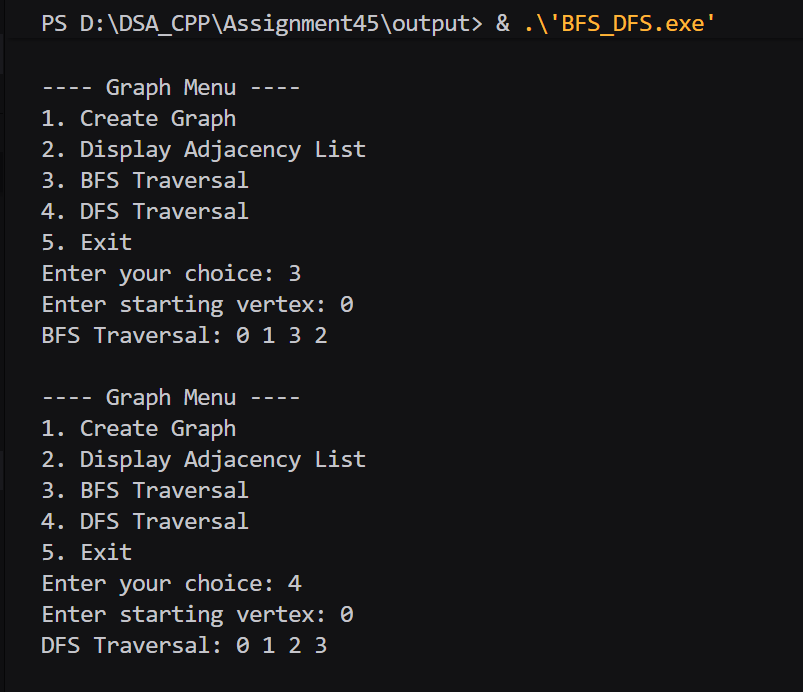

# Assignment No : 45 
### Title : Write a Program to accept a graph from a user and represent it with Adjacency List and perform BFS and DFS traversals on it.

---

### Theory :  
A **graph** is a collection of vertices (nodes) and edges (connections between nodes).  
The **Adjacency List** is one of the most efficient ways to represent a graph — where each vertex maintains a list of all the vertices directly connected to it.

**Breadth First Search (BFS)** and **Depth First Search (DFS)** are two fundamental graph traversal techniques:

- **BFS (Breadth First Search):**  
  Traverses the graph **level by level** using a **queue**.  
  It explores all neighbors of a vertex before moving to the next level.

- **DFS (Depth First Search):**  
  Traverses the graph **deeply** using **recursion** or a **stack**.  
  It explores as far as possible along each branch before backtracking.

---

### Algorithm :  

**BFS Algorithm:**  
1. Initialize a queue and mark all vertices as unvisited.  
2. Push the starting vertex into the queue and mark it as visited.  
3. Pop a vertex from the queue, print it, and push all its unvisited neighbors into the queue.  
4. Repeat until the queue is empty.

**DFS Algorithm:**  
1. Mark the current vertex as visited and print it.  
2. Recursively call DFS for all unvisited neighbors of the vertex.

---

### Code :
```
#include <iostream>
#include <vector>
#include <queue>
using namespace std;

void addEdge_rrl(vector<vector<int>> &adj_rrl, int u_rrl, int v_rrl) {
    adj_rrl[u_rrl].push_back(v_rrl);
    adj_rrl[v_rrl].push_back(u_rrl);
}

void displayAdjList_rrl(vector<vector<int>> &adj_rrl) {
    cout << "Adjacency List:\n";
    for (int i_rrl = 0; i_rrl < adj_rrl.size(); i_rrl++) {
        cout << i_rrl << ": ";
        for (int v_rrl : adj_rrl[i_rrl]) cout << v_rrl << " ";
        cout << "\n";
    }
}

void bfs_rrl(vector<vector<int>> &adj_rrl, int start_rrl) {
    vector<bool> visited_rrl(adj_rrl.size(), false);
    queue<int> q_rrl;
    visited_rrl[start_rrl] = true;
    q_rrl.push(start_rrl);
    cout << "BFS Traversal: ";
    while (!q_rrl.empty()) {
        int u_rrl = q_rrl.front();
        q_rrl.pop();
        cout << u_rrl << " ";
        for (int v_rrl : adj_rrl[u_rrl]) {
            if (!visited_rrl[v_rrl]) {
                visited_rrl[v_rrl] = true;
                q_rrl.push(v_rrl);
            }
        }
    }
    cout << "\n";
}

void dfsUtil_rrl(vector<vector<int>> &adj_rrl, int u_rrl, vector<bool> &visited_rrl) {
    visited_rrl[u_rrl] = true;
    cout << u_rrl << " ";
    for (int v_rrl : adj_rrl[u_rrl])
        if (!visited_rrl[v_rrl]) dfsUtil_rrl(adj_rrl, v_rrl, visited_rrl);
}

void dfs_rrl(vector<vector<int>> &adj_rrl, int start_rrl) {
    vector<bool> visited_rrl(adj_rrl.size(), false);
    cout << "DFS Traversal: ";
    dfsUtil_rrl(adj_rrl, start_rrl, visited_rrl);
    cout << "\n";
}

int main() {
    int vertices_rrl = 0, edges_rrl = 0;
    vector<vector<int>> adj_rrl;
    int choice_rrl = 0;

    while (true) {
        cout << "\n---- Graph Menu ----\n";
        cout << "1. Create Graph\n";
        cout << "2. Display Adjacency List\n";
        cout << "3. BFS Traversal\n";
        cout << "4. DFS Traversal\n";
        cout << "5. Exit\n";
        cout << "Enter your choice: ";
        cin >> choice_rrl;

        if (choice_rrl == 1) {
            cout << "Enter number of vertices: ";
            cin >> vertices_rrl;
            cout << "Enter number of edges: ";
            cin >> edges_rrl;
            adj_rrl.assign(vertices_rrl, vector<int>());
            cout << "Enter edges (u v):\n";
            for (int i_rrl = 0; i_rrl < edges_rrl; i_rrl++) {
                int u_rrl, v_rrl;
                cin >> u_rrl >> v_rrl;
                addEdge_rrl(adj_rrl, u_rrl, v_rrl);
            }
        } 
        else if (choice_rrl == 2) {
            if (vertices_rrl == 0) cout << "Graph not created yet.\n";
            else displayAdjList_rrl(adj_rrl);
        } 
        else if (choice_rrl == 3) {
            if (vertices_rrl == 0) cout << "Graph not created yet.\n";
            else {
                int start_rrl;
                cout << "Enter starting vertex: ";
                cin >> start_rrl;
                if (start_rrl >= 0 && start_rrl < vertices_rrl)
                    bfs_rrl(adj_rrl, start_rrl);
                else cout << "Invalid vertex.\n";
            }
        } 
        else if (choice_rrl == 4) {
            if (vertices_rrl == 0) cout << "Graph not created yet.\n";
            else {
                int start_rrl;
                cout << "Enter starting vertex: ";
                cin >> start_rrl;
                if (start_rrl >= 0 && start_rrl < vertices_rrl)
                    dfs_rrl(adj_rrl, start_rrl);
                else cout << "Invalid vertex.\n";
            }
        } 
        else if (choice_rrl == 5) {
            cout << "Exiting...\n";
            break;
        } 
        else cout << "Invalid choice!\n";
    }
    return 0;
}

```

### Output 



