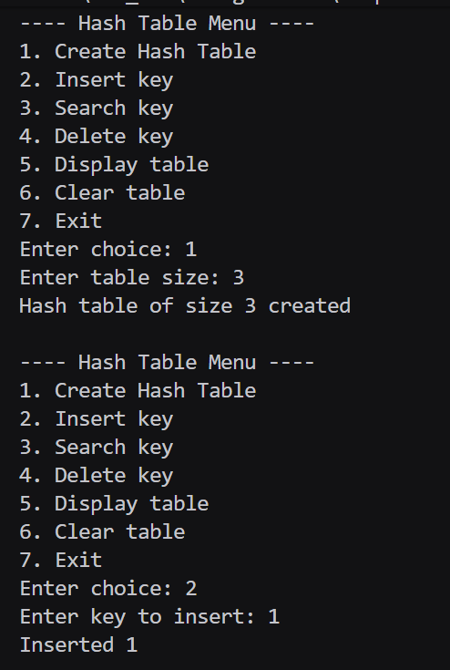
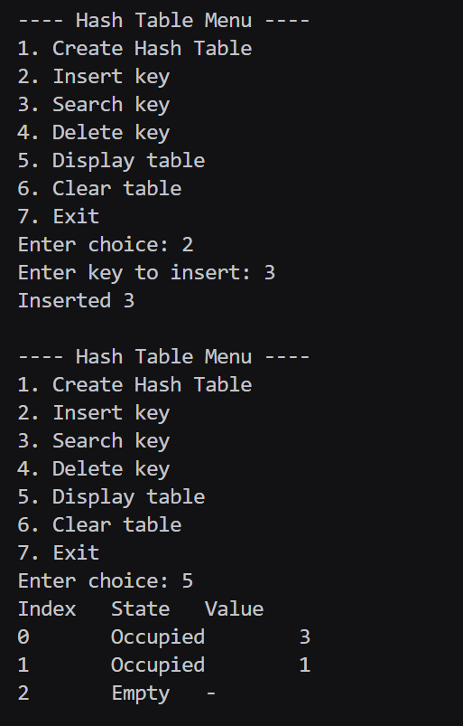
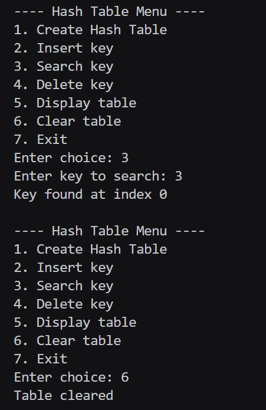
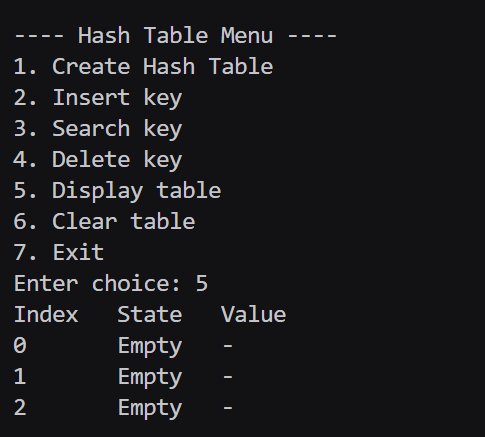

# Assignment No : 46
### Title : Implement a Hash Table with collision resolution using Linear Probing.

---

### Theory :  
A **Hash Table** is a data structure that stores data in key–value form.  
It uses a **hash function** to map a key to an index in an array.

However, two keys may produce the **same hash index** — this is called a **collision**.

### Linear Probing Collision Resolution:
When a collision occurs:
- Check the **next index** `(index + 1) % size`
- Continue checking linearly until an empty slot is found  
- This technique is simple and efficient for moderate loads

### Algorithm :

**Insert(key):**
1. Compute hash = key % size  
2. If slot is empty → insert  
3. If occupied → move linearly until empty  
4. Insert key in first free or deleted slot  

**Search(key):**
1. Compute hash  
2. Linearly scan until:
   - Key found → return index  
   - Empty slot → key not present  

**Delete(key):**
1. Search key  
2. Mark slot as **deleted**  

**Display():**
- Print all slots with their state (empty / occupied / deleted)


### Code :
```
#include <iostream>
#include <vector>
using namespace std;

class HashTable_rrl {
    int size_rrl;
    vector<int> table_rrl;
    vector<int> state_rrl; // 0 = empty, 1 = occupied, 2 = deleted
public:
    HashTable_rrl(int n_rrl = 10) {
        size_rrl = n_rrl;
        table_rrl.assign(size_rrl, 0);
        state_rrl.assign(size_rrl, 0);
    }
    int hash_rrl(int key_rrl) {
        int h_rrl = key_rrl % size_rrl;
        if (h_rrl < 0) h_rrl += size_rrl;
        return h_rrl;
    }
    bool insert_rrl(int key_rrl) {
        int h_rrl = hash_rrl(key_rrl);
        int firstDeleted_rrl = -1;
        for (int i_rrl = 0; i_rrl < size_rrl; i_rrl++) {
            int idx_rrl = (h_rrl + i_rrl) % size_rrl;
            if (state_rrl[idx_rrl] == 1 && table_rrl[idx_rrl] == key_rrl) return false;
            if (state_rrl[idx_rrl] == 2 && firstDeleted_rrl == -1) firstDeleted_rrl = idx_rrl;
            if (state_rrl[idx_rrl] == 0) {
                if (firstDeleted_rrl != -1) {
                    table_rrl[firstDeleted_rrl] = key_rrl;
                    state_rrl[firstDeleted_rrl] = 1;
                } else {
                    table_rrl[idx_rrl] = key_rrl;
                    state_rrl[idx_rrl] = 1;
                }
                return true;
            }
        }
        if (firstDeleted_rrl != -1) {
            table_rrl[firstDeleted_rrl] = key_rrl;
            state_rrl[firstDeleted_rrl] = 1;
            return true;
        }
        return false;
    }
    int search_rrl(int key_rrl) {
        int h_rrl = hash_rrl(key_rrl);
        for (int i_rrl = 0; i_rrl < size_rrl; i_rrl++) {
            int idx_rrl = (h_rrl + i_rrl) % size_rrl;
            if (state_rrl[idx_rrl] == 0) return -1;
            if (state_rrl[idx_rrl] == 1 && table_rrl[idx_rrl] == key_rrl) return idx_rrl;
        }
        return -1;
    }
    bool remove_rrl(int key_rrl) {
        int pos_rrl = search_rrl(key_rrl);
        if (pos_rrl == -1) return false;
        state_rrl[pos_rrl] = 2;
        return true;
    }
    void display_rrl() {
        cout << "Index\tState\tValue\n";
        for (int i_rrl = 0; i_rrl < size_rrl; i_rrl++) {
            cout << i_rrl << "\t";
            if (state_rrl[i_rrl] == 0) cout << "Empty\t-\n";
            else if (state_rrl[i_rrl] == 2) cout << "Deleted\t-\n";
            else cout << "Occupied\t" << table_rrl[i_rrl] << "\n";
        }
    }
    void clear_rrl() {
        table_rrl.assign(size_rrl, 0);
        state_rrl.assign(size_rrl, 0);
    }
};

int main() {
    int choice_rrl = 0;
    HashTable_rrl ht_rrl;
    bool created_rrl = false;

    while (true) {
        cout << "\n---- Hash Table Menu ----\n";
        cout << "1. Create Hash Table\n";
        cout << "2. Insert key\n";
        cout << "3. Search key\n";
        cout << "4. Delete key\n";
        cout << "5. Display table\n";
        cout << "6. Clear table\n";
        cout << "7. Exit\n";
        cout << "Enter choice: ";
        cin >> choice_rrl;

        if (choice_rrl == 1) {
            int n_rrl;
            cout << "Enter table size: ";
            cin >> n_rrl;
            ht_rrl = HashTable_rrl(n_rrl);
            created_rrl = true;
            cout << "Hash table created\n";
        }
        else if (choice_rrl == 2) {
            if (!created_rrl) { cout << "Create table first\n"; continue; }
            int key_rrl; 
            cout << "Enter key to insert: "; 
            cin >> key_rrl;
            if (ht_rrl.insert_rrl(key_rrl)) cout << "Inserted\n";
            else cout << "Insertion failed\n";
        }
        else if (choice_rrl == 3) {
            if (!created_rrl) { cout << "Create table first\n"; continue; }
            int key_rrl; 
            cout << "Enter key to search: "; 
            cin >> key_rrl;
            int pos_rrl = ht_rrl.search_rrl(key_rrl);
            if (pos_rrl == -1) cout << "Key not found\n";
            else cout << "Key found at index " << pos_rrl << "\n";
        }
        else if (choice_rrl == 4) {
            if (!created_rrl) { cout << "Create table first\n"; continue; }
            int key_rrl; 
            cout << "Enter key to delete: "; 
            cin >> key_rrl;
            if (ht_rrl.remove_rrl(key_rrl)) cout << "Key deleted\n";
            else cout << "Key not found\n";
        }
        else if (choice_rrl == 5) {
            if (!created_rrl) cout << "Create table first\n";
            else ht_rrl.display_rrl();
        }
        else if (choice_rrl == 6) {
            if (!created_rrl) cout << "Create table first\n";
            else { ht_rrl.clear_rrl(); cout << "Table cleared\n"; }
        }
        else if (choice_rrl == 7) {
            break;
        }
        else cout << "Invalid choice\n";
    }
    return 0;
}
```

### Output :



