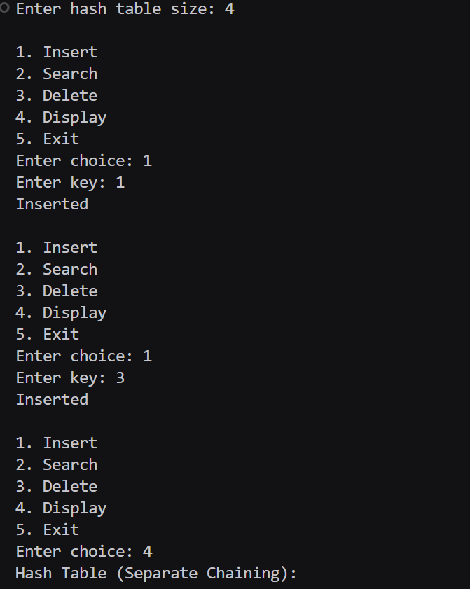
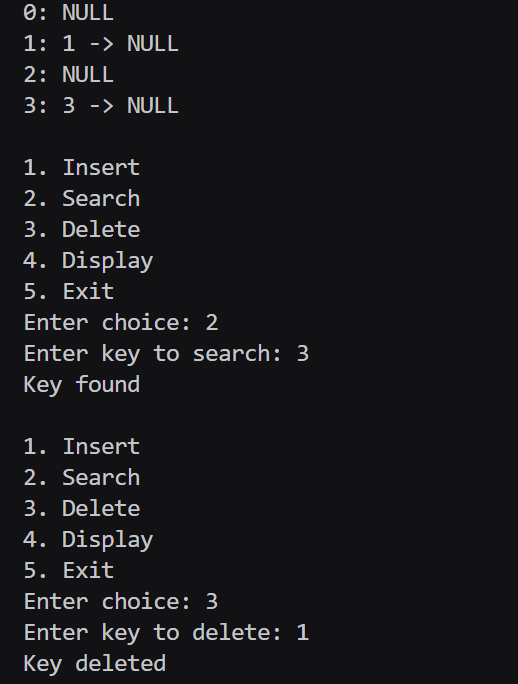
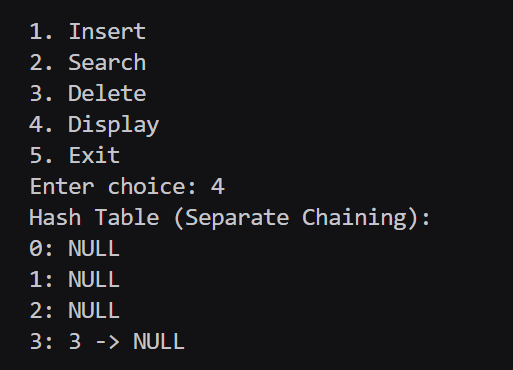

# Assignment No : 47  
### Title : Implement collision handling using separate chaining.

---

### Theory :  
A **Hash Table** stores data using a hash function that maps keys to indices.  
Sometimes, two keys map to the **same index** — this is called a **collision**.

### Separate Chaining:
- Each index of the hash table stores a **linked list (chain)**.  
- When multiple keys hash to the same index, they are stored in the **same chain**.  
- Simple, efficient, and widely used.

---

### Algorithm :

**Insert(key):**
1. Compute `index = key % size`
2. Insert key at the end of the chain at that index.

**Search(key):**
1. Compute index  
2. Traverse the chain  
3. If key found → return success

**Delete(key):**
1. Compute index  
2. Traverse chain  
3. Remove if found

**Display():**
- For each index, print the chain in the format:  
  `index: key1 -> key2 -> NULL`


### Code :
```cpp


