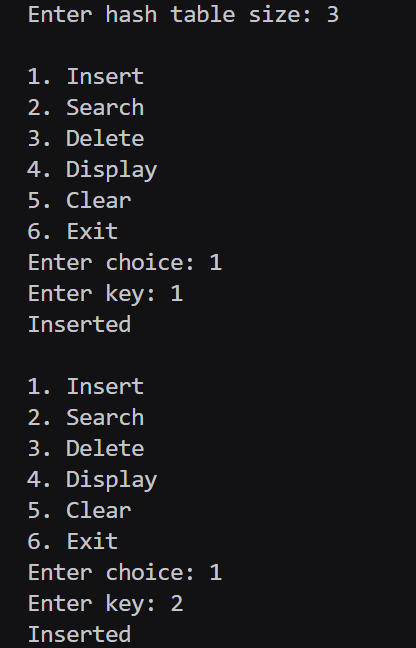
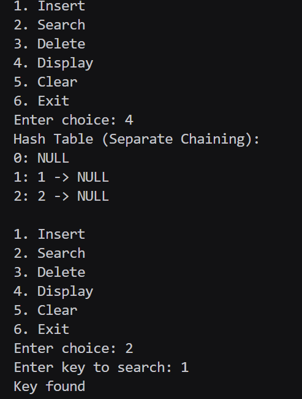
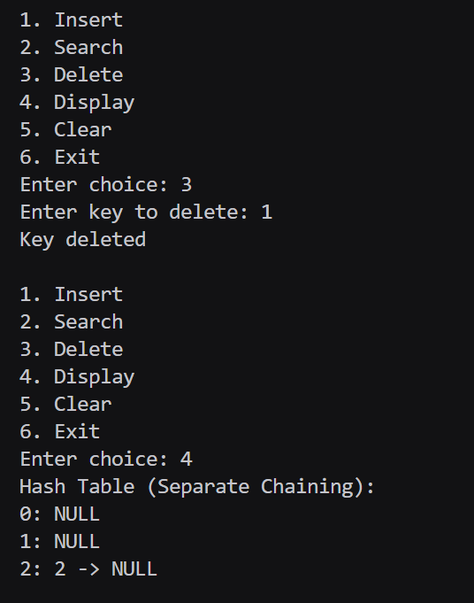
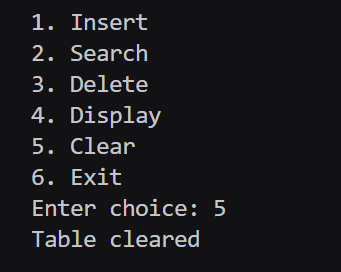

# Assignment No : 48 
### Title :  Implement collision resolution using linked lists.

---

### Theory :  
A **Hash Table** is a data structure that stores data using a *hash function* to determine the index for each key.  
However, different keys may hash to the **same index**, causing a **collision**.

To handle collisions, **Separate Chaining** is used.

### Separate Chaining:
- Each index of the hash table stores a **linked list** (implemented using `std::list<int>`).
- When multiple keys hash to the same index, they are inserted into the **same list**.
- It is simple, efficient, and avoids overflow issues of open addressing.

---

### Algorithm :

#### **Insert(key)**  
1. Compute `index = key % size`  
2. Traverse the list at that index  
3. If the key exists → do nothing  
4. Else, append key to the list  

#### **Search(key)**  
1. Compute index  
2. Traverse list  
3. If key found → success  
4. Else → not found  

#### **Delete(key)**  
1. Compute index  
2. Traverse list  
3. If key found → remove from list  

#### **Display()**  
For every index:  
`index: key1 -> key2 -> ... -> NULL`

---

### Code :
```
#include <iostream>
#include <vector>
#include <list>
using namespace std;

class HashTable_rrl {
    int size_rrl;
    vector<list<int>> table_rrl;
public:
    HashTable_rrl(int n_rrl = 10) {
        size_rrl = n_rrl;
        table_rrl.assign(size_rrl, list<int>());
    }

    int hash_rrl(int key_rrl) {
        return key_rrl % size_rrl;
    }

    void insert_rrl(int key_rrl) {
        int idx_rrl = hash_rrl(key_rrl);
        for (int x_rrl : table_rrl[idx_rrl])
            if (x_rrl == key_rrl) {
                cout << "Key already exists\n";
                return;
            }
        table_rrl[idx_rrl].push_back(key_rrl);
        cout << "Inserted\n";
    }

    bool search_rrl(int key_rrl) {
        int idx_rrl = hash_rrl(key_rrl);
        for (int x_rrl : table_rrl[idx_rrl])
            if (x_rrl == key_rrl) return true;
        return false;
    }

    bool delete_rrl(int key_rrl) {
        int idx_rrl = hash_rrl(key_rrl);
        for (auto it_rrl = table_rrl[idx_rrl].begin();
             it_rrl != table_rrl[idx_rrl].end(); it_rrl++) {
            if (*it_rrl == key_rrl) {
                table_rrl[idx_rrl].erase(it_rrl);
                return true;
            }
        }
        return false;
    }

    void display_rrl() {
        cout << "Hash Table (Separate Chaining):\n";
        for (int i_rrl = 0; i_rrl < size_rrl; i_rrl++) {
            cout << i_rrl << ": ";
            for (int x_rrl : table_rrl[i_rrl])
                cout << x_rrl << " -> ";
            cout << "NULL\n";
        }
    }

    void clear_rrl() {
        for (int i_rrl = 0; i_rrl < size_rrl; i_rrl++)
            table_rrl[i_rrl].clear();
        cout << "Table cleared\n";
    }
};

int main() {
    int size_rrl;
    cout << "Enter hash table size: ";
    cin >> size_rrl;

    HashTable_rrl ht_rrl(size_rrl);
    int choice_rrl;

    while (true) {
        cout << "\n1. Insert\n2. Search\n3. Delete\n4. Display\n5. Clear\n6. Exit\nEnter choice: ";
        cin >> choice_rrl;

        if (choice_rrl == 1) {
            int key_rrl;
            cout << "Enter key: ";
            cin >> key_rrl;
            ht_rrl.insert_rrl(key_rrl);
        }
        else if (choice_rrl == 2) {
            int key_rrl;
            cout << "Enter key to search: ";
            cin >> key_rrl;
            if (ht_rrl.search_rrl(key_rrl)) cout << "Key found\n";
            else cout << "Key NOT found\n";
        }
        else if (choice_rrl == 3) {
            int key_rrl;
            cout << "Enter key to delete: ";
            cin >> key_rrl;
            if (ht_rrl.delete_rrl(key_rrl)) cout << "Key deleted\n";
            else cout << "Key NOT found\n";
        }
        else if (choice_rrl == 4) {
            ht_rrl.display_rrl();
        }
        else if (choice_rrl == 5) {
            ht_rrl.clear_rrl();
        }
        else if (choice_rrl == 6) {
            break;
        }
        else {
            cout << "Invalid choice\n";
        }
    }

    return 0;
}
```

### Output 



