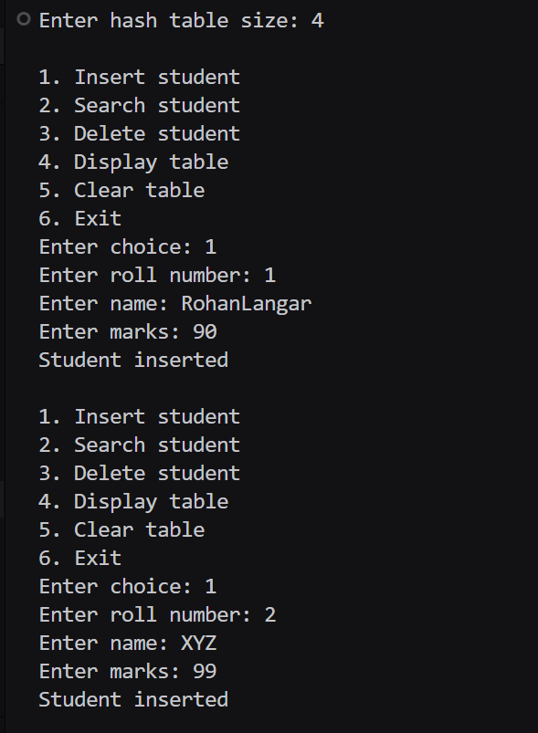
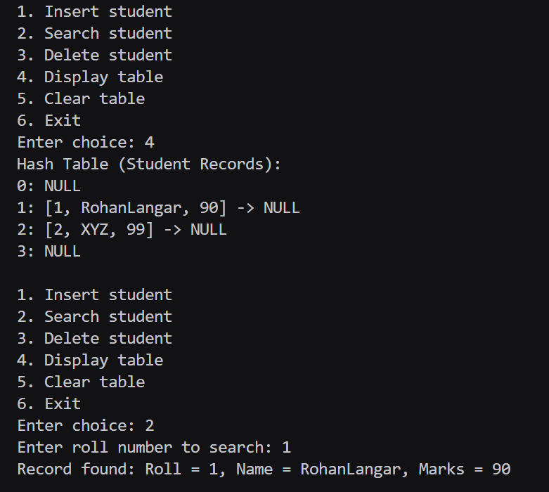
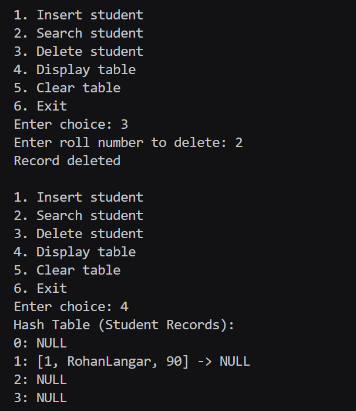

# Assignment No : 49
### Title :  Store and retrieve student records using roll numbers.

---

### Theory :  
A **Hash Table** is a data structure that stores data using a *hash function* to determine the index for each key.  
However, different keys may hash to the **same index**, causing a **collision**.

To handle collisions, **Separate Chaining** is used.

## **Algorithm :**

### **Insert Student**
1. Read student roll, name, and marks  
2. Compute hash index  
3. Traverse the list at that index  
4. If roll exists → print error  
5. Else → insert student into list  

### **Search Student**
1. Read roll number  
2. Compute hash index  
3. Search in the chain  
4. If found → display record  

### **Delete Student**
1. Read roll  
2. Compute index  
3. Traverse the list  
4. If found → delete node  

### **Display Table**
For each index, print chain as:
---

### Code :
```
#include <iostream>
#include <vector>
#include <list>
using namespace std;

struct Student_rrl {
    int roll_rrl;
    string name_rrl;
    int marks_rrl;
};

class StudentHash_rrl {
    int size_rrl;
    vector<list<Student_rrl>> table_rrl;
public:
    StudentHash_rrl(int n_rrl = 10) {
        size_rrl = n_rrl;
        table_rrl.assign(size_rrl, list<Student_rrl>());
    }

    int hash_rrl(int roll_rrl) {
        return roll_rrl % size_rrl;
    }

    void insert_rrl(Student_rrl s_rrl) {
        int idx_rrl = hash_rrl(s_rrl.roll_rrl);
        for (auto &stu_rrl : table_rrl[idx_rrl]) {
            if (stu_rrl.roll_rrl == s_rrl.roll_rrl) {
                cout << "Roll number already exists\n";
                return;
            }
        }
        table_rrl[idx_rrl].push_back(s_rrl);
        cout << "Student inserted\n";
    }

    bool search_rrl(int roll_rrl, Student_rrl &out_rrl) {
        int idx_rrl = hash_rrl(roll_rrl);
        for (auto &stu_rrl : table_rrl[idx_rrl]) {
            if (stu_rrl.roll_rrl == roll_rrl) {
                out_rrl = stu_rrl;
                return true;
            }
        }
        return false;
    }

    bool delete_rrl(int roll_rrl) {
        int idx_rrl = hash_rrl(roll_rrl);
        for (auto it_rrl = table_rrl[idx_rrl].begin(); it_rrl != table_rrl[idx_rrl].end(); it_rrl++) {
            if (it_rrl->roll_rrl == roll_rrl) {
                table_rrl[idx_rrl].erase(it_rrl);
                return true;
            }
        }
        return false;
    }

    void display_rrl() {
        cout << "Hash Table (Student Records):\n";
        for (int i_rrl = 0; i_rrl < size_rrl; i_rrl++) {
            cout << i_rrl << ": ";
            for (auto &stu_rrl : table_rrl[i_rrl]) {
                cout << "[" << stu_rrl.roll_rrl << ", " << stu_rrl.name_rrl << ", " << stu_rrl.marks_rrl << "] -> ";
            }
            cout << "NULL\n";
        }
    }

    void clear_rrl() {
        for (int i_rrl = 0; i_rrl < size_rrl; i_rrl++) table_rrl[i_rrl].clear();
        cout << "Table cleared\n";
    }
};

int main() {
    int size_rrl;
    cout << "Enter hash table size: ";
    cin >> size_rrl;

    StudentHash_rrl ht_rrl(size_rrl);

    while (true) {
        cout << "\n1. Insert student\n2. Search student\n3. Delete student\n4. Display table\n5. Clear table\n6. Exit\nEnter choice: ";
        int choice_rrl;
        cin >> choice_rrl;

        if (choice_rrl == 1) {
            Student_rrl s_rrl;
            cout << "Enter roll number: ";
            cin >> s_rrl.roll_rrl;
            cout << "Enter name: ";
            cin >> s_rrl.name_rrl;
            cout << "Enter marks: ";
            cin >> s_rrl.marks_rrl;

            ht_rrl.insert_rrl(s_rrl);
        }
        else if (choice_rrl == 2) {
            int roll_rrl;
            cout << "Enter roll number to search: ";
            cin >> roll_rrl;

            Student_rrl srch_rrl;
            if (ht_rrl.search_rrl(roll_rrl, srch_rrl)) {
                cout << "Record found: Roll = " << srch_rrl.roll_rrl 
                     << ", Name = " << srch_rrl.name_rrl 
                     << ", Marks = " << srch_rrl.marks_rrl << "\n";
            } else {
                cout << "Record not found\n";
            }
        }
        else if (choice_rrl == 3) {
            int roll_rrl;
            cout << "Enter roll number to delete: ";
            cin >> roll_rrl;

            if (ht_rrl.delete_rrl(roll_rrl)) cout << "Record deleted\n";
            else cout << "Record not found\n";
        }
        else if (choice_rrl == 4) {
            ht_rrl.display_rrl();
        }
        else if (choice_rrl == 5) {
            ht_rrl.clear_rrl();
        }
        else if (choice_rrl == 6) {
            break;
        }
        else {
            cout << "Invalid choice\n";
        }
    }

    return 0;
}

```

### Output 


