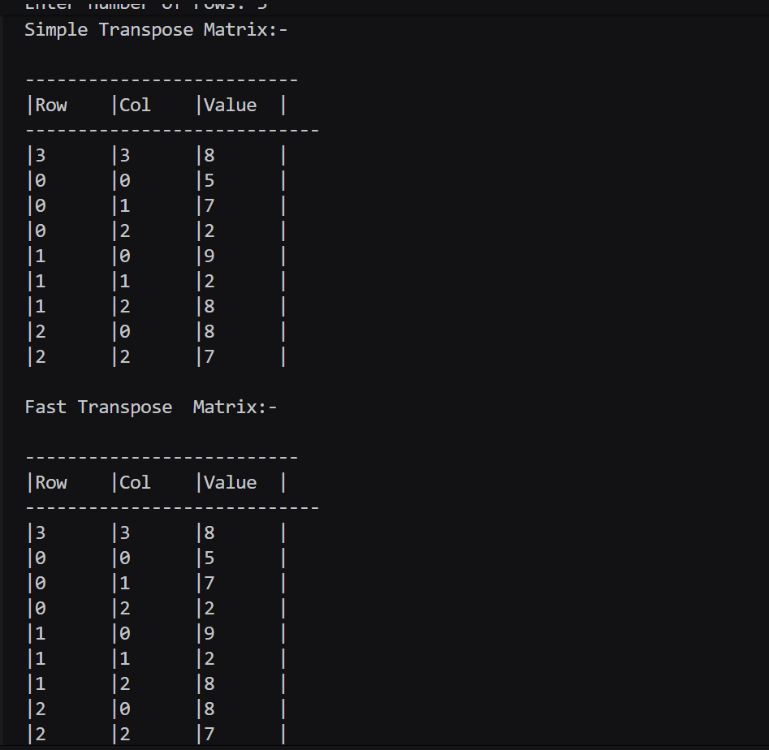

## Assignment no : 5
### Title : Develop a program to compute the fast transpose of a sparse matrix using its compact (triplet) representation efficiently.


#### Program :
```
#include <iostream>
#include <vector>
#include <cstdlib>
#include <ctime>

struct Element_rrl {
    int row_rrl;
    int col_rrl;
    int val_rrl;
};

int main() {
    int rows_rrl, cols_rrl, count_rrl = 0;

    std::cout << "Enter number of rows: ";
    std::cin >> rows_rrl;
    std::cout << "Enter number of cols: ";
    std::cin >> cols_rrl;

    std::vector<std::vector<int>> matrix_rrl(rows_rrl, std::vector<int>(cols_rrl));

    srand(static_cast<unsigned>(time(nullptr)));
    std::cout << "Randomly generated array elements:\n";
    for (int i_rrl = 0; i_rrl < rows_rrl; i_rrl++) {
        for (int j_rrl = 0; j_rrl < cols_rrl; j_rrl++) {
            matrix_rrl[i_rrl][j_rrl] = rand() % 10;
            std::cout << matrix_rrl[i_rrl][j_rrl] << " ";
            if (matrix_rrl[i_rrl][j_rrl] != 0) {
                count_rrl++;
            }
        }
        std::cout << "\n";
    }

    std::cout << "\nSimple Matrix:-\n";
    for (int i_rrl = 0; i_rrl < rows_rrl; i_rrl++) {
        for (int j_rrl = 0; j_rrl < cols_rrl; j_rrl++) {
            std::cout << matrix_rrl[i_rrl][j_rrl] << " ";
        }
        std::cout << "\n";
    }

    std::vector<Element_rrl> sparse_rrl(count_rrl + 1);
    sparse_rrl[0] = {rows_rrl, cols_rrl, count_rrl};

    int k_rrl = 1;
    for (int i_rrl = 0; i_rrl < rows_rrl; i_rrl++) {
        for (int j_rrl = 0; j_rrl < cols_rrl; j_rrl++) {
            if (matrix_rrl[i_rrl][j_rrl] != 0) {
                sparse_rrl[k_rrl++] = {i_rrl, j_rrl, matrix_rrl[i_rrl][j_rrl]};
            }
        }
    }

    std::cout << "\nSparse Matrix:-\n";
    std::cout << "\n--------------------------";
    std::cout << "\n|Row\t|Col\t|Value\t|\n";
    std::cout << "----------------------------\n";
    for (int i_rrl = 0; i_rrl <= count_rrl; i_rrl++) {
        std::cout << "|" << sparse_rrl[i_rrl].row_rrl << "\t|" << sparse_rrl[i_rrl].col_rrl << "\t|" << sparse_rrl[i_rrl].val_rrl << "\t|\n";
    }

    std::vector<Element_rrl> transpose_rrl(count_rrl + 1);
    transpose_rrl[0] = {sparse_rrl[0].col_rrl, sparse_rrl[0].row_rrl, sparse_rrl[0].val_rrl};

    int l_rrl = 1;
    for (int i_rrl = 0; i_rrl < sparse_rrl[0].col_rrl; i_rrl++) {
        for (int j_rrl = 1; j_rrl <= sparse_rrl[0].val_rrl; j_rrl++) {
            if (sparse_rrl[j_rrl].col_rrl == i_rrl) {
                transpose_rrl[l_rrl++] = {sparse_rrl[j_rrl].col_rrl, sparse_rrl[j_rrl].row_rrl, sparse_rrl[j_rrl].val_rrl};
            }
        }
    }

    std::cout << "\nSimple Transpose Matrix:-\n";
    std::cout << "\n--------------------------";
    std::cout << "\n|Row\t|Col\t|Value\t|\n";
    std::cout << "----------------------------\n";
    for (int i_rrl = 0; i_rrl <= count_rrl; i_rrl++) {
        std::cout << "|" << transpose_rrl[i_rrl].row_rrl << "\t|" << transpose_rrl[i_rrl].col_rrl << "\t|" << transpose_rrl[i_rrl].val_rrl << "\t|\n";
    }

    std::vector<Element_rrl> f_transpose_rrl(count_rrl + 1);
    f_transpose_rrl[0] = {sparse_rrl[0].col_rrl, sparse_rrl[0].row_rrl, sparse_rrl[0].val_rrl};

    std::vector<int> rowterms_rrl(sparse_rrl[0].col_rrl, 0);
    std::vector<int> startpos_rrl(sparse_rrl[0].col_rrl);

    for (int i_rrl = 1; i_rrl <= count_rrl; i_rrl++) {
        rowterms_rrl[sparse_rrl[i_rrl].col_rrl]++;
    }

    startpos_rrl[0] = 1;
    for (int i_rrl = 1; i_rrl < sparse_rrl[0].col_rrl; i_rrl++) {
        startpos_rrl[i_rrl] = startpos_rrl[i_rrl - 1] + rowterms_rrl[i_rrl - 1];
    }

    for (int i_rrl = 1; i_rrl <= count_rrl; i_rrl++) {
        int col_rrl = sparse_rrl[i_rrl].col_rrl;
        int pos_rrl = startpos_rrl[col_rrl];

        f_transpose_rrl[pos_rrl] = {sparse_rrl[i_rrl].col_rrl, sparse_rrl[i_rrl].row_rrl, sparse_rrl[i_rrl].val_rrl};
        startpos_rrl[col_rrl]++;
    }

    std::cout << "\nFast Transpose  Matrix:-\n";
    std::cout << "\n--------------------------";
    std::cout << "\n|Row\t|Col\t|Value\t|\n";
    std::cout << "----------------------------\n";
    for (int i_rrl = 0; i_rrl <= count_rrl; i_rrl++) {
        std::cout << "|" << f_transpose_rrl[i_rrl].row_rrl << "\t|" << f_transpose_rrl[i_rrl].col_rrl << "\t|" << f_transpose_rrl[i_rrl].val_rrl << "\t|\n";
    }

    return 0;
}

```

#### Output :


https://drive.google.com/file/d/1JQqCQpDdnLG5oA1m240ekPfNTeeV1dai/view?usp=sharing


