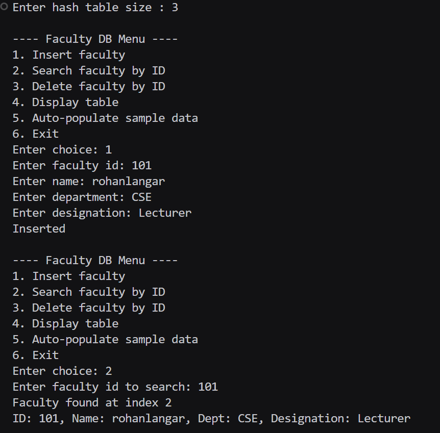
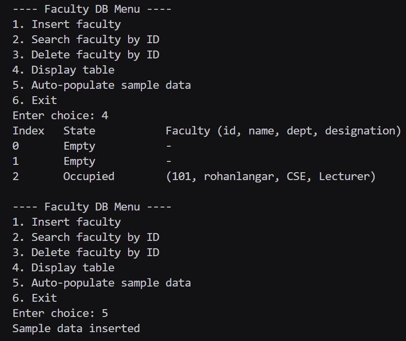
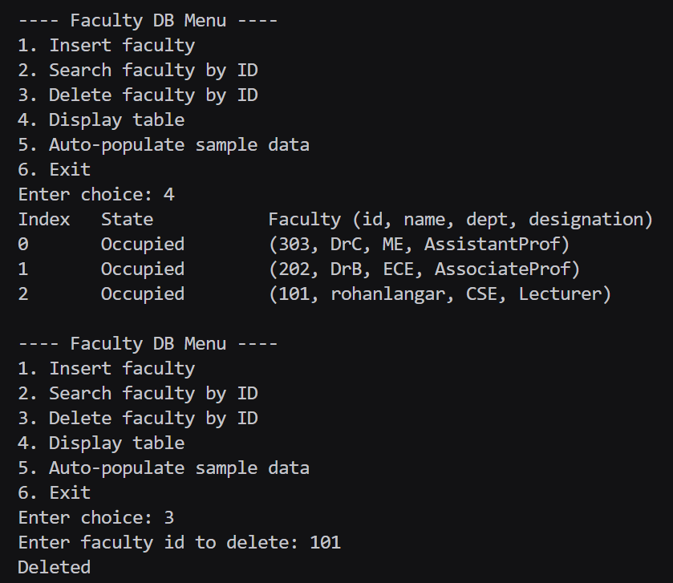

# Assignment No : 50
### Title :  WAP to simulate a faculty database as a hash table. Search a particular faculty by using MOD as a hash function for linear probing method of collision handling technique. Assume suitable data for faculty record.

---

### Theory :  
A **Hash Table** is a data structure that stores data using a *hash function* to determine the index for each key.  
However, different keys may hash to the **same index**, causing a **collision**.

To handle collisions, **Separate Chaining** is used.

### Algorithm :

### **Insert Faculty**
1. Read faculty details  
2. Compute index using MOD  
3. If slot empty → insert  
4. Else → move to next slot (linear probing)  
5. Stop when an empty or deleted slot is found  

### **Search Faculty**
1. Compute index  
2. Linearly probe until:  
   - Key found → return index  
   - Empty slot → not found  

### **Delete Faculty**
1. Search for key  
2. If found → mark slot as deleted  

### **Display Table**
Print every index along with stored faculty record.

### Code :
```
#include <iostream>
#include <vector>
#include <string>
using namespace std;

struct Faculty_rrl {
    int id_rrl;
    string name_rrl;
    string dept_rrl;
    string designation_rrl;
};

class FacultyHash_rrl {
    int size_rrl;
    vector<Faculty_rrl> table_rrl;
    vector<int> state_rrl;
public:
    FacultyHash_rrl(int n_rrl = 11) {
        size_rrl = n_rrl;
        table_rrl.assign(size_rrl, Faculty_rrl{0,"","",""});
        state_rrl.assign(size_rrl, 0);
    }

    int hash_rrl(int id_rrl) {
        int idx_rrl = id_rrl % size_rrl;
        if (idx_rrl < 0) idx_rrl += size_rrl;
        return idx_rrl;
    }

    bool insert_rrl(const Faculty_rrl &f_rrl) {
        int idx_rrl = hash_rrl(f_rrl.id_rrl);
        int start_rrl = idx_rrl;
        do {
            if (state_rrl[idx_rrl] == 0 || state_rrl[idx_rrl] == 2) {
                table_rrl[idx_rrl] = f_rrl;
                state_rrl[idx_rrl] = 1;
                return true;
            }
            if (state_rrl[idx_rrl] == 1 && table_rrl[idx_rrl].id_rrl == f_rrl.id_rrl) {
                return false;
            }
            idx_rrl = (idx_rrl + 1) % size_rrl;
        } while (idx_rrl != start_rrl);
        return false;
    }

    int searchIndex_rrl(int id_rrl) {
        int idx_rrl = hash_rrl(id_rrl);
        int start_rrl = idx_rrl;
        do {
            if (state_rrl[idx_rrl] == 0) return -1;
            if (state_rrl[idx_rrl] == 1 && table_rrl[idx_rrl].id_rrl == id_rrl) return idx_rrl;
            idx_rrl = (idx_rrl + 1) % size_rrl;
        } while (idx_rrl != start_rrl);
        return -1;
    }

    Faculty_rrl get_rrl(int idx_rrl) {
        return table_rrl[idx_rrl];
    }

    bool remove_rrl(int id_rrl) {
        int pos_rrl = searchIndex_rrl(id_rrl);
        if (pos_rrl == -1) return false;
        state_rrl[pos_rrl] = 2;
        table_rrl[pos_rrl] = Faculty_rrl{0,"","",""};
        return true;
    }

    void display_rrl() {
        cout << "Index\tState\t\tFaculty (id, name, dept, designation)\n";
        for (int i_rrl = 0; i_rrl < size_rrl; i_rrl++) {
            cout << i_rrl << "\t";
            if (state_rrl[i_rrl] == 0) cout << "Empty\t\t-\n";
            else if (state_rrl[i_rrl] == 2) cout << "Deleted\t\t-\n";
            else {
                cout << "Occupied\t";
                cout << "(" << table_rrl[i_rrl].id_rrl << ", " << table_rrl[i_rrl].name_rrl
                     << ", " << table_rrl[i_rrl].dept_rrl << ", " << table_rrl[i_rrl].designation_rrl << ")\n";
            }
        }
    }

    void autoPopulate_rrl() {
        insert_rrl(Faculty_rrl{101, "DrA", "CSE", "Professor"});
        insert_rrl(Faculty_rrl{202, "DrB", "ECE", "AssociateProf"});
        insert_rrl(Faculty_rrl{303, "DrC", "ME",  "AssistantProf"});
        insert_rrl(Faculty_rrl{404, "DrD", "CSE", "Lecturer"});
        insert_rrl(Faculty_rrl{505, "DrE", "IT",  "Professor"});
    }
};

int main() {
    int size_rrl;
    cout << "Enter hash table size (e.g. 11): ";
    cin >> size_rrl;
    FacultyHash_rrl ht_rrl(size_rrl);

    while (true) {
        cout << "\n---- Faculty DB Menu ----\n";
        cout << "1. Insert faculty\n2. Search faculty by ID\n3. Delete faculty by ID\n4. Display table\n5. Auto-populate sample data\n6. Exit\nEnter choice: ";
        int choice_rrl; cin >> choice_rrl;

        if (choice_rrl == 1) {
            Faculty_rrl f_rrl;
            cout << "Enter faculty id: "; cin >> f_rrl.id_rrl;
            cout << "Enter name: "; cin >> f_rrl.name_rrl;
            cout << "Enter department: "; cin >> f_rrl.dept_rrl;
            cout << "Enter designation: "; cin >> f_rrl.designation_rrl;
            if (ht_rrl.insert_rrl(f_rrl)) cout << "Inserted\n";
            else cout << "Insertion failed\n";
        }
        else if (choice_rrl == 2) {
            int id_rrl; cout << "Enter faculty id to search: "; cin >> id_rrl;
            int pos_rrl = ht_rrl.searchIndex_rrl(id_rrl);
            if (pos_rrl == -1) cout << "Faculty not found\n";
            else {
                Faculty_rrl f_rrl = ht_rrl.get_rrl(pos_rrl);
                cout << "Faculty found at index " << pos_rrl << "\n";
                cout << "ID: " << f_rrl.id_rrl << ", Name: " << f_rrl.name_rrl
                     << ", Dept: " << f_rrl.dept_rrl << ", Designation: " << f_rrl.designation_rrl << "\n";
            }
        }
        else if (choice_rrl == 3) {
            int id_rrl; cout << "Enter faculty id to delete: "; cin >> id_rrl;
            if (ht_rrl.remove_rrl(id_rrl)) cout << "Deleted\n";
            else cout << "Faculty not found\n";
        }
        else if (choice_rrl == 4) {
            ht_rrl.display_rrl();
        }
        else if (choice_rrl == 5) {
            ht_rrl.autoPopulate_rrl();
            cout << "Sample data inserted\n";
        }
        else if (choice_rrl == 6) {
            break;
        }
        else {
            cout << "Invalid choice\n";
        }
    }
    return 0;
}

```

### Output 


