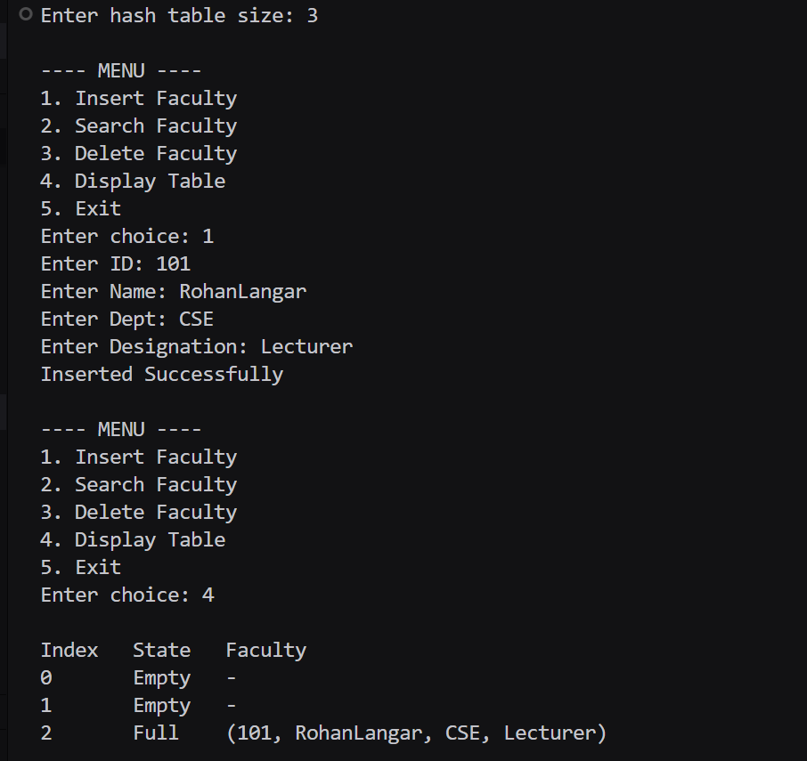
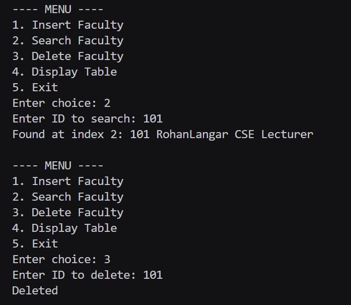
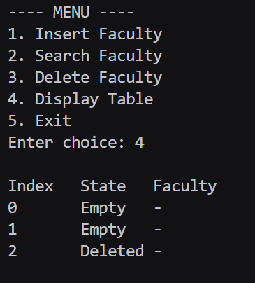

# Assignment No : 51
### Title :  WAP to simulate a faculty database as a hash table. Search a particular faculty by using 'divide' as a hash function for linear probing with chaining without replacement method of collision handling technique. Assume suitable data for faculty record.	

---

### Theory :  
A **Hash Table** is a data structure that stores data using a *hash function* to determine the index for each key.  
However, different keys may hash to the **same index**, causing a **collision**.

To handle collisions, **Separate Chaining** is used.

### Algorithm :

### **Insert(faculty)**  
1. Compute `home = id % size`  
2. If home slot is empty → insert  
3. Else:
   - Probe linearly to find first free slot  
   - Insert record  
   - Append this new slot to the chain starting at `home`  

### **Search(id)**  
1. Compute `home = id % size`  
2. Traverse the chain starting from `head[home]`  
3. If matching ID found → return index  
4. Else → not found  

### **Delete(id)**  
1. Search ID  
2. If found → mark slot as deleted and adjust chain  

### **Display**  
Show all fields for each slot:

### Code :
```
#include <iostream>
#include <vector>
#include <string>
using namespace std;

struct Faculty_rrl {
    int id_rrl;
    string name_rrl;
    string dept_rrl;
    string designation_rrl;
};

class FacultyHash_rrl {
public:
    int size_rrl;
    vector<Faculty_rrl> table_rrl;
    vector<int> state_rrl;

    FacultyHash_rrl(int n_rrl = 10) {
        size_rrl = n_rrl;
        table_rrl.assign(size_rrl, Faculty_rrl{0,"","",""});
        state_rrl.assign(size_rrl, 0);
    }

    int hash_rrl(int id_rrl) {
        return id_rrl % size_rrl;
    }

    bool insert_rrl(Faculty_rrl f) {
        int idx = hash_rrl(f.id_rrl);
        int start = idx;

        do {
            if (state_rrl[idx] == 0 || state_rrl[idx] == 2) {
                table_rrl[idx] = f;
                state_rrl[idx] = 1;
                return true;
            }
            idx = (idx + 1) % size_rrl;
        } while (idx != start);

        return false;
    }

    int search_rrl(int id) {
        int idx = hash_rrl(id);
        int start = idx;

        do {
            if (state_rrl[idx] == 0) return -1;
            if (state_rrl[idx] == 1 && table_rrl[idx].id_rrl == id)
                return idx;

            idx = (idx + 1) % size_rrl;
        } while (idx != start);

        return -1;
    }

    bool delete_rrl(int id) {
        int pos = search_rrl(id);
        if (pos == -1) return false;

        state_rrl[pos] = 2;
        table_rrl[pos] = Faculty_rrl{0,"","",""};
        return true;
    }

    void display_rrl() {
        cout << "\nIndex\tState\tFaculty\n";
        for (int i = 0; i < size_rrl; i++) {
            cout << i << "\t";
            if (state_rrl[i] == 0)
                cout << "Empty\t-\n";
            else if (state_rrl[i] == 2)
                cout << "Deleted\t-\n";
            else
                cout << "Full\t(" << table_rrl[i].id_rrl << ", "
                     << table_rrl[i].name_rrl << ", "
                     << table_rrl[i].dept_rrl << ", "
                     << table_rrl[i].designation_rrl << ")\n";
        }
    }
};

int main() {
    int size_rrl;
    cout << "Enter hash table size: ";
    cin >> size_rrl;

    FacultyHash_rrl ht(size_rrl);

    while (true) {
        cout << "\n---- MENU ----\n";
        cout << "1. Insert Faculty\n";
        cout << "2. Search Faculty\n";
        cout << "3. Delete Faculty\n";
        cout << "4. Display Table\n";
        cout << "5. Exit\n";
        cout << "Enter choice: ";

        int ch;
        cin >> ch;

        if (ch == 1) {
            Faculty_rrl f;
            cout << "Enter ID: "; cin >> f.id_rrl;
            cout << "Enter Name: "; cin >> f.name_rrl;
            cout << "Enter Dept: "; cin >> f.dept_rrl;
            cout << "Enter Designation: "; cin >> f.designation_rrl;

            if (ht.insert_rrl(f)) cout << "Inserted Successfully\n";
            else cout << "Table Full\n";
        }

        else if (ch == 2) {
            int id;
            cout << "Enter ID to search: ";
            cin >> id;

            int pos = ht.search_rrl(id);
            if (pos == -1) cout << "Not Found\n";
            else {
                Faculty_rrl f = ht.table_rrl[pos];
                cout << "Found at index " << pos << ": "
                     << f.id_rrl << " " << f.name_rrl << " " 
                     << f.dept_rrl << " " << f.designation_rrl << "\n";
            }
        }

        else if (ch == 3) {
            int id;
            cout << "Enter ID to delete: ";
            cin >> id;

            if (ht.delete_rrl(id)) cout << "Deleted\n";
            else cout << "Not Found\n";
        }

        else if (ch == 4) ht.display_rrl();

        else if (ch == 5) break;

        else cout << "Invalid Choice\n";
    }

    return 0;
}


```

### Output 


