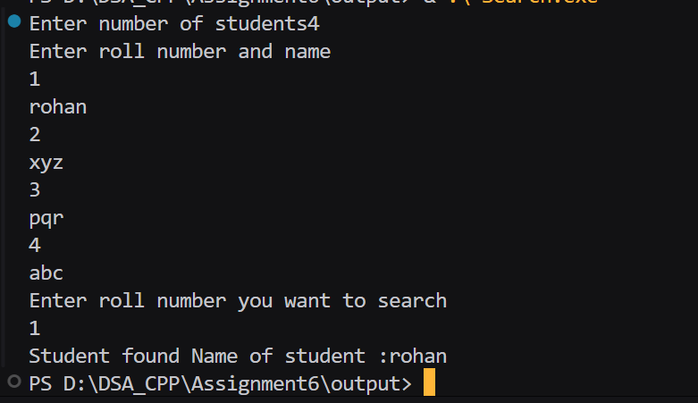

## Assignment no : 6 

### Title : In Computer Engg. Dept. of VIT there are S.Y., T.Y., and B.Tech. students. Assume that all these students are on ground for a function. We need to identify a student of S.Y. div. (X) whose name is "XYZ" and roll no. is "17". Apply appropriate Searching method to identify the required student.

#### Theory :

1) Take input Roll number from use
2) initialize int i = 0 to n (size of structure)
3) Check if (arr[i].roll_rrl == target_rrl) if yes then return student name or print 
4) If student roll number not found then simply set flag = false and print student not found 

#### Program :
```
#include<iostream>
using namespace std;
#include<string>

struct student_rrl{
    int roll_rrl;
    string name_rrl;
};

int main(){ 
    int n_rrl;
    cout << "Enter number of students";
    cin >> n_rrl;

    student_rrl *arr = new student_rrl[n_rrl];

    if (arr==NULL){
        cout << "Memory not allocated";
    }

    cout << "Enter roll number and name"<<endl;
    for (int i = 0 ;i < n_rrl; i++){
        cin >> arr[i].roll_rrl >> arr[i].name_rrl;
    }

    int target_rrl;
    cout << "Enter roll number you want to search"<<endl;
    cin >> target_rrl;
    bool flag_rrl=false;
    for (int i =0 ; i < n_rrl ;i++){
        if (arr[i].roll_rrl == target_rrl){
            cout <<"Student found"<<" "<<"Name of student :"<<arr[i].name_rrl<<endl;
            flag_rrl=true;
        }
    }

    if (flag_rrl == false){
        cout << " Student not found";
    }
    delete[] arr;


    return 0;
}
```

#### Output :


https://drive.google.com/file/d/1Swf-CdpSVXznXJvbpJaHzOnpSNoiqjww/view?usp=sharing