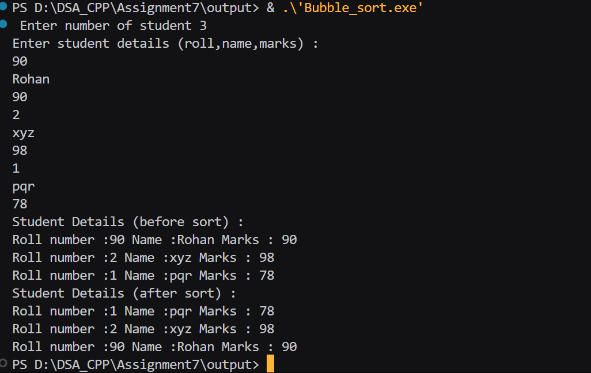
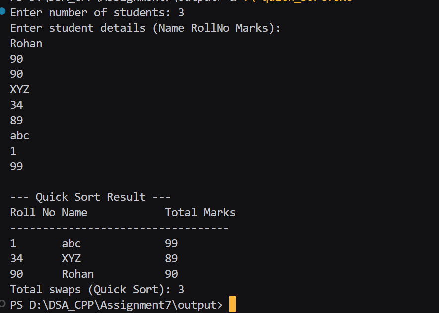

## Assignment no : 7
### Title : WAP to implement Bubble sort and Quick Sort on a 1D array of Student structure (contains student_name, student_roll_no, total_marks), with key as student_roll_no. And count the number of swap performed by each method.


#### Theory :

Bubble sort -> 

1)  Start with the first student in the list.
2) Compare the roll number of the current student with the next student.
3) If the first roll number is bigger, swap the two students and increase the swap count.
3) Move to the next pair of students and repeat the same step.
4) After one full round, the student with the largest roll number will move to the end.
5) Repeat the process for the remaining students until no more swaps are needed.
6) Finally, display the sorted list and the total number of swaps done.


#### Program :
```
#include<iostream>
#include<string>
using namespace std;

struct student_rrl
{
    int roll_no_rrl;
    string name_rrl;
    int marks_rrl;
};

int main(){
    int n_rrl;
    cout << " Enter number of student";
    cin >> n_rrl;

    student_rrl *arr_rrl = new student_rrl[n_rrl];

    if (arr_rrl == NULL){
        cout << "Memory not allocated";
    }

    cout << "Enter student details (roll,name,marks) :" << endl;
    for (int i_rrl = 0; i_rrl < n_rrl; i_rrl++){
        cin >> arr_rrl[i_rrl].roll_no_rrl >> arr_rrl[i_rrl].name_rrl >> arr_rrl[i_rrl].marks_rrl;
    }

    cout << "Student Details (before sort) :" << endl;
    for (int i_rrl = 0; i_rrl < n_rrl; i_rrl++){
        cout <<"Roll number :"<<arr_rrl[i_rrl].roll_no_rrl <<" "<< "Name :" << arr_rrl[i_rrl].name_rrl <<" "<< "Marks : " << arr_rrl[i_rrl].marks_rrl << endl;
    }

    for(int i_rrl = 0; i_rrl < n_rrl; i_rrl++){
        for (int j_rrl = i_rrl + 1; j_rrl < n_rrl; j_rrl++){
            if (arr_rrl[i_rrl].roll_no_rrl > arr_rrl[j_rrl].roll_no_rrl){
                student_rrl temp_rrl = arr_rrl[i_rrl];
                arr_rrl[i_rrl] = arr_rrl[j_rrl];
                arr_rrl[j_rrl] = temp_rrl;
            }
        }
    }

    cout << "Student Details (after sort) :" << endl;
    for (int i_rrl = 0; i_rrl < n_rrl; i_rrl++){
        cout <<"Roll number :"<<arr_rrl[i_rrl].roll_no_rrl <<" "<< "Name :" << arr_rrl[i_rrl].name_rrl <<" "<< "Marks : " << arr_rrl[i_rrl].marks_rrl << endl;
    }

    return 0;
}
```

#### Output :



Quick sort ->

1) Choose one student’s roll number as the pivot (usually the last student in the list).
2) Rearrange the list so that all students with roll numbers smaller than the pivot come before it, and all with larger roll numbers come after it
3) While rearranging, swap students when needed and increase the swap count.
4) Now the pivot is in its correct position in the sorted list.
5) Repeat the same process (steps 1–3) for the left side of the list and for the right side of the list.
6) Continue until every part of the list is sorted.
7) Finally, display the sorted list and the total number of swaps done.


#### Program :
```
#include <iostream>
#include <string>
using namespace std;

struct Student {
    string student_name;
    int student_roll_no;
    float total_marks;
};

void swapStudents(Student &a_rrl, Student &b_rrl, int &swapCount_rrl) {
    Student temp_rrl = a_rrl;
    a_rrl = b_rrl;
    b_rrl = temp_rrl;
    swapCount_rrl++;
}

int partition(Student arr_rrl[], int low_rrl, int high_rrl, int &swapCount_rrl) {
    int pivot_rrl = arr_rrl[high_rrl].student_roll_no;  
    int i_rrl = low_rrl - 1;

    for (int j_rrl = low_rrl; j_rrl < high_rrl; j_rrl++) {
        if (arr_rrl[j_rrl].student_roll_no < pivot_rrl) {
            i_rrl++;
            swapStudents(arr_rrl[i_rrl], arr_rrl[j_rrl], swapCount_rrl);
        }
    }
    swapStudents(arr_rrl[i_rrl + 1], arr_rrl[high_rrl], swapCount_rrl);
    return i_rrl + 1;
}

void quickSort(Student arr_rrl[], int low_rrl, int high_rrl, int &swapCount_rrl) {
    if (low_rrl < high_rrl) {
        int pi_rrl = partition(arr_rrl, low_rrl, high_rrl, swapCount_rrl);
        quickSort(arr_rrl, low_rrl, pi_rrl - 1, swapCount_rrl);
        quickSort(arr_rrl, pi_rrl + 1, high_rrl, swapCount_rrl);
    }
}

void displayStudents(Student arr_rrl[], int n_rrl) {
    cout << "\nRoll No\tName\t\tTotal Marks\n";
    cout << "----------------------------------\n";
    for (int i_rrl = 0; i_rrl < n_rrl; i_rrl++) {
        cout << arr_rrl[i_rrl].student_roll_no << "\t"
             << arr_rrl[i_rrl].student_name << "\t\t"
             << arr_rrl[i_rrl].total_marks << "\n";
    }
}

int main() {
    int n_rrl;
    cout << "Enter number of students: ";
    cin >> n_rrl;

    Student *arr_rrl = new Student[n_rrl];

    cout << "Enter student details (Name RollNo Marks):\n";
    for (int i_rrl = 0; i_rrl < n_rrl; i_rrl++) {
        cin >> arr_rrl[i_rrl].student_name >> arr_rrl[i_rrl].student_roll_no >> arr_rrl[i_rrl].total_marks;
    }

    int quickSwapCount_rrl = 0;
    quickSort(arr_rrl, 0, n_rrl - 1, quickSwapCount_rrl);

    cout << "\n--- Quick Sort Result ---";
    displayStudents(arr_rrl, n_rrl);
    cout << "Total swaps (Quick Sort): " << quickSwapCount_rrl << endl;

    delete[] arr_rrl;
    return 0;
}
```


#### Output :
