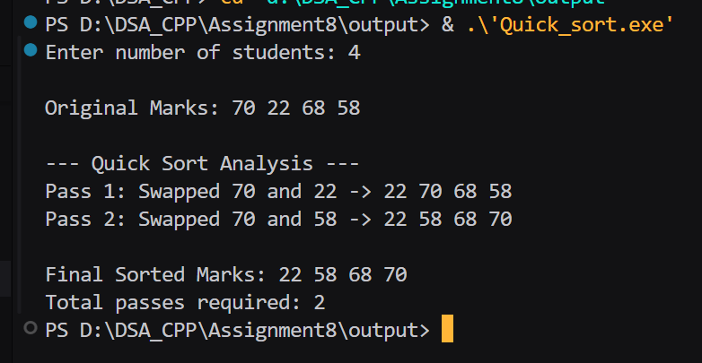

## Assignment no : 8
### Title : Write a program to input marks of n students Sort the marks in ascending order using the Quick Sort algorithm without using built-in library functions and analyse the sorting algorithm pass by pass. Find the minimum and maximum marks using Divide and Conquer (recursively).


#### Theory :

Quick sort -> 

1) Start with the entire list of students.
2) Select one student’s roll number as the pivot (commonly the first, last, or middle element).
3) Rearrange the list so that:
4) All students with roll numbers smaller than the pivot are placed before it.
5) All students with roll numbers greater than the pivot are placed after it.
6) Now the pivot is in its final correct position.
7) Repeat the same process (recursively) for the left part (students before pivot) and the right part (students after pivot).
8) Continue dividing and arranging until every part has only one student (or no student).
9) Finally, the entire list is sorted in ascending order of roll numbers.


#### Program :
```
#include <iostream>
#include <iomanip>
#include <cstdlib>
#include <ctime>
using namespace std;

int passCount_rrl = 0; 

void swap_rrl(int &a_rrl, int &b_rrl) {
    int temp_rrl = a_rrl;
    a_rrl = b_rrl;
    b_rrl = temp_rrl;
}

void printArray_rrl(int arr_rrl[], int n_rrl) {
    for (int i_rrl = 0; i_rrl < n_rrl; i_rrl++) {
        cout << arr_rrl[i_rrl] << " ";
    }
    cout << endl;
}

int partition_rrl(int arr_rrl[], int low_rrl, int high_rrl, int n_rrl) {
    int pivot_rrl = arr_rrl[high_rrl];
    int i_rrl = low_rrl - 1;

    for (int j_rrl = low_rrl; j_rrl < high_rrl; j_rrl++) {
        if (arr_rrl[j_rrl] <= pivot_rrl) {
            i_rrl++;
            if (i_rrl != j_rrl) {
                passCount_rrl++;
                cout << "Pass " << passCount_rrl << ": Swapped " 
                     << arr_rrl[i_rrl] << " and " << arr_rrl[j_rrl] << " -> ";
                swap_rrl(arr_rrl[i_rrl], arr_rrl[j_rrl]);
                printArray_rrl(arr_rrl, n_rrl);
            }
        }
    }

    if (i_rrl + 1 != high_rrl) {
        passCount_rrl++;
        cout << "Pass " << passCount_rrl << ": Swapped " 
             << arr_rrl[i_rrl + 1] << " and " << arr_rrl[high_rrl] << " -> ";
        swap_rrl(arr_rrl[i_rrl + 1], arr_rrl[high_rrl]);
        printArray_rrl(arr_rrl, n_rrl);
    }

    return i_rrl + 1;
}

void quickSort_rrl(int arr_rrl[], int low_rrl, int high_rrl, int n_rrl) {
    if (low_rrl < high_rrl) {
        int pi_rrl = partition_rrl(arr_rrl, low_rrl, high_rrl, n_rrl);
        quickSort_rrl(arr_rrl, low_rrl, pi_rrl - 1, n_rrl);
        quickSort_rrl(arr_rrl, pi_rrl + 1, high_rrl, n_rrl);
    }
}

int main() {
    srand(time(0));
    int n_rrl;
    cout << "Enter number of students: ";
    cin >> n_rrl;

    int* marks_rrl = new(nothrow) int[n_rrl];
    if (!marks_rrl) {
        cout << "Memory allocation failed!\n";
        return 1;
    }

    cout << "\nOriginal Marks: ";
    for (int i_rrl = 0; i_rrl < n_rrl; i_rrl++) {
        marks_rrl[i_rrl] = rand() % 100 + 1;
        cout << marks_rrl[i_rrl] << " ";
    }
    cout << "\n\n--- Quick Sort Analysis ---\n";

    quickSort_rrl(marks_rrl, 0, n_rrl - 1, n_rrl);

    cout << "\nFinal Sorted Marks: ";
    printArray_rrl(marks_rrl, n_rrl);

    cout << "Total passes required: " << passCount_rrl << endl;

    delete[] marks_rrl;
    return 0;
}

```

#### Output :



