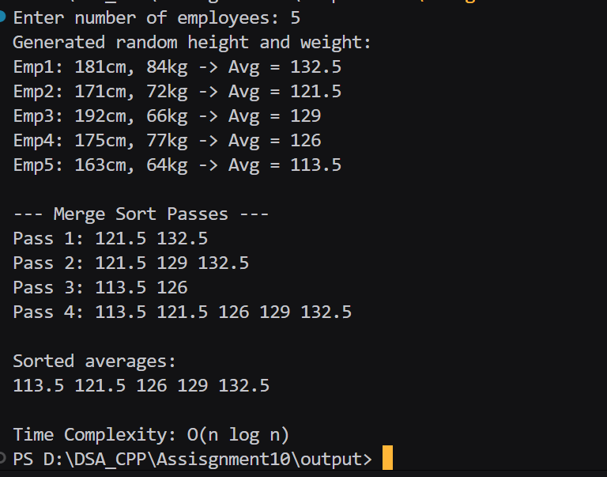
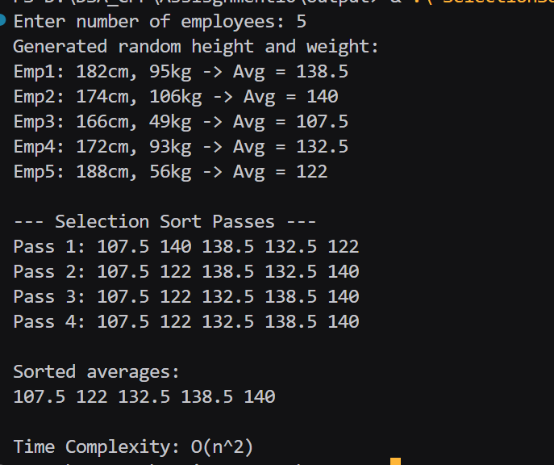

## Assignment no : 10
### Title : Write a program to arrange the list of employees as per the average of their height and weight by using Merge and Selection sorting method. Analyse their time complexities and conclude which algorithm will take less time to sort the list. 	


#### Theory :

Marge sort -> 

1) Start with the entire list of students
2) if the list has more than one student, divide it into two halves.
3) Apply Merge Sort recursively on the left half.
4) Apply Merge Sort recursively on the right half.
5) Once both halves are sorted, merge them together by comparing roll numbers from each half:
6) Pick the smaller roll number first.
7) Continue until all students from both halves are merged in order.
8) Repeat this process until the entire list is combined into one sorted list.


#### Program :
```
#include <iostream>
#include <cstdlib>
#include <ctime>
using namespace std;

void merge_rrl(float arr_rrl[], int l_rrl, int m_rrl, int r_rrl, int &pass_rrl) {
    int n1_rrl = m_rrl - l_rrl + 1;
    int n2_rrl = r_rrl - m_rrl;

    float *L_rrl = new float[n1_rrl];
    float *R_rrl = new float[n2_rrl];

    for (int i_rrl = 0; i_rrl < n1_rrl; i_rrl++) L_rrl[i_rrl] = arr_rrl[l_rrl + i_rrl];
    for (int j_rrl = 0; j_rrl < n2_rrl; j_rrl++) R_rrl[j_rrl] = arr_rrl[m_rrl + 1 + j_rrl];

    int i_rrl = 0, j_rrl = 0, k_rrl = l_rrl;
    while (i_rrl < n1_rrl && j_rrl < n2_rrl) {
        if (L_rrl[i_rrl] <= R_rrl[j_rrl]) {
            arr_rrl[k_rrl++] = L_rrl[i_rrl++];
        } else {
            arr_rrl[k_rrl++] = R_rrl[j_rrl++];
        }
    }
    while (i_rrl < n1_rrl) arr_rrl[k_rrl++] = L_rrl[i_rrl++];
    while (j_rrl < n2_rrl) arr_rrl[k_rrl++] = R_rrl[j_rrl++];

    cout << "Pass " << pass_rrl++ << ": ";
    for (int x_rrl = l_rrl; x_rrl <= r_rrl; x_rrl++) cout << arr_rrl[x_rrl] << " ";
    cout << endl;

    delete[] L_rrl;
    delete[] R_rrl;
}

void mergeSort_rrl(float arr_rrl[], int l_rrl, int r_rrl, int &pass_rrl) {
    if (l_rrl < r_rrl) {
        int m_rrl = (l_rrl + r_rrl) / 2;
        mergeSort_rrl(arr_rrl, l_rrl, m_rrl, pass_rrl);
        mergeSort_rrl(arr_rrl, m_rrl + 1, r_rrl, pass_rrl);
        merge_rrl(arr_rrl, l_rrl, m_rrl, r_rrl, pass_rrl);
    }
}

int main() {
    srand(time(0));
    int n_rrl;
    cout << "Enter number of employees: ";
    cin >> n_rrl;

    int *height_rrl = new int[n_rrl];
    int *weight_rrl = new int[n_rrl];
    float *avg_rrl = new float[n_rrl];

    if (height_rrl == NULL || weight_rrl == NULL || avg_rrl == NULL){
        cout << "Memory not allocatde ";
        return -1;
    }

    cout << "Generated random height and weight:\n";
    for (int i_rrl = 0; i_rrl < n_rrl; i_rrl++) {
        height_rrl[i_rrl] = rand() % 61 + 140; 
        weight_rrl[i_rrl] = rand() % 71 + 40;  
        avg_rrl[i_rrl] = (height_rrl[i_rrl] + weight_rrl[i_rrl]) / 2.0;
        cout << "Emp" << i_rrl + 1 << ": " << height_rrl[i_rrl] << "cm, "
             << weight_rrl[i_rrl] << "kg -> Avg = " << avg_rrl[i_rrl] << endl;
    }

    int pass_rrl = 1;
    cout << "\n--- Merge Sort Passes ---\n";
    mergeSort_rrl(avg_rrl, 0, n_rrl - 1, pass_rrl);

    cout << "\nSorted averages:\n";
    for (int i_rrl = 0; i_rrl < n_rrl; i_rrl++) cout << avg_rrl[i_rrl] << " ";

    cout << "\n\nTime Complexity: O(n log n)\n";

    delete[] height_rrl;
    delete[] weight_rrl;
    delete[] avg_rrl;

    return 0;
}

```

#### Output :



Selection Sort -> 

1) Start with the first student in the list.
2) Assume this student has the smallest roll number.
3) Compare this roll number with all remaining students.
4) If a student with a smaller roll number is found, update the position of the smallest student.
5) After scanning the entire list, swap the first student with the student having the smallest roll number.
6) Move to the second student and repeat steps 2–5 for the remaining students.
7)  Continue until all students are arranged in ascending order.
8) Finally, display the sorted list.

#### Program : 
```
#include <iostream>
#include <cstdlib>
#include <ctime>
using namespace std;

int main() {
    srand(time(0));
    int n_rrl;
    cout << "Enter number of employees: ";
    cin >> n_rrl;

    int *height_rrl = new int[n_rrl];
    int *weight_rrl = new int[n_rrl];
    float *avg_rrl = new float[n_rrl];

    if (height_rrl == NULL || weight_rrl == NULL || avg_rrl == NULL){
        cout << "Memory not allocatde ";
        return -1;
    }

    cout << "Generated random height and weight:\n";
    for (int i_rrl = 0; i_rrl < n_rrl; i_rrl++) {
        height_rrl[i_rrl] = rand() % 61 + 140; 
        weight_rrl[i_rrl] = rand() % 71 + 40;  
        avg_rrl[i_rrl] = (height_rrl[i_rrl] + weight_rrl[i_rrl]) / 2.0;
        cout << "Emp" << i_rrl + 1 << ": " << height_rrl[i_rrl] << "cm, "
             << weight_rrl[i_rrl] << "kg -> Avg = " << avg_rrl[i_rrl] << endl;
    }

    int pass_rrl = 1;
    cout << "\n--- Selection Sort Passes ---\n";
    for (int i_rrl = 0; i_rrl < n_rrl - 1; i_rrl++) {
        int minIndex_rrl = i_rrl;
        for (int j_rrl = i_rrl + 1; j_rrl < n_rrl; j_rrl++) {
            if (avg_rrl[j_rrl] < avg_rrl[minIndex_rrl]) {
                minIndex_rrl = j_rrl;
            }
        }
        swap(avg_rrl[i_rrl], avg_rrl[minIndex_rrl]);

        cout << "Pass " << pass_rrl++ << ": ";
        for (int k_rrl = 0; k_rrl < n_rrl; k_rrl++) cout << avg_rrl[k_rrl] << " ";
        cout << endl;
    }

    cout << "\nSorted averages:\n";
    for (int i_rrl = 0; i_rrl < n_rrl; i_rrl++) cout << avg_rrl[i_rrl] << " ";

    cout << "\n\nTime Complexity: O(n^2)\n";

    delete[] height_rrl;
    delete[] weight_rrl;
    delete[] avg_rrl;

    return 0;
}

```

#### Output : 



