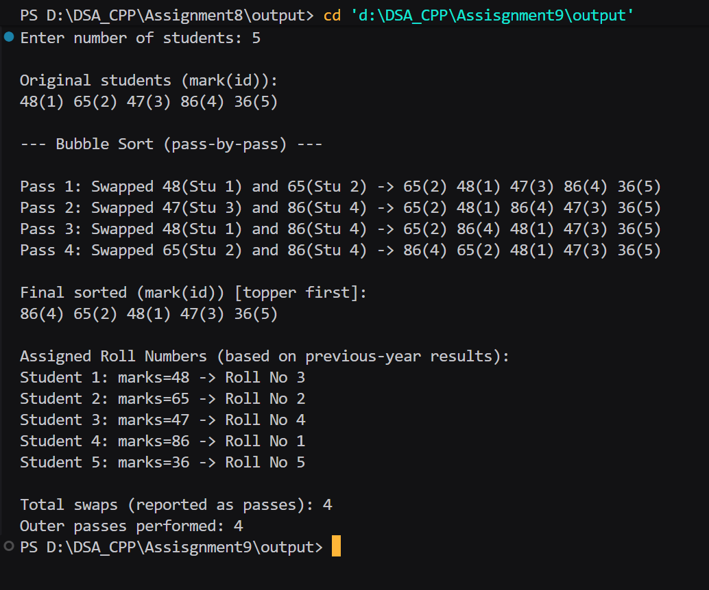

## Assignment no : 9
### Title : Write a program using Bubble sort algorithm, assign the roll nos. to the students of your class as per their previous years result. i.e. topper will be roll no. 1 and analyse the sorting algorithm pass by pass.


#### Theory :

Bubble sort -> 

1)  Start with the first student in the list.
2) Compare the roll number of the current student with the next student.
3) If the first roll number is bigger, swap the two students and increase the swap count.
3) Move to the next pair of students and repeat the same step.
4) After one full round, the student with the largest roll number will move to the end.
5) Repeat the process for the remaining students until no more swaps are needed.
6) Finally, display the sorted list and the total number of swaps done.

#### Program :
```
#include <iostream>
#include <cstdlib>
#include <ctime>
using namespace std;

void swap_rrl(int &a_rrl, int &b_rrl) {
    int tmp_rrl = a_rrl;
    a_rrl = b_rrl;
    b_rrl = tmp_rrl;
}

void printArray_rrl(int marks_rrl[], int id_rrl[], int n_rrl) {
    for (int k_rrl = 0; k_rrl < n_rrl; k_rrl++) {
        cout << marks_rrl[k_rrl] << "(" << id_rrl[k_rrl] << ")";
        if (k_rrl < n_rrl - 1) cout << " ";
    }
    cout << '\n';
}

int main() {
    srand((unsigned)time(0));

    int n_rrl;
    cout << "Enter number of students: ";
    if (!(cin >> n_rrl) || n_rrl <= 0) {
        cout << "Invalid input. Exiting.\n";
        return 1;
    }

    int* marks_rrl = new(nothrow) int[n_rrl];
    int* orig_marks_rrl = new(nothrow) int[n_rrl]; 
    int* id_rrl = new(nothrow) int[n_rrl];         
    int* roll_rrl = new(nothrow) int[n_rrl];       

    if (!marks_rrl || !orig_marks_rrl || !id_rrl || !roll_rrl) {
        cout << "Memory allocation failed!\n";
        if (marks_rrl) delete[] marks_rrl;
        if (orig_marks_rrl) delete[] orig_marks_rrl;
        if (id_rrl) delete[] id_rrl;
        if (roll_rrl) delete[] roll_rrl;
        return 1;
    }

    cout << "\nOriginal students (mark(id)):\n";
    for (int i_rrl = 0; i_rrl < n_rrl; i_rrl++) {
        marks_rrl[i_rrl] = rand() % 101;      
        orig_marks_rrl[i_rrl] = marks_rrl[i_rrl];
        id_rrl[i_rrl] = i_rrl + 1;            
        cout << marks_rrl[i_rrl] << "(" << id_rrl[i_rrl] << ")";
        if (i_rrl < n_rrl - 1) cout << " ";
    }
    cout << "\n\n--- Bubble Sort (pass-by-pass) ---\n\n";

    long long passCount_rrl = 0;   
    int outerPasses_rrl = 0;       

    for (int i_rrl = 0; i_rrl < n_rrl - 1; i_rrl++) {
        bool swapped_rrl = false;
        outerPasses_rrl++;
        for (int j_rrl = 0; j_rrl < n_rrl - 1 - i_rrl; j_rrl++) {
            if (marks_rrl[j_rrl] < marks_rrl[j_rrl + 1]) {
                passCount_rrl++;
                cout << "Pass " << passCount_rrl << ": Swapped "
                     << marks_rrl[j_rrl] << "(Stu " << id_rrl[j_rrl] << ") and "
                     << marks_rrl[j_rrl + 1] << "(Stu " << id_rrl[j_rrl + 1] << ") -> ";
                swap_rrl(marks_rrl[j_rrl], marks_rrl[j_rrl + 1]);
                swap_rrl(id_rrl[j_rrl], id_rrl[j_rrl + 1]);
                printArray_rrl(marks_rrl, id_rrl, n_rrl);
                swapped_rrl = true;
            }
        }
        if (!swapped_rrl) {
            break;
        }
    }

    for (int i_rrl = 0; i_rrl < n_rrl; i_rrl++) {
        int originalID_rrl = id_rrl[i_rrl];   
        roll_rrl[originalID_rrl - 1] = i_rrl + 1; 
    }

    cout << "\nFinal sorted (mark(id)) [topper first]:\n";
    printArray_rrl(marks_rrl, id_rrl, n_rrl);

    cout << "\nAssigned Roll Numbers (based on previous-year results):\n";
    for (int orig_rrl = 0; orig_rrl < n_rrl; orig_rrl++) {
        cout << "Student " << (orig_rrl + 1)
             << ": marks=" << orig_marks_rrl[orig_rrl]
             << " -> Roll No " << roll_rrl[orig_rrl] << "\n";
    }

    cout << "\nTotal swaps (reported as passes): " << passCount_rrl << '\n';
    cout << "Outer passes performed: " << outerPasses_rrl << '\n';

    delete[] marks_rrl;
    delete[] orig_marks_rrl;
    delete[] id_rrl;
    delete[] roll_rrl;

    return 0;
}

```

#### Output :

