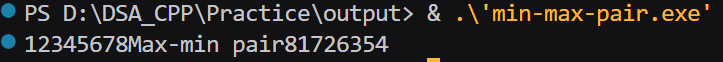
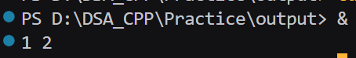
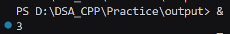

# Practice 

## Code :
### Max-Min Pairs


```
#include <iostream>
using namespace std;
int main(){

    int arr[8]={1,2,3,4,5,6,7,8};
    int n=8;
    for (int i=0;i<n;i++){
        cout<<arr[i];
    }
    for (int i=0;i<n;i+=2){
        int temp=arr[i];

        for(int j=n-1;j>=n-1;j--){
            arr[i]=arr[j];
        }

        for (int k=n-2;k>=i+1;k--){
            arr[k+1]=arr[k];
        }

      arr[i+1]=temp;
    }
    cout<<"Max-min pair";
    for (int i=0;i<n;i++){
        cout << arr[i];
    }

    return 0;
}
```

## Output :



## Code 2 : 
### Odd occurance of numbers :

```
#include <iostream>
using namespace std;

int main(){

    int arr[6]={1,2,2,3,3,3};
    int n =6 ;
    for (int i=0;i<n;i++){
        int cnt=0;

        for (int j=0;j<n;j++){

            if (arr[i]==arr[j]){
                cnt++;
            }
            
        }
        if (cnt % 2 != 0 ){
            cout << arr[i];
        }
    }
    
    return 0;
}
```

## Code 3 : 
### Two sum 

```
#include <iostream>
#include <vector>
using namespace std;

int main(){
    vector <int> vec={2,7,11,15};
    int target=18;
    int n=vec.size();
    int i=0,j=n-1;
    int sum=0;
    while (j > i){
        sum=vec[i]+vec[j];
        if (sum > target){
            j--;
        }
        else if(sum < target){
            i++;
        }
        else {
            cout << i <<" "<< j;
            break;
        }
    }
    return 0;
}
```

### Output :



## Code 4 :
### Majority Element in array :

```
#include <iostream>
using namespace std;

int main(){
    int arr[6]={1,2,3,3,3,3};
    int n=6;
    int cnt=0;
    for (int i =0 ;i < n ;i++){
        cnt=0;
        for ( int j =0 ; j < n; j++ ){
            if (arr[i] == arr[j]){
                cnt+=1;
            } 
        }
        if (cnt > n/2){
                cout << arr[i];
                break;
            }   
    }
}

```

### Output :
